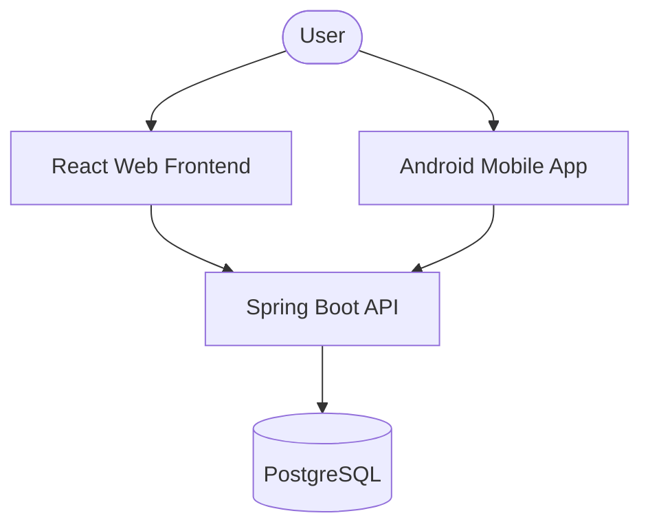

# Architecture

> Auto-generated by /map on 2026-05-07

## Overview

DevOrbit is a full-stack platform for managing and exploring developers' projects, courses, and roadmaps. It follows a multi-module architecture with a unified backend and multiple client interfaces (Web and Mobile).

## Components

### Backend API (`devorbit-api`)
- **Purpose:** Central business logic and data persistence.
- **Location:** `devorbit-api/src/main/java/vn/edu/uit/devorbit_api`
- **Pattern:** Layered Architecture (Controller -> Service -> Repository -> Entity).
- **Security:** JWT-based authentication for Admins and Students.

### Web Frontend (`devorbit-web`)
- **Purpose:** Responsive web interface for students and administrators.
- **Location:** `devorbit-web/src`
- **Tech:** React 19, React Router 7, Vite.
- **State Management:** Hooks-based (useEffect, custom hooks in `src/lib/hooks.ts`).

### Mobile App (`devorbit-mobile`)
- **Purpose:** Native Android experience.
- **Location:** `devorbit-mobile/app/src/main`
- **Tech:** Kotlin, Android SDK.

## Data Flow

1. **Client Request:** Web or Mobile client sends an HTTP request with a JWT token (if authenticated).
2. **Security Filter:** Spring Security validates the JWT and sets the authentication context.
3. **Controller Handling:** The request is routed to a specific Controller (e.g., `AdminRepoController`).
4. **Business Logic:** Services handle complex logic (e.g., repository candidate processing).
5. **Data Access:** Repositories interact with PostgreSQL via JPA.
6. **Response:** Data is returned as JSON, often normalized by the client (see `devorbit-web/src/lib/api.ts`).

## Integration Points

| Service | Type | Purpose |
|---------|------|---------|
| PostgreSQL | DB | Primary data storage. |
| GitHub API | External | Inferred from `AdminGithubController` and `GithubRepoService`. |

## Technical Debt

- **Monorepo Management:** No formal monorepo tool (like Nx or Lerna); dependencies are managed separately in each folder.
- **Code Duplication:** Potential overlap in DTO/Model definitions between API, Web, and Mobile.
- **Normalization:** `devorbit-web/src/lib/api.ts` performs manual normalization of API responses (e.g., `techStacks` handling).

## Conventions

- **Naming:** CamelCase for Java/TS, snake_case for database columns (implied).
- **Structure:** Modular by feature (Admin/Student/Public).
- **Testing:** Vitest for Web, JUnit for API (implied by `pom.xml` and `package.json`).
