# DevOrbit API — Onboarding Guide

Generated from `/understand` knowledge graph analysis (2026-05-22).

---

## Project Overview

| Field | Value |
|-------|-------|
| **Name** | `devorbit-api` |
| **Type** | Spring Boot 4.0.6 REST API |
| **Language** | Java 21 |
| **Package** | `vn.edu.uit.devorbit_api` |
| **Build tool** | Maven (wrapper: `mvnw`/`mvnw.cmd`) |
| **Description** | Backend API for DevOrbit — manages courses, GitHub repos, AI knowledge graphs, roadmaps, photobooth frames, JWT auth, and admin functions for UIT students. Consumed by `devorbit-web` (React 19) and `devorbit-mobile` (Kotlin Compose). |

### Frameworks & Key Dependencies

| Dependency | Purpose |
|-----------|---------|
| **Spring Boot 4.0.6** | Framework (parent POM) |
| **Spring Data JPA** | ORM / database access (PostgreSQL) |
| **Spring Security** | JWT-based auth (admin + student roles) |
| **Spring WebFlux** | WebClient for GitHub API |
| **jjwt 0.12.6** | JWT token creation/validation |
| **Flyway** | Database migration versioning |
| **Lombok** | Boilerplate reduction (`@Data`, `@Builder`, `@RequiredArgsConstructor`) |
| **springdoc 2.8.6** | OpenAPI / Swagger UI |
| **H2** | In-memory DB for tests |
| **PostgreSQL 16** | Production database (via Supabase Pooler) |

---

## Architecture Layers (13)

```
┌───────────────────────────────────────────────┐
│  Application Entry (DevorbitApiApplication)    │
├───────────────────────────────────────────────┤
│  Presentation / Controller Layer (18 files)    │
├───────────────────────────────────────────────┤
│  DTO / API Contract Layer (42 DTOs)           │
├───────────────────────────────────────────────┤
│  Service / Business Logic Layer (19 files)     │
│  AI / LLM Service Layer (5 files)              │
├───────────────────────────────────────────────┤
│  Repository / Data Access Layer (17 repos)     │
├───────────────────────────────────────────────┤
│  Domain / Entity Layer (21 entities + enums)   │
├───────────────────────────────────────────────┤
│  Database Schema & Migrations (7 SQL files)    │
├───────────────────────────────────────────────┤
│  Configuration & Security Layer (14 files)     │
│  Exception & Event Handling (5 files)          │
├───────────────────────────────────────────────┤
│  Infrastructure & Deployment (5 files)         │
│  Documentation (6 files)                       │
│  Test Suite (9 files)                          │
└───────────────────────────────────────────────┘
```

### 1. Application Entry
**Files:** `DevorbitApiApplication.java`, `CurriculumConstants.java`

`@SpringBootApplication` entry point. `CurriculumConstants` defines SE2025 curriculum constants.

### 2. Presentation / Controller Layer (18 controllers)
REST controllers organized by access level:

| Group | Count | Endpoints | Auth |
|-------|-------|-----------|------|
| **Admin** | 9 | Courses, repos, candidates, roadmaps, notes, auth, relationships, resources | JWT (ADMIN) |
| **Public** | 6 | Courses, repos, AI queries, knowledge graph, discovery, tech stacks | None |
| **Student** | 2 | Auth, bookmarks | JWT (STUDENT) |
| **Other** | 1 | Photobooth frame upload/download | Mixed |

### 3. DTO / API Contract Layer (42 DTOs)
Request/response objects grouped by access:
- **admin/** (26): `LoginRequest/Response`, `CourseUpsertRequest`, `RepoCandidateResponse`, `RoadmapRequest/Response`, `NoteResponse`, `ArticleRequest/Response`, `PhaseRequest/Response`, `TutorialRequest/Response`, `YoutubePlaylistRequest/Response`, etc.
- **publicapi/** (10): `AiQueryRequest/Response`, `CourseDetailResponse`, `KnowledgeGraphResponse`, `RoadmapGenerationRequest`, `RoadmapRecommendationResponse`, `TechStackResponse`, etc.
- **student/** (6): `StudentAuthResponse`, `StudentLoginRequest`, `StudentRegisterRequest`, `StudentProfileResponse`, `StudentBookmarkRequest/Response`
- **root**: `PhotoboothFrameDTO`

### 4. Service / Business Logic Layer (19 services)
Services implement domain logic:

| Service | Responsibility |
|---------|---------------|
| `CourseService` | CRUD courses |
| `CourseRelationshipService` | Course dependency graph |
| `CourseArticleService` | Course articles CRUD |
| `CourseTutorialService` | Course tutorials CRUD |
| `CourseYoutubePlaylistService` | YouTube playlists CRUD |
| `KnowledgeGraphService` | Build/query course knowledge graphs |
| `LearningRoadmapService` | Roadmap generation and CRUD |
| `GithubRepoService` | Authorized repo CRUD |
| `GithubScanService` | GitHub API repo scanning |
| `RepoCandidateService` | Candidate approval pipeline |
| `AdminAuthService` | Admin login/auth |
| `JwtService` | Token creation/validation |
| `StudentAuthService` | Student registration/auth |
| `StudentBookmarkService` | Student bookmarks CRUD |
| `PhotoboothFrameService` | Frame CRUD + image upload |
| `SupabaseStorageService` | Supabase Storage integration |
| `TechStackService` | Tech stack CRUD |
| `AdminNoteService` | Admin notes CRUD |
| `AiService` | Orchestrates AI queries |

### 5. AI / LLM Service Layer (5 services)

| Service | Function |
|---------|----------|
| `AdviceGenerator` | LLM-powered advice generation |
| `CurriculumMatcher` | Match courses to curriculum requirements |
| `GraphQueryEngine` | Natural-language Q&A over knowledge graph |
| `RoadmapGenerator` | Generate learning roadmaps from curriculum data |
| `SummaryGenerator` | Content summarization via LLM |

### 6. Repository / Data Access Layer (17 repos)
Spring Data JPA repositories for each entity: `CourseRepository`, `GithubRepoRepository`, `RepoCandidateRepository`, `LearningRoadmapRepository`, `RoadmapItemRepository`, `RoadmapPhaseRepository`, `NoteRepository`, `NoteCodeSnippetRepository`, `PhotoboothFrameRepository`, `StudentBookmarkRepository`, `AdminUserRepository`, `StudentUserRepository`, `TechStackRepository`, `CourseArticleRepository`, `CourseTutorialRepository`, `CourseYoutubePlaylistRepository`, `CourseRelationshipRepository`.

### 7. Domain / Entity Layer (21 entities + enums)
JPA entities: `Course`, `AdminUser`, `StudentUser`, `GithubRepo`, `RepoCandidate`, `LearningRoadmap`, `RoadmapItem`, `RoadmapPhase`, `Note`, `NoteCodeSnippet`, `PhotoboothFrame`, `TechStack`, `CourseArticle`, `CourseTutorial`, `CourseYoutubePlaylist`, `CourseRelationship`, `StudentBookmark`.

Enums: `CourseRelationType`, `NoteTargetType`, `RepoCandidateStatus`, `RoadmapItemTargetType`.

### 8. Database Schema & Migrations (7 SQL files)
- `schema.sql` / `schema-complete.sql` — Full database schema (all tables, enums, indexes)
- `data.sql` — Seed data (courses, repos, tech stacks)
- `V002__create_photobooth_frames.sql` — Flyway migration
- `cleanup_courses.sql` / `update_electives.sql` / `update_se2025.sql` — Maintenance scripts

### 9. Configuration & Security Layer (14 files)
Key configs:
- `SecurityConfig.java` — Spring Security with JWT filter chain
- `JwtAuthenticationFilter.java` — Per-request JWT validation
- `JwtProperties.java` / `GithubProperties.java` — Externalized config
- `GithubClientConfig.java` — WebClient for GitHub API
- `SupabaseStorageService` — Image upload integration
- `OpenApiConfig.java` — Swagger UI (/swagger-ui.html)
- `RepoCandidateDataInitializer.java` — Seeds initial candidates on startup

### 10. Exception & Event Handling (5 files)
- `ApiExceptionHandler.java` — Global `@RestControllerAdvice`
- `BadRequestException`, `NotFoundException`, `UnauthorizedException` — Custom exceptions
- `RelationshipChangedEvent` — Domain event for course relationships

### 11. Infrastructure & Deployment (5 files)
- `Dockerfile` — Multi-stage: Maven 3.9 + Temurin 21 → JRE-alpine
- `mvnw` / `mvnw.cmd` — Maven wrapper
- `run.bat` — Windows launch script
- `backup_supabase.py` — Supabase DB backup

---

## Key Concepts

### Access-Level Architecture
Three access tiers with separate JWT roles:
- **Public** — No auth required (`/api/courses/**`, `/api/repos/**`, `/api/ai/**`, `/api/discovery`, `/api/photobooth-frames/**`, `/api/tech-stacks`)
- **Admin** — JWT `ADMIN` role (`/api/admin/**` — full CRUD on all entities)
- **Student** — JWT `STUDENT` role (`/api/student/**` — auth + bookmarks)

### GitHub Repo Pipeline
1. `GithubScanService` scans GitHub for student repos
2. Results become `RepoCandidate` entries (status: `PENDING`)
3. Admin reviews via `AdminRepoCandidateController`
4. Approved candidates become `GithubRepo` entries (status: `APPROVED`/`REJECTED`)

### AI Knowledge Graph Pipeline
1. Course data feeds `KnowledgeGraphService`
2. `GraphQueryEngine` enables natural-language queries over the graph
3. `RoadmapGenerator` creates structured learning roadmaps
4. `CurriculumMatcher` validates against SE2025 requirements
5. `AdviceGenerator` provides personalized learning advice

### Error Handling
All exceptions flow through `ApiExceptionHandler` (`@RestControllerAdvice`) returning consistent JSON error format.

---

## Guided Tour (10 Steps)

```mermaid
flowchart LR
  Step1[1. Entry Point] --> Step2[2. Config & Security]
  Step2 --> Step3[3. Domain Entities]
  Step3 --> Step4[4. Repositories]
  Step4 --> Step5[5. Core Services]
  Step5 --> Step6[6. AI Services]
  Step6 --> Step7[7. Controllers]
  Step7 --> Step8[8. DTO Contracts]
  Step8 --> Step9[9. Error Handling]
  Step9 --> Step10[10. Schema & Tests]
```



### Step 1: Application Entry Point
**Files:** `DevorbitApiApplication.java`, `CurriculumConstants.java`
Understand how Spring Boot bootstraps and what curriculum constants drive the domain.

### Step 2: Configuration & Security Setup
**Files:** `SecurityConfig.java`, `JwtAuthenticationFilter.java`, `application.yaml`, `pom.xml`
Learn JWT auth flow, external service configs (GitHub, Supabase), CORS, and Swagger setup.

### Step 3: Domain Model — JPA Entities & Enums
**Files:** `Course.java`, `GithubRepo.java`, `RepoCandidate.java`, `LearningRoadmap.java`, `Note.java`, `PhotoboothFrame.java`, `StudentUser.java`, `AdminUser.java`, `TechStack.java`
Explore the domain model — relationships, inheritance patterns, and enum-driven state machines.

### Step 4: Data Access — Spring Data JPA Repositories
**Files:** `CourseRepository.java`, `GithubRepoRepository.java`, `RepoCandidateRepository.java`, `LearningRoadmapRepository.java`, `NoteRepository.java`, `PhotoboothFrameRepository.java`, `StudentBookmarkRepository.java`
See how Spring Data JPA provides CRUD + custom queries for each entity.

### Step 5: Business Logic — Core Services (8 key files)
**Files:** `CourseService.java`, `GithubScanService.java`, `RepoCandidateService.java`, `KnowledgeGraphService.java`, `LearningRoadmapService.java`, `JwtService.java`, `AdminAuthService.java`, `SupabaseStorageService.java`
Trace the business logic — how services orchestrate between repositories and controllers.

### Step 6: AI & LLM Service Integration
**Files:** `AiService.java`, `GraphQueryEngine.java`, `RoadmapGenerator.java`, `AdviceGenerator.java`, `SummaryGenerator.java`
Understand how AI/LLM services process natural-language queries and generate structured content.

### Step 7: REST API — Controllers by Access Level
**Files:** `AdminCourseController.java`, `AdminGithubController.java`, `PublicCourseController.java`, `PublicAiController.java`, `StudentAuthController.java`, `PhotoboothFrameController.java`, etc.
See how controllers map to endpoints, validate auth, delegate to services, and return DTOs.

### Step 8: API Contracts — DTO Layer
**Files:** Representative DTOs from admin/, publicapi/, student/ packages
Learn the request/response shapes that define the API contract.

### Step 9: Exception Handling & Domain Events
**Files:** `ApiExceptionHandler.java`, custom exceptions, `RelationshipChangedEvent.java`
Understand consistent error JSON format and domain event publishing.

### Step 10: Database Schema, Migrations & Testing
**Files:** `schema.sql`, `data.sql`, `V002*`, test controllers + services
Review the full schema, seed data, Flyway migrations, and test patterns.

---

## Running the Application

### Prerequisites
- Java 21 JDK
- PostgreSQL 16 (or Supabase Pooler)
- `.env` file with: `DATABASE_URL`, `JWT_SECRET`, `GITHUB_TOKEN`, `SUPABASE_URL`, `SUPABASE_KEY`, `SUPABASE_BUCKET`

### Commands
```bash
# Build
./mvnw clean install

# Run locally
./mvnw spring-boot:run -Dspring-boot.run.profiles=local

# Tests
./mvnw test

# Docker
docker build -t devorbit-api .
docker run -p 8080:8080 --env-file .env devorbit-api
```

### API Documentation
- Swagger UI: `http://localhost:8080/swagger-ui.html`
- OpenAPI spec: `http://localhost:8080/v3/api-docs`

---

## Knowledge Graph Stats

| Metric | Value |
|--------|-------|
| Total nodes | 333 |
| File nodes | 171 |
| Edge relationships | 421 (imports: 248, contains: 162, tested_by: 7, configures: 3, deploys: 1) |
| Layers | 13 |
| Tour steps | 10 |

---

## Saved To

This guide is at `docs/ONBOARDING.md`. Commit it to the repo to help new team members get started.
