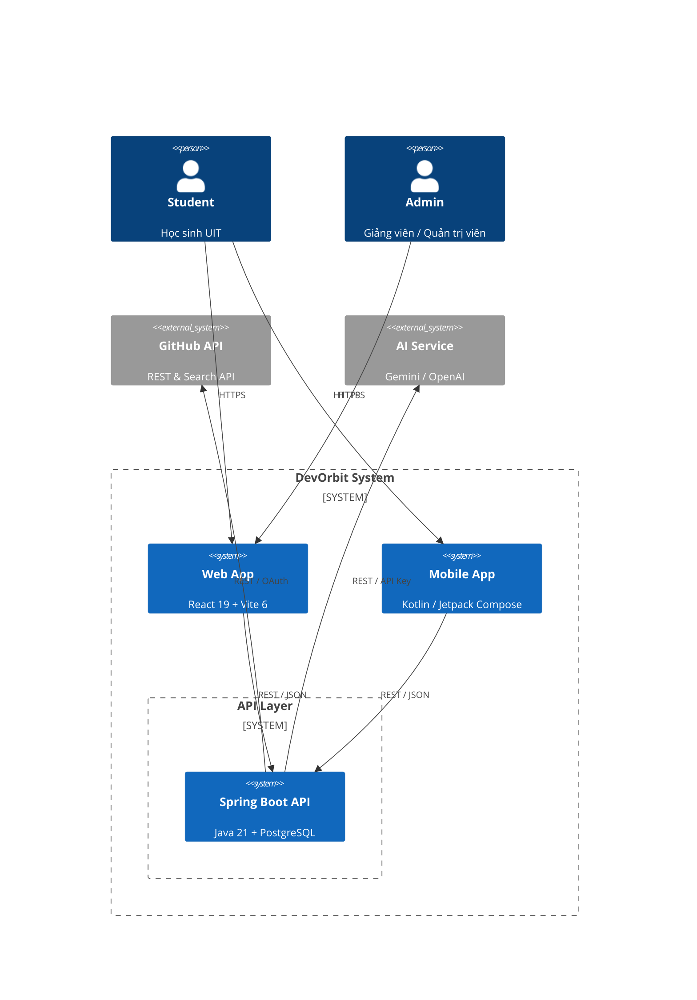
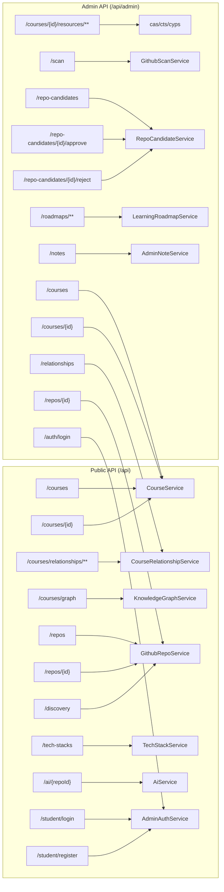
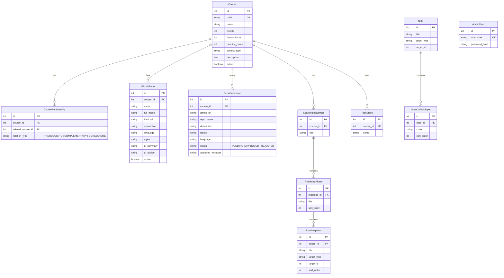
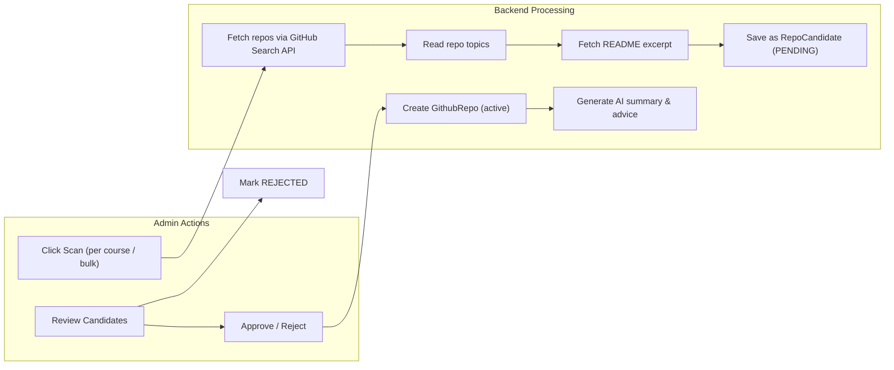
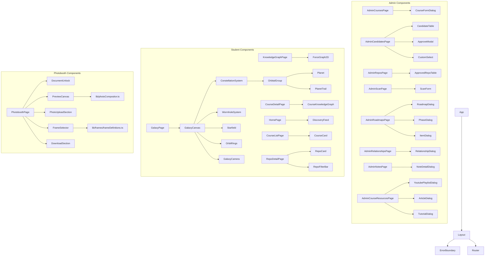
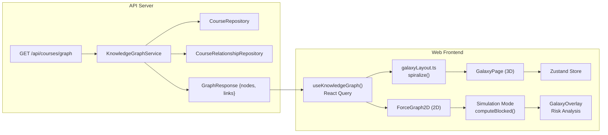

# Architecture

DevOrbit is a multi-platform system for discovering, scanning, and managing academic source code from GitHub across UIT's curriculum.

## System Overview



## Tech Stack

| Layer | Technology |
|-------|-----------|
| **Backend** | Java 21, Spring Boot 3.4.6, Spring Security, JWT, WebClient |
| **Database** | PostgreSQL 16 |
| **Web** | React 19, Vite 6, TypeScript, Tailwind CSS 3.4, React Router 7 |
| **State (Web)** | TanStack React Query 5, Zustand 5 |
| **Visualization** | D3 ForceGraph 2D (`react-force-graph-2d`), Three.js / R3F 3D (`@react-three/fiber`, `@react-three/drei`) |
| **Mobile** | Kotlin 2.0, Jetpack Compose, Retrofit, Hilt |
| **Infrastructure** | Docker Compose, Nginx |
| **CI/CD** | GitHub Actions |

## Backend Architecture

### Layering

```text
Controller (HTTP Interface)
  ↓  DTO mapping
Service (Application / Domain Logic)
  ↓  method call
Repository (JPA / Data Access)
  ↓  @Entity
Database (PostgreSQL 16)
```

### Package Map

```mermaid
graph TB
  subgraph Controller Layer
    ac[AdminCourseController]
    arc[AdminRepoCandidateController]
    agc[AdminGithubController]
    arrc[AdminRepoController]
    aac[AdminAuthController]
    armc[AdminRoadmapController]
    anrc[AdminCourseRelationshipController]
    anc[AdminNoteController]
    arc2[AdminCourseResourceController]
    pc[PublicCourseController]
    prc[PublicRepoController]
    pcc[PublicCourseRelationshipController]
    ptsc[PublicTechStackController]
    pai[PublicAiController]
    pdc[PublicDiscoveryController]
    hc[HealthController]
  end

  subgraph Service Layer
    cs[CourseService]
    grs[GithubRepoService]
    gss[GithubScanService]
    rcs[RepoCandidateService]
    kgs[KnowledgeGraphService]
    ls[LearningRoadmapService]
    crs[CourseRelationshipService]
    cas[CourseArticleService]
    cts[CourseTutorialService]
    cyps[CourseYoutubePlaylistService]
    ans[AdminNoteService]
    aas[AdminAuthService]
    js[JwtService]
    ais[AiService]
    tss[TechStackService]
  end

  subgraph Repository Layer
    cr[CourseRepository]
    gr[GithubRepoRepository]
    rcr[RepoCandidateRepository]
    rpi[RoadmapItemRepository]
    rph[RoadmapPhaseRepository]
    lr[LearningRoadmapRepository]
    crr[CourseRelationshipRepository]
    car[CourseArticleRepository]
    ctr[CourseTutorialRepository]
    cypr[CourseYoutubePlaylistRepository]
    nr[NoteRepository]
    ncsr[NoteCodeSnippetRepository]
    aur[AdminUserRepository]
    sur[StudentUserRepository]
    tr[TechStackRepository]
  end

  subgraph Entity Layer
    e_c[Course]
    e_gr[GithubRepo]
    e_rc[RepoCandidate]
    e_lr[LearningRoadmap]
    e_rp[RoadmapPhase]
    e_ri[RoadmapItem]
    e_cr[CourseRelationship]
    e_t[TechStack]
    e_n[Note]
    e_ncs[NoteCodeSnippet]
    e_au[AdminUser]
    e_su[StudentUser]
    e_ca[CourseArticle]
    e_ct[CourseTutorial]
    e_cyp[CourseYoutubePlaylist]
  end

  subgraph Security / Config
    sc[SecurityConfig]
    jf[JwtAuthenticationFilter]
    gc[GithubClientConfig]
    oac[OpenApiConfig]
  end

  ac --> cs
  ac --> grs
  arc --> rcs
  agc --> gss
  arrc --> grs
  pai --> ais
  pc --> cs
  prc --> grs
  pcc --> crs
  ptsc --> tss

  cs --> cr
  grs --> gr
  gss --> rcr
  rcs --> rcr
  kgs --> cr
  kgs --> crr

  cs --> e_c
  grs --> e_gr
  rcs --> e_rc
  gss --> e_rc
```



### API Route Map



### Security Architecture

```mermaid
flowchart LR
  subgraph "Authentication Flow"
    req[HTTP Request] --> jf{JwtAuthenticationFilter}
    jf -->|has JWT| sv[JWT Validation]
    jf -->|no JWT| pass[Pass Through]
    sv -->|valid| ctx[Set SecurityContext]
    sv -->|invalid| err[401 Unauthorized]
  end

  subgraph "Route Protection"
    api[/api/**] --> sc{Spring Security Config}
    api_admin[/api/admin/**] --> sc
    sc -->|public| permit[Permit All]
    sc -->|admin| auth[Require Authentication]
    sc -->|student| auth
  end
```

### Database Schema (Core Entities)



## GitHub Pipeline

The core pipeline scans GitHub for student repositories matching course criteria:



## Frontend Architecture

### Route Structure

```mermaid
graph TB
  subgraph "Router (/)"
    public["Public Routes"]
    admin["Admin Routes (Require Auth)"]
  end

  subgraph "Student Pages"
    Home
    CourseList["/courses"]
    CourseDetail["/courses/:id"]
    RepoDetail["/repos/:id"]
    KnowledgeGraph["/knowledge-graph (2D ForceGraph)"]
    Galaxy["/galaxy (3D Three.js)"]
    PhotoBooth["/photobooth"]
    PhotoGallery["/photograph"]
    Bookmarks["/bookmarks"]
    Login["/login"]
  end

  subgraph "Admin Pages"
    Dashboard["/admin"]
    AdminCourses["/admin/courses"]
    AdminCourseResources["/admin/courses/:id/resources"]
    Scan["/admin/scan"]
    Candidates["/admin/candidates"]
    Repos["/admin/repos"]
    Roadmaps["/admin/roadmaps"]
    Relationships["/admin/relationships"]
    Notes["/admin/notes"]
    AdminLogin["/admin/login"]
  end

  public --> Home
  public --> CourseList
  public --> CourseDetail
  public --> RepoDetail
  public --> KnowledgeGraph
  public --> Galaxy
  public --> PhotoBooth
  public --> PhotoGallery
  public --> Bookmarks
  public --> Login

  admin --> Dashboard
  admin --> AdminCourses
  admin --> AdminCourseResources
  admin --> Scan
  admin --> Candidates
  admin --> Repos
  admin --> Roadmaps
  admin --> Relationships
  admin --> Notes
  admin --> AdminLogin
```



### Component Hierarchy



### State Management

| Concern | Solution |
|---------|----------|
| **Server state (React)** | TanStack React Query 5 via `useKnowledgeGraph` hook (5min stale, 30min gc) |
| **Server state (Admin)** | Custom `useApiFetch` hook with manual `refetch` |
| **Galaxy/3D state** | Zustand store (`useGalaxyStore`) — simulation mode, time travel, failed/blocked nodes |
| **Planet positions (3D)** | React Context (`PlanetPositionContext`) — shared position map for trail rendering |
| **Auth tokens** | `localStorage` (`devorbit-admin-token` / `devorbit-student-token`) via `lib/auth.ts` |

## Data Flow: Knowledge Graph



### Graph Data Models

```typescript
// API Response
type GraphNode = { id: number; name: string; code: string; level: number; val: number; impactScore: number }
type GraphLink = { source: number; target: number; type: 'PREREQUISITE' | 'COMPLEMENTARY' | 'COREQUISITE' }

// Galaxy (3D) Layout
type GalaxyNode = { id: number; code: string; domain: 'IT' | 'CS' | 'SE' | 'IS' | 'NT' | 'MA' | 'OTHER'; x: number; y: number; z: number }
type DomainGalaxy = { id: DomainId; name: string; color: string; nodes: GalaxyNode[]; center: [number, number, number] }
type GalaxyData = { galaxies: DomainGalaxy[]; edges: GalaxyEdge[] }
```

### Simulation Mode (Failure Cascade)

When a student marks a course as "failed", the system recursively computes blocked courses:

```
computeBlocked(failed: Set<number>, links: GraphLink[]):
  1. blocked = copy(failed)
  2. BFS through PREREQUISITE links:
     - if course A is blocked AND A is prerequisite for B → B is also blocked
  3. Visual feedback: red nodes (failed) → pink nodes (blocked) → dimmed edges
```

## Design System: ArchLine

The UI follows a **Claymorphic + Glassmorphic** design system:

| Token | Example |
|-------|---------|
| **Colors** | `--clay-primary: #10b981` (emerald), `--clay-text: #1e293b` (slate-800), `--clay-bg: #f8fafc` |
| **Border radius** | `0px` (geometric, blueprint-inspired) |
| **Spacing** | Fibonacci: 4/8/12/20/32/52/84px |
| **Fonts** | `Be Vietnam Pro` (headings), `Inter` (body) |
| **Glass** | `backdrop-blur-xl`, `bg-white/80`, `border-clay-border` |

## Key Design Decisions

| Decision | Rationale |
|----------|-----------|
| **JWT over session auth** | Stateless, works across web + mobile without shared session store |
| **TanStack Query for server state** | Automatic caching, deduplication, and background refetch vs manual `useEffect` |
| **Zustand for galaxy state** | Lightweight, no boilerplate — perfect for transient UI state (simulation mode, currently hovered node) |
| **Custom `useApiFetch` for admin** | Simpler than adding React Query for every admin page; admin pages need manual refetch after mutations |
| **ForceGraph2D + Three.js 3D** | Two visualization modes for the knowledge graph — 2D for quick analysis, 3D galaxy for immersive exploration |
| **SessionStorage for photobooth unlock** | Document unlock is session-scoped; survives soft navigation but clears on tab close |
| **Dark mode permanently on** | Theme toggle removed; simplified styling without dark/light branching |

## Deployment

```yaml
# docker-compose.yaml
services:
  api:     # Spring Boot → :8080
  web:     # Nginx serves React build → :80
  db:      # PostgreSQL 16 → :5432
```

## Monorepo Layout

```text
devorbit/
├── devorbit-api/           # Spring Boot backend
│   └── src/main/java/vn/edu/uit/devorbit_api/
│       ├── config/         # Security, JWT, GitHub client, OpenAPI
│       ├── controller/     # 17 REST controllers
│       ├── dto/            # 30+ request/response DTOs
│       ├── entity/         # 16 JPA entities
│       ├── repository/     # 16 Spring Data repositories
│       └── service/        # 15 business services
├── devorbit-web/           # React SPA
│   └── src/
│       ├── components/     # Reusable UI (admin, student, photobooth)
│       ├── hooks/          # Custom hooks (useKnowledgeGraph)
│       ├── lib/            # API client, auth, colors, photoCompositor
│       ├── pages/          # 20 route pages (admin + student)
│       └── types/          # TypeScript interfaces
├── devorbit-mobile/        # Kotlin Android app
├── devorbit-showcase/      # Next.js showcase site
├── docs/                   # Architecture, glossary, test matrix
└── .gsd/                   # GSD methodology artifacts
```
