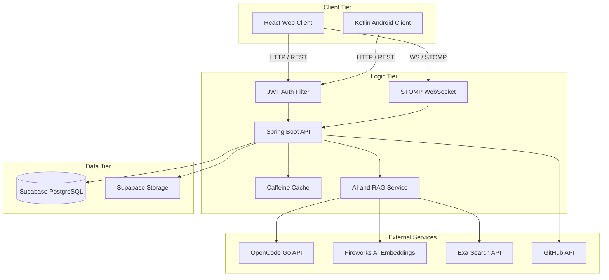
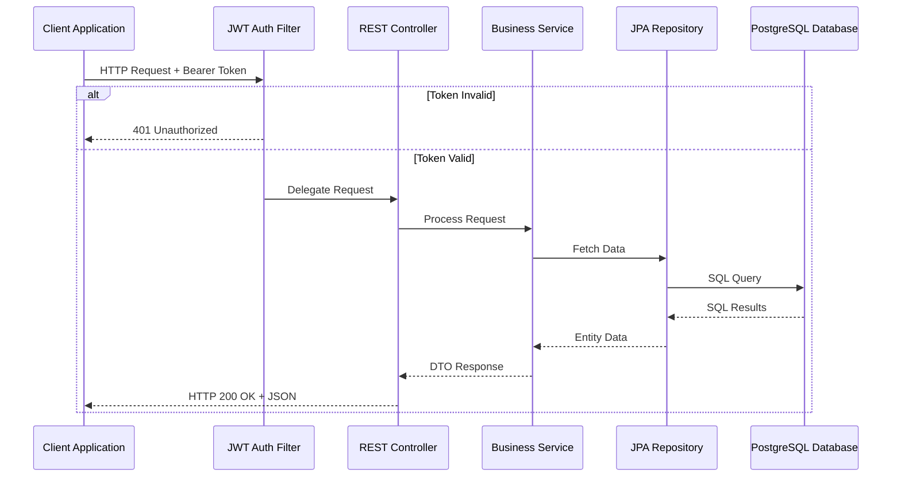
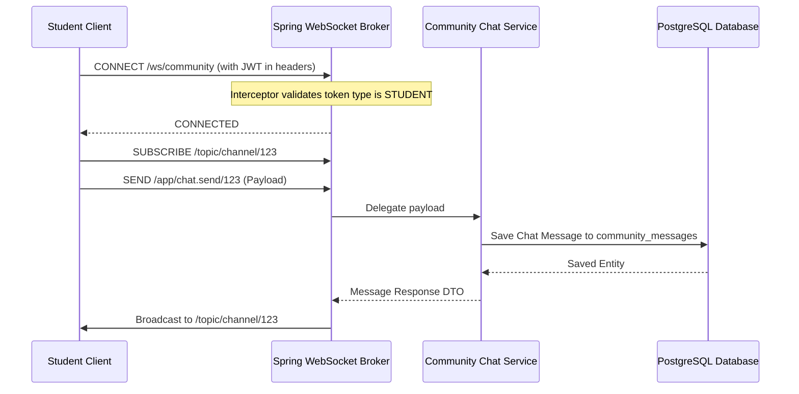
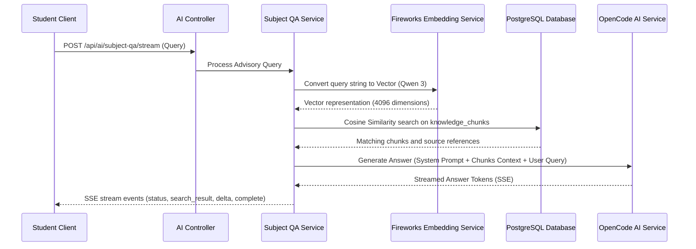

# System Architecture

This document describes the high-level architecture, module relationships, and request execution flows of the DevOrbit system.

## System Overview

DevOrbit is built as a three-tier system:
1. Client Tier: Represents user interfaces (devorbit-web, devorbit-mobile) that interact with the application.
2. Logic Tier: Represents the Spring Boot backend (devorbit-api) handling business logic, caching, authentication, and external integrations.
3. Data Tier: Represents the PostgreSQL database hosted on Supabase, along with storage buckets for static frames and uploads.

Here is a block diagram of the system components and their interactions:

## Module Dependencies

The project is structured into three main modules:
- devorbit-api : Built with Maven, depends on Java 21, Spring Boot, Spring Security, Hibernate JPA, PostgreSQL, Caffeine caching, and WebFlux.
- devorbit-web : Built with npm/Vite, depends on Node.js 20, React 19, Redux Toolkit, Zustand, TailwindCSS, stompjs, and Three.js.
- devorbit-mobile : Built with Gradle/Kotlin, compiles to an Android application using Jetpack Compose.

There are no direct code dependencies between the modules; communication is established strictly over network protocols (HTTP REST and WebSocket STOMP).

## Request Execution Flows

### REST Request Flow
The following diagram illustrates how standard API requests are authenticated and processed:

### Community Chat Flow
The community chat uses WebSockets with the STOMP protocol. Authenticated students can send and receive real-time messages within channels:

### RAG and AI Query Flow
The AI Tutor uses Retrieval-Augmented Generation (RAG) to answer queries about course materials. The workflow involves looking up vector embeddings of documents and feeding them to the LLM:

## Architectural Decisions

1. Backend-Owned Database Posture: 
   To protect database integrity and enforce central business logic, direct client access via Supabase's PostgREST API is denied. The backend automatically applies RLS (Row Level Security) rules on startup that deny SELECT, INSERT, UPDATE, and DELETE operations to `anon` and `authenticated` roles for all tables except public SELECT on photobooth frames and limited public INSERT validation on tutor registrations.
2. Stateless Sessions:
   Authentication is completely stateless using JWTs. Session revocations are managed by storing logged-out token identifiers (jti) in Caffeine cache (via RevokedTokenStore).
3. Offline Stubbing Fallback:
   When external AI APIs are down or credentials are not configured, the backend falls back to offline stub responses for course queries. This ensures local development is possible without external keys.
