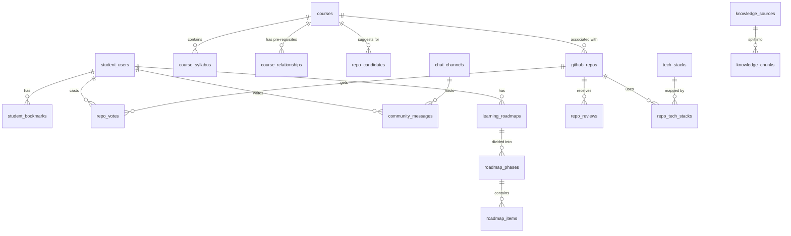

# Database Schema and Security Posture

This document describes the database schema, table relationships, security policies, and schema migration rules of the DevOrbit system, based on supabase_complete_schema.sql and the application initialization logic.

## Database Posture

DevOrbit adopts a backend-owned database posture. To safeguard integrity and enforce business logic, clients do not execute queries or mutations directly against PostgreSQL/Supabase via PostgREST. Instead, all traffic passes through the Spring Boot API layer.

Row Level Security (RLS) is configured to support this:
- Deny Direct API Access: An RLS policy named "Deny direct API access" is applied to 37 tables, forcing all SELECT, INSERT, UPDATE, and DELETE operations to be denied for both 'anon' and 'authenticated' roles.
- Exceptions:
  - photobooth_frames allows public select: SELECT is permitted for anonymous and authenticated users.
  - tutor_registrations allows public insert: INSERT is permitted for anonymous and authenticated users, subject to limited validation constraints (e.g. valid email syntax, name lengths, and pending status).
- Storage Buckets: Select access on storage objects is limited to the 'devorbit' and 'frame-overlays' buckets.

## Database Extensions

The database utilizes the pgvector extension to store and search embedding vectors for RAG:
- Schema: extensions
- Extension Name: vector
- Dimension: 4096 (used by Fireworks AI Qwen 3 embeddings)

## Table Domains

The 37 public tables are organized into the following functional domains:

### 1. Users and Security
- admin_users : Stores administrator login names, passwords (BCrypt hashed), and names.
- student_users : Stores student profiles including student codes (e.g. 2152xxxx), names, email addresses, passwords, verification status, and active status.
- otps : Stores temporary One-Time Passwords for registration verification, password resets, and validation timestamps.

### 2. Core Academic (Courses)
- courses : Stores basic course details (course code, name, description, credits, department).
- course_syllabus : Syllabus outline linked to a parent course.
- course_sessions : Detail on weekly sessions or class schedules.
- course_objectives : Learning objectives for a course.
- course_outcomes : Intended learning outcomes for students.
- course_assessments : Evaluation schemes (midterm, final weightings).
- course_references : Textbook and reference material.
- course_tools : Software, compilers, or platforms used in the course.
- course_tutorials : Guides or tutorials mapped to the course.
- course_youtube_playlists : Supplementary video links.
- course_articles : Reading materials.
- course_relationships : Mappings between pre-requisite, co-requisite, or successor courses.

### 3. Code Repositories
- github_repos : Repositories parsed by the scanner, containing owner, name, description, upvote counts, stars, forks, primary language, and tech stacks.
- repo_candidates : Repositories submitted by students that are pending review before approval.
- repo_reviews : Reviews and comments left on repositories.
- tech_stacks : Predefined programming languages, frameworks, or tools (e.g., Spring Boot, React).
- repo_tech_stacks : Many-to-many join table connecting github_repos with tech_stacks.
- repo_votes : Tracks student upvotes to ensure each student votes only once per repository.

### 4. AI Knowledge and RAG
- knowledge_sources : Ingested syllabus documents or web URLs.
- knowledge_chunks : Text fragments extracted from sources, including 4096-dimension vector embeddings.
- learning_roadmaps : Recommended learning pathways generated by the AI.
- roadmap_phases : Core phases of a recommended learning roadmap.
- roadmap_items : Checklists or tasks within a roadmap phase.

### 5. Community and Chat
- chat_channels : Conversation channels (e.g., General, Calculus course).
- community_messages : Chat logs associated with a channel, containing messages, student codes, and timestamps.
- chat_sessions : Private AI tutor chat sessions.
- chat_messages : History of messages within an AI tutor chat session.

### 6. Utilities
- photobooth_frames : Available photo frames with overlay URLs and titles.
- student_bookmarks : Bookmarked courses or repositories saved by student profiles.
- notifications : Message logs sent to students.
- tutor_registrations : Student applications to become course tutors.

## Entity Relationship Diagram

The core connections between the database tables are shown below:

## Schema Update Guidelines

1. Do Not Alter Production Schema Directly: Since direct access is disabled, schema updates must be rolled out via backend database initializer scripts or migrations.
2. Maintain Startup Initializers: Ensure that any new tables are added to the list of backend-owned tables in SupabaseDatabaseHardeningInitializer.java to deny direct API access automatically.
3. Configure Indexes: Always create database indexes on foreign keys to prevent table scans. The backend database initializer creates these indexes automatically if they are missing (e.g., idx_repo_votes_student).
