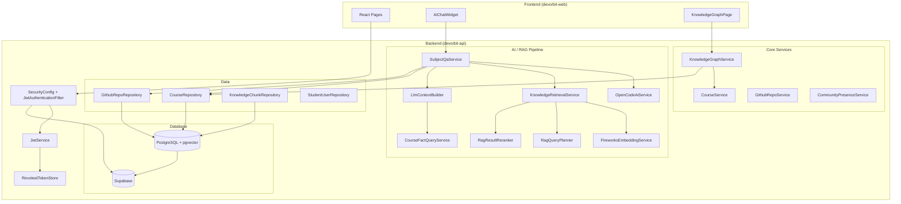
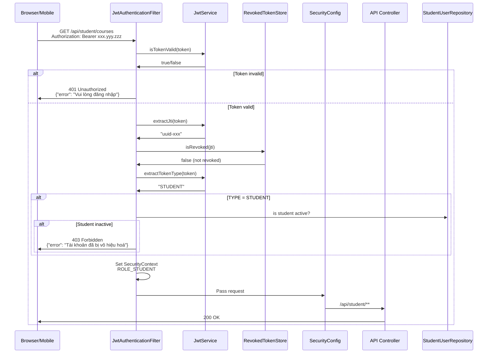
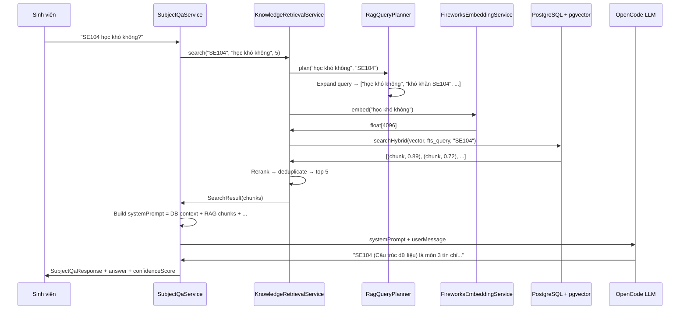

# Hướng dẫn hiểu toàn bộ code tôi đã push

> **Tác giả**: Nguyễn Huy Hoàng (huyhoang171106)
>
> **Phương pháp**: Feynman Technique — giải thích bằng ngôn ngữ đơn giản trước, đi sâu kỹ thuật sau.
>
> **Phạm vi**: Tất cả commit do Hoàng push lên nhánh master, từ ngày 01/06/2026 đến 17/06/2026.

---

## 1. Bức tranh tổng thể

### 1.1 Tôi đã xây dựng cái gì?

Tôi (Huy Hoàng) xây dựng **phần backend lõi** cho DevOrbit — một nền tảng hỗ trợ sinh viên UIT tra cứu môn học, repository GitHub, và nhận tư vấn học tập từ AI.

Hãy tưởng tượng DevOrbit như một **thư viện thông minh**:
- Có **kệ sách** (database) chứa thông tin môn học, repo GitHub, người dùng
- Có **thủ thư** (backend API) biết cách lấy đúng sách và trả lời câu hỏi
- Có **trợ lý ảo** (AI Tutor) có thể tư vấn học tập dựa trên dữ liệu thật
- Có **bản đồ tri thức** (knowledge graph) chỉ ra môn nào là tiên quyết của môn nào
- Có **hệ thống bảo vệ** (JWT auth, Supabase hardening) để chỉ người có quyền mới vào được

### 1.2 Vấn đề tôi giải quyết

| Vấn đề | Giải pháp của tôi |
|--------|-------------------|
| Sinh viên không biết môn nào nên học trước, môn nào học sau | Knowledge graph với topological sort + impact score |
| Sinh viên cần hỏi về môn học nhưng không có ai tư vấn | AI Tutor với RAG (Retrieval-Augmented Generation) |
| Dữ liệu môn học nằm rải rác, khó tra cứu | REST API chuẩn với caching |
| Repository GitHub không được gắn với môn học | GithubRepoService với scan tự động |
| Người dùng không nên tự ý truy cập API trực tiếp vào Supabase | Supabase hardening với RLS policies |
| Token JWT có thể bị đánh cắp | RevokedTokenStore in-memory |
| Streaming AI chat bị treo nếu LLM lâu | SubjectQaStreamingConfig với thread pool riêng |

### 1.3 Các component chính kết nối với nhau



### 1.4 Work của tôi nằm ở đâu trong toàn bộ hệ thống?

DevOrbit có 4 module chính: `devorbit-api` (backend Java Spring Boot), `devorbit-web` (React frontend), `devorbit-mobile` (Kotlin Android), và `supabase` (migrations + schema). Công việc của tôi tập trung vào:

1. **Backend lõi** (~80% công việc): JWT auth, entities, services, controllers, AI/RAG pipeline, knowledge graph, community presence
2. **Frontend** (~10%): AiChatWidget, ParticleNetwork, hooks (useSubjectQa, useCommunitySocket), bugs và tối ưu
3. **CI/CD & DevOps** (~5%): CI/CD pipeline, AGENTS.md, run.bat
4. **Docs & Specs** (~5%): Story documents, test matrix, admin page plan, v.v.

---

## 2. Bản đồ commit của tôi

### 2.1 Tổng quan

| Commit | Ngày | Loại | Thay đổi chính | File quan trọng | Trạng thái |
|--------|------|------|----------------|-----------------|------------|
| `10d54b8` | 01/06 | fix | Replace @PostConstruct với @EventListener | TechStackDataInitializer.java | Active |
| `a6c37ff` | 05/06 | fix | Fix TS errors, jsdom env | (nhiều file test) | Active |
| `b7c3e56` | 07/06 | docs | Spec cho community chat | SPECS.yaml | Active |
| `808fff0` | 07/06 | chore | Gitignore cập nhật | .gitignore | Active |
| `15b6947` | 07/06 | perf | Tối ưu DB + Hibernate batch | application.yaml | Active |
| `30a48bb` | 07/06 | fix | ParticleNetwork rAF dead loop | ParticleNetwork.tsx | Active |
| `58d76e5` | 07/06 | feat | Security audit fixes (19 files) | JwtService, SecurityConfig | Active |
| `b389939` | 07/06 | fix | Security hardening gaps | StudentAuthService | Active |
| `bf49dcf` | 08/06 | fix | CI check failures | ci.yml, ParticleNetwork.tsx | Active |
| `0bbbece` | 08/06 | harness | CI/CD pre-push gate | AGENTS.md | Active |
| `9652496` | 08/06 | feat | OTP paste + run.bat env | StudentLoginPage.tsx | Active |
| `984abc2` | 08/06 | perf | Course loading optimization | CourseService + react-query | Active |
| `562d2e4` | 08/06 | docs | Admin page rewrite plan | plan.md | Active |
| `8b4fa64` | 08/06 | feat | **LLM infrastructure** | AiConfig, PromptTemplates, OpenCodeAiService | Active |
| `a48259f` | 08/06 | feat | LLM → SummaryGenerator, AdviceGenerator | SummaryGenerator.java | Active |
| `1d15e9c` | 08/06 | feat | LLM → RoadmapGenerator, GraphQueryEngine | GraphQueryEngine.java | Active |
| `b8e0414` | 08/06 | feat | **Chat Q&A endpoint + session management** | ChatService.java, ChatRequest/Response | Active |
| `c6c0f8a` | 08/06 | feat | **LlmContextBuilder + RAG prompts** | LlmContextBuilder.java | Active |
| `0f812ca` | 08/06 | feat | RAG → Summary + Advice | AdviceGenerator.java | Active |
| `d7f3612` | 08/06 | feat | RAG → Chat + GraphQuery | ChatService.java | Active |
| `5715c9e` | 08/06 | feat | Fix KNOWLEDGE_QUERY prompt | PromptTemplates.java | Active |
| `45c1ad0` | 09/06 | fix | Review findings: token, VoteButtons, bookmark | VoteButtons.tsx, api.ts | Active |
| `dff7669` | 09/06 | fix | Mobile auth session | AuthSessionPolicy | Active |
| `1c6f9d8` | 09/06 | feat | **AsyncConfig, CacheConfig, GithubRepoService** | GithubRepoService.java | Active |
| `bc6f216` | 10/06 | feat | **Knowledge RAG system - 81 files** | KnowledgeRetrievalService, TutorRagService | Active |
| `f6fcf43` | 10/06 | chore | Normalize line endings | 218 files | Active |
| `0431ad9` | 10/06 | fix | Remove example credentials | LoginRequest.java | Active |
| `5021735` | 10/06 | chore | Remove junk files | Eclipse config, audit data | Active |
| `2fb78b3` | 11/06 | fix | **pgvector migration → 4096-dim Fireworks** | V005 migration SQL | Active |
| `bfe59e7` | 11/06 | feat | **Fireworks embedding provider** | FireworksEmbeddingService.java | Active |
| `339e078` | 11/06 | refactor | Firecrawl runtime enable check | FirecrawlClient.java | Active |
| `6ff9101` | 11/06 | feat | **Lazy DB knowledge bootstrap + RAG semantic retrieval** | CourseKnowledgeBootstrapService, SubjectQaService | Active |
| `1a10805` | 11/06 | fix | AI client timeouts 30s→90s | AiConfig.java | Active |
| `2653f99` | 11/06 | fix | Move @EnableCaching, fix regex escape | CacheConfig, ChatService | Active |
| `5352819` | 11/06 | chore | Improve run.bat env loading | run.bat | Active |
| `d4a159e` | 11/06 | docs | US-021 story + test matrix | TEST_MATRIX.md | Active |
| `a203ddb` | 12/06 | feat | **Real SSE streaming** | SubjectQaService.streamQuery(), SseEmitter | Active |
| `7eea0b7` | 12/06 | fix | Builder compilation, duplicate test | LearningRoadmapService | Active |
| `305807a` | 12/06 | feat | **Smarter RAG: hybrid retrieval, query expansion, reranking** | RagQueryPlanner, RagResultReranker | Active |
| `e1016b5` | 12/06 | feat | AI Course Q&A streaming chat (US-021) | useSubjectQa.ts | Active |
| `f8ded63` | 13/06 | feat | RAG progress UI + Java career advice | AiChatWidget.tsx | Active |
| `7c82c29` | 13/06 | feat | Refactor streaming, fix edge cases | SubjectQaService | Active |
| `c50aabb` | 13/06 | feat | Structured roadmap → ai chat | AiChatWidget.tsx | Active |
| `3f2ca30` | 13/06 | feat | Render roadmap as semester nodes | AiChatWidget.tsx | Active |
| `ccd779f` | 13/06 | feat | Improve roadmap timeline | AiChatWidget.tsx | Active |
| `d8bc1b7` | 13/06 | feat | Resolve ai chat roadmap merge | ChatContext, ChatMessage | Active |
| `a9812d4` | 14/06 | feat | Improve subject QA grounding + startup safety | SubjectQaService, CourseKnowledgeBootstrapService | Active |
| `080d6b8` | 15/06 | feat | Merge web/habac features | (nhiều file) | Active |
| `36d2df1` | 16/06 | fix | **Refactor SecurityConfig, JWT, auth controllers** | SecurityConfig.java, JwtService | Active |
| `7be2c43` | 17/06 | fix | **Cascade delete cleanup - Course + Note** | CourseDeletionLifecycleIT | Active |
| `d9c3b37` | 17/06 | fix | Lifecycle cleanup - 8 defects fixed | GithubRepoServiceTest | Active |
| `76a83e3` | 17/06 | feat | **Harden Supabase schema + storage** | SupabaseDatabaseHardeningInitializer | Active |
| `e7af6c8` | 17/06 | docs | Repository guides, fix active course queries | (nhiều file docs) | Active |
| `9f24d52` | 17/06 | fix | **Sync active presence to Supabase** | CommunityPresenceService | Active |

### 2.2 Các commit kết nối với nhau như thế nào?

Các commit của tôi không phải là các mảnh rời rạc. Chúng xây dựng lên nhau:

1. **Giai đoạn khởi tạo** (01-07/06): Fix linh tinh, docs, specs, tối ưu nhỏ
2. **Giai đoạn AI infrastructure** (08/06): Xây dựng LLM infrastructure từ đầu → AiConfig → OpenCodeAiService → PromptTemplates → ChatService
3. **Giai đoạn RAG** (08-11/06): Thêm LlmContextBuilder → kết nối RAG vào các service → Fireworks embedding → pgvector migration
4. **Giai đoạn Streaming** (12-13/06): SSE streaming → Smarter RAG → UI improvements
5. **Giai đoạn Security & Lifecycle** (16-17/06): SecurityConfig refactor → Cascade delete → Lifecycle cleanup → Supabase hardening → Community presence

### 2.3 Commit nào đã bị thay đổi/sửa sau?

Hầu hết commit đều active. Một số điểm cần lưu ý:
- **`58d76e5` (Security audit fixes)** được bổ sung bởi **`b389939` (Security hardening gaps)** — commit sau fix thêm các lỗ hổng còn sót
- **`b8e0414` (Chat Q&A)** được mở rộng bởi **`6ff9101` (RAG)** và **`a203ddb` (Streaming)** — từ chat đơn giản → có RAG → streaming realtime
- **`2fb78b3` (pgvector migration)** đi kèm với **`bfe59e7` (Fireworks embedding)** — thay đổi embedding provider buộc phải migration schema

---

## 3. Các tính năng tôi đã xây dựng

### 3.1 Hệ thống JWT Authentication & Authorization

#### Vấn đề cần giải quyết

Hệ thống cần phân biệt ai là sinh viên, ai là admin, và đảm bảo chỉ người có quyền mới truy cập được API tương ứng. Nếu không có auth, bất kỳ ai cũng có thể xóa dữ liệu.

#### Giải pháp của tôi

Xây dựng hệ thống JWT (JSON Web Token) 2 tầng:
1. **Tầng 1 — JwtService**: Tạo token, ký bằng secret key, giải mã token
2. **Tầng 2 — JwtAuthenticationFilter**: Chặn mọi request HTTP, kiểm tra token trước khi cho vào
3. **Tầng 3 — SecurityConfig**: Định nghĩa rule đường dẫn nào cần quyền gì
4. **Tầng 4 — RevokedTokenStore**: Lưu token đã thu hồi (khi logout)

#### Luồng chạy thực tế



#### Code quan trọng

| File | Vai trò |
|------|---------|
| `config/SecurityConfig.java` | Định nghĩa URL → role mapping. Dùng `@EnableWebSecurity` + `SecurityFilterChain` |
| `config/JwtAuthenticationFilter.java` | `OncePerRequestFilter` — chặn mọi request. Parse header "Authorization: Bearer ..." |
| `service/JwtService.java` | Tạo token với jti (UUID), subject (username), claim "type" (ADMIN/STUDENT) |
| `service/RevokedTokenStore.java` | `ConcurrentHashMap<String, Instant>` — lưu token bị thu hồi đến hết hạn |
| `config/JwtProperties.java` | Config: secret key, expiration minutes |

#### Điểm quan trọng trong code

```java
// JwtService — mỗi token có jti duy nhất
.id(UUID.randomUUID().toString())
.claim("type", tokenType) // "STUDENT" hoặc "ADMIN"

// JwtAuthenticationFilter — kiểm tra active ngay trong filter
if ("STUDENT".equals(tokenType)) {
    boolean active = studentUserRepository.findByStudentCode(username)
        .map(StudentUser::isActive).orElse(false);
    if (!active) { /* 403 Forbidden */ }
}

// SecurityConfig — messages bằng tiếng Việt
.authenticationEntryPoint((request, response, authException) -> {
    response.getWriter().write("{\"error\": \"Vui lòng đăng nhập\"}");
})
```

#### Ví dụ đơn giản

Giống như bạn có **chìa khóa phòng** (JWT token). Chìa khóa có ghi "sinh viên" hay "admin". Khi bạn vào cửa (gửi request), bảo vệ (JwtAuthenticationFilter) kiểm tra chìa khóa còn hạn không, có bị thu hồi không, rồi mới cho vào đúng khu vực được phép.

#### Tại sao không làm theo cách đơn giản hơn?

**Session-based auth (cookies)**: Đơn giản hơn nhưng không phù hợp với mobile app và React SPA vì cần CSRF protection và không stateless. JWT stateless → không cần lưu session ở server, scale dễ hơn.

**OAuth2**: Mạnh hơn nhưng quá nặng cho đồ án UIT. JWT tự xây dựng đủ dùng, dễ kiểm soát.

#### Điều gì có thể bị lỗi?

1. **Secret key mặc định**: JwtService có sentinel check — nếu dùng `default-jwt-secret-...` trong production, throw exception ngay lúc start
2. **RevokedTokenStore là in-memory**: Mất khi restart server → token cũ vẫn dùng được. Giải pháp: dùng Redis nếu cần production
3. **Token không refresh**: Hết hạn là phải login lại. Chưa có refresh token mechanism
4. **Race condition với ConcurrentHashMap**: `isRevoked` + check/remove không atomic. Với token hết hạn tự nhiên, có thể bỏ sót nếu 2 thread gọi cùng lúc

#### Tôi phải tự giải thích được gì?

<details>
<summary>5 câu hỏi tự kiểm tra</summary>

1. **JwtService dùng thuật toán gì để ký token?**
   → Dùng `Keys.hmacShaKeyFor()` với secret key dạng string → HMAC-SHA (HS256/HS384 tùy độ dài key)

2. **Tại sao cần cả jti và subject trong token?**
   → `jti` (JWT ID) là UUID duy nhất để revoke token. `subject` là username để xác định danh tính. Nếu chỉ có subject, không thể revoke một token cụ thể.

3. **RevokedTokenStore làm sạch entry hết hạn như thế nào?**
   → `isRevoked()` check nếu `clock.instant().isAfter(expiresAt)` thì xóa entry và return false. Ngoài ra có `evictExpired()` chạy quét toàn bộ.

4. **Nếu request không có header Authorization thì chuyện gì xảy ra?**
   → Filter không làm gì, `filterChain.doFilter()` được gọi → request đến SecurityConfig → nếu đường dẫn cần auth thì bị chặn ở `.anyRequest().denyAll()` hoặc `.hasAuthority(...)`.

5. **Tại sao dùng `OncePerRequestFilter` thay vì `Filter` thông thường?**
   → Đảm bảo filter chỉ chạy một lần mỗi request, tránh trường hợp filter được gọi nhiều lần trong forward chain.

</details>

---

### 3.2 AI Infrastructure — Kết nối với LLM (OpenCode Go API)

#### Vấn đề cần giải quyết

Hệ thống cần một AI có thể trả lời câu hỏi về môn học. Nhưng call API AI thì chậm (có thể 30-90 giây), dễ fail, và tốn tiền. Làm sao để call AI mà không làm sập hệ thống?

#### Giải pháp của tôi

Xây dựng **OpenCodeAiService** — một service kết nối với OpenCode Go API (tương thích OpenAI API format). Có 3 cơ chế quan trọng:

1. **WebClient với connection pooling**: 50 connections, timeout 90s
2. **Fallback offline**: Khi LLM không hoạt động, trả về câu trả lời mẫu tiếng Việt
3. **Streaming SSE**: Cho phép trả về từng token một thay vì chờ toàn bộ

#### Code quan trọng

| File | Vai trò |
|------|---------|
| `config/AiConfig.java` | WebClient pool 50 connections, timeout 90s, `isLlmEnabled()` check API key |
| `service/ai/OpenCodeAiService.java` | 4 phương thức: `generateCompletion()`, `generateCompletionAsync()`, `streamCompletion()`, `isLlmEnabled()` |
| `service/ai/PromptTemplates.java` | 5 system prompts: REPO_SUMMARY, TUTOR_ADVICE, ROADMAP_EXPLANATION, KNOWLEDGE_QUERY, CHAT_TUTOR |

#### Streaming chi tiết

```java
// OpenCodeAiService — streamCompletion sử dụng SSE
public Flux<String> streamCompletion(String systemPrompt, String userMessage) {
    // Gửi request với "stream": true
    // Nhận về ServerSentEvent<String> qua WebClient
    // Extract delta content từ data: {...}
    // Fallback nếu không có delta nào
}
```

#### Ví dụ đơn giản

Giống như gọi điện cho trợ lý. Thay vì đợi trợ lý nói xong cả câu mới nghe được (non-streaming — chờ 90s), bạn có thể nghe từng chữ một (streaming — nhận token đầu tiên sau 2s).

#### Điều gì có thể bị lỗi?

1. **LLM timeout**: Timeout 90s có thể vẫn chưa đủ với câu hỏi phức tạp
2. **API key hết hạn**: `isLlmEnabled()` check empty string nhưng không check hết hạn
3. **SSE parse lỗi**: `extractDeltaContents()` dùng regex `data:` — nếu provider khác format, không parse được
4. **Offline fallback cứng nhắc**: Fallback chỉ nhận biết được "giải tích" — các câu hỏi khác trả về message chung chung

<details>
<summary>Câu hỏi tự kiểm tra</summary>

1. **AiConfig tạo WebClient với timeout bao nhiêu?**
   → Connect: 10s, Read: 90s, Write: 90s

2. **Tại sao dùng Reactor Netty thay vì RestTemplate?**
   → RestTemplate sắp bị deprecated trong Spring, không hỗ trợ reactive streaming. WebClient + Reactor Netty support SSE, non-blocking I/O, và connection pooling.

3. **Nếu LLM call fail sau khi đã emit 1 delta thì chuyện gì xảy ra?**
   → Service emit `Flux.error(e)` → subscriber (SubjectQaService) log error nhưng không fallback — dữ liệu đã gửi một phần tới client.

4. **PromptTemplates dùng {{variable}} — ai thay thế các variable này?**
   → Các service gọi `PromptTemplates.REPO_SUMMARY.replace("{{context}}", context)` trước khi gửi lên LLM.

</details>

---

### 3.3 RAG Pipeline — Retrieval-Augmented Generation

#### Vấn đề cần giải quyết

AI chỉ biết những gì nó được train. Nếu hỏi "môn SE104 có bao nhiêu tín chỉ?", AI có thể trả lời sai vì nó không biết dữ liệu UIT cụ thể. Làm sao để AI trả lời **dựa trên dữ liệu thật** từ database?

#### Giải pháp của tôi

RAG = Retrieval-Augmented Generation. Thay vì chỉ hỏi AI, ta:

1. **Truy xuất dữ liệu thật** từ database (PostgreSQL + pgvector)
2. **Nhúng dữ liệu vào prompt** (context) trước khi gửi lên LLM
3. **LLM chỉ trả lời dựa trên context đó** — không tự bịa

Cụ thể, tôi xây dựng **hybrid retrieval**:
- **Vector search** (pgvector): Tìm kiếm ngữ nghĩa bằng embedding
- **Full-text search** (PostgreSQL FTS): Tìm kiếm từ khóa
- **Reranking**: Sắp xếp lại kết quả bằng điểm số

#### Luồng chạy



#### Code quan trọng

| File | Vai trò |
|------|---------|
| `service/knowledge/KnowledgeRetrievalService.java` | Hybrid search: vector + FTS + rerank |
| `service/knowledge/RagQueryPlanner.java` | Mở rộng query thành nhiều biến thể |
| `service/knowledge/RagResultReranker.java` | Sắp xếp lại kết quả |
| `service/knowledge/CourseKnowledgeBootstrapService.java` | Lazy index knowledge khi có request đầu tiên |
| `service/ai/FireworksEmbeddingService.java` | Embed text → float[4096] qua Fireworks API |
| `service/ai/EmbeddingService.java` | Interface cho embedding (Fireworks, OpenC AI-compatible, Offline) |

#### Tại sao hybrid retrieval?

- **Vector search tốt cho ngữ nghĩa**: "học khó" ~ "độ khó" nhưng khác từ
- **FTS tốt cho từ khóa chính xác**: "SE104" chỉ match đúng "SE104"
- **Kết hợp = tốt nhất cả hai**

#### Reranking chi tiết

```java
// RagResultReranker.rerank(query, candidates, topK)
// Input: 30+ candidate chunks từ hybrid search
// Output: Top K chunks sau khi rerank
// Chiến lược: kết hợp cosine similarity score + keyword overlap + diversity penalty
```

#### Điều gì có thể bị lỗi?

1. **Embedding service degrade**: Fireworks API 429 → flag `embeddingDegraded` → bỏ qua RAG, dùng web search thay thế
2. **Chunk text > context window**: `trimForPrompt()` cắt ở 1200 ký tự
3. **Không tìm thấy chunk nào**: Fallback về web search hoặc nói "không có dữ liệu"
4. **pgvector dimension mismatch**: Fireworks model qwen3-embedding-8b (4096 dim) — nếu đổi model, migration V005 chạy resize

<details>
<summary>Câu hỏi tự kiểm tra</summary>

1. **Tại sao cần cả embedding lẫn FTS?**
   → FTS tìm chính xác từ khóa (mã môn "SE104"), embedding tìm ngữ nghĩa ("môn nào dễ"). Kết hợp → recall cao hơn.

2. **vectorToPgString làm gì?**
   → Chuyển float[] thành string "[0.1,0.2,0.3,...]" để PostgreSQL pgvector hiểu được.

3. **RagQueryPlanner mở rộng query như thế nào?**
   → Dùng LLM hoặc quy tắc để tạo thêm các biến thể: "cách học Java" → ["học Java hiệu quả", "tài liệu Java", "bài tập Java"].

4. **Nếu embedding service offline thì sao?**
   → `isEnabled()` trả về false → `OfflineNoopEmbeddingService` được dùng → RAG không hoạt động → SubjectQaService fallback về web search hoặc trả lời trực tiếp.

</details>

---

### 3.4 Streaming AI Chat với SSE

#### Vấn đề cần giải quyết

AI trả lời có thể mất 30-90 giây. Nếu đợi toàn bộ câu trả lời mới hiển thị, sinh viên sẽ tưởng app bị treo.

#### Giải pháp của tôi

Dùng **Server-Sent Events (SSE)** — gửi từng phần câu trả lời ngay khi AI sinh ra:
1. Client gửi POST `/api/ai/subject-qa/stream`
2. Backend trả về `SseEmitter` (kết nối HTTP持久化)
3. Backend gọi LLM streaming API → nhận token → emit SSE event
4. Client nhận từng event, render dần

#### Các loại event

| Event | Mục đích | Ví dụ |
|-------|----------|-------|
| `status` | Cập nhật tiến trình | `{"type":"status","data":"Đang tìm trong Knowledge RAG"}` |
| `search_result` | Kết quả tìm kiếm web | `{"type":"search_result","data":{...}}` |
| `delta` | Một phần câu trả lời | `{"type":"delta","data":"SE104 là môn..."}` |
| `complete` | Kết thúc + metadata | `{"type":"complete","data":{...followUps, confidence...}}` |
| `error` | Lỗi | `{"type":"error","data":"..."}` |

#### Thread pool riêng

```java
@Configuration
public class SubjectQaStreamingConfig {
    @Bean(name = "subjectQaStreamExecutor")
    public Executor subjectQaStreamExecutor() {
        ThreadPoolTaskExecutor executor = new ThreadPoolTaskExecutor();
        executor.setCorePoolSize(2);
        executor.setMaxPoolSize(8);
        executor.setQueueCapacity(0); // Không queue — tạo thread mới nếu cần
        return executor;
    }
}
```

Tại sao cần thread pool riêng? Vì SSE streaming chạy blocking I/O — nếu dùng thread của Tomcat (servlet container), có thể làm cạn kiệt thread pool cho request khác.

#### Fallback streaming → one-shot

Trong `SubjectQaService.streamQuery()`, có cơ chế fallback:
- Nếu LLM stream không emit token nào → tự động gọi `generateCompletion()` (one-shot) → gửi toàn bộ câu trả lời
- Nếu stream lỗi sau khi đã emit → log error, không fallback (dữ liệu đã gửi một phần)

<details>
<summary>Câu hỏi tự kiểm tra</summary>

1. **SSE khác WebSocket thế nào?**
   → SSE chỉ một chiều (server → client), dùng HTTP đơn giản. WebSocket hai chiều. SSE phù hợp cho streaming AI vì chỉ cần gửi từ server xuống.

2. **Tại sao dùng `SseEmitter` timeout 120s?**
   → LLM có thể mất 90s. Timeout 120s cho buffer 30s.

3. **SseEmitter.onCompletion() và onTimeout() dùng để làm gì?**
   → Cleanup: dispose subscription của LLM stream để không gọi callback khi emitter đã đóng.

</details>

---

### 3.5 Knowledge Graph & Impact Score

#### Vấn đề cần giải quyết

Sinh viên cần biết môn học nào quan trọng, môn nào là tiên quyết của môn nào, và nếu bỏ một môn thì ảnh hưởng đến những môn nào.

#### Giải pháp của tôi

Xây dựng **Knowledge Graph** với 3 thành phần:
1. **Graph nodes**: Các môn học trong chương trình KTPM (mandatory courses)
2. **Graph links**: Quan hệ PREREQUISITE, COMPLEMENTARY, COREQUISITE
3. **Impact score**: Điểm ảnh hưởng của mỗi môn (0-10)

#### Impact Score công thức

```java
// KnowledgeGraphService.calculateImpactScores()
double score = (unlockedCount * 0.4) + (depth * 0.3) + (bottleneck * 0.3);
// unlockedCount: Số môn có thể học được sau môn này (reachable)
// depth: Độ sâu tối đa trong DAG
// bottleneck: Số môn phụ thuộc trực tiếp
// Chuẩn hóa về thang 0-10
```

Môn có impact score cao → nếu học tốt, mở ra nhiều môn khác. Nếu học kém, ảnh hưởng nhiều môn sau.

#### Topological sort

```java
// KnowledgeGraphService.calculateLevels()
// Dùng Kahn's algorithm (BFS trên DAG)
// Level 0: không có prerequisite
// Level N: cần hoàn thành N prerequisite chain
```

#### Simulation mode

Có flag `SimulationMode` cho phép thử nghiệm "nếu bỏ môn X thì các môn nào bị ảnh hưởng?".

<details>
<summary>Câu hỏi tự kiểm tra</summary>

1. **Tại sao impact score cần 3 yếu tố?**
   → `unlockedCount` đo số lượng, `depth` đo độ sâu ảnh hưởng, `bottleneck` đo mức độ tập trung. Môn là bottleneck (nhiều môn phụ thuộc) rất quan trọng.

2. **Giá trị maxRaw để làm gì?**
   → Chuẩn hóa về 0-10. Nếu max score là 25, thì môn 20 điểm → 8/10.

3. **Làm sao tránh cycle vô hạn trong DFS tính depth?**
   → Dùng `visitedInPath` set — nếu gặp lại node trong path hiện tại, coi như cycle và return 0.

</details>

---

### 3.6 Community Presence — theo dõi người dùng online

#### Vấn đề cần giải quyết

Trong chat community, cần biết ai đang online trong kênh nào để hiển thị danh sách thành viên trực tuyến.

#### Giải pháp

- **CommunityPresence entity**: Lưu sessionId + subscriptionId + channelId + studentCode
- **Kết nối WebSocket**: Khi user subscribe channel → tạo presence record. Khi disconnect → xóa
- **Sync lên Supabase**: Đồng bộ trạng thái presence lên Supabase để các client khác nhận realtime update

#### Luồng

```
User join channel → POST subscribe(sessionId, channelId)
  → CommunityPresenceService.subscribe()
  → Xóa presence cũ của session (nếu có)
  → Tạo presence mới
  → Broadcast presence update qua WebSocket

User disconnect → session kết thúc
  → CommunityPresenceService.disconnect()
  → Xóa tất cả presence của session
  → Broadcast affected channels
```

<details>
<summary>Câu hỏi tự kiểm tra</summary>

1. **Tại sao cần cả sessionId lẫn subscriptionId?**
   → sessionId định danh kết nối WebSocket. subscriptionId định danh subscription đến một channel cụ thể. Một session có thể subscribe nhiều channel.

2. **Nếu user bị mất kết nối WebSocket nhưng không gửi disconnect?**
   → Cần heartbeat/timeout mechanism. Hiện tại WebSocket session đóng tự động khi kết nối mất.

</details>

---

### 3.7 Supabase Database Hardening

#### Vấn đề cần giải quyết

DevOrbit dùng Supabase làm database. Supabase mặc định cho phép anon key truy cập trực tiếp vào database qua REST API. Đây là lỗ hổng bảo mật nghiêm trọng — ai cũng có thể đọc/ghi dữ liệu nếu biết URL và anon key.

#### Giải pháp của tôi

Xây dựng **SupabaseDatabaseHardeningInitializer** — chạy `@PostConstruct` khi backend start, thực hiện:

1. **Tạo extension pgvector** trong schema `extensions` riêng
2. **Tạo missing foreign key indexes** — 13 indexes cho JOIN performance
3. **Drop duplicate bookmark constraint** — fix lỗi schema
4. **Harden photobooth storage policies** — chỉ cho phép đọc bucket `devorbit` và `frame-overlays`
5. **Harden tutor registration policies** — chỉ cho insert với validation
6. **Revoke public SECURITY DEFINER functions** — chặn leo quyền
7. **Declare backend-owned tables** — 35+ tables được bảo vệ bằng policy "Deny direct API access"

#### Backend-owned tables pattern

```sql
-- Cho mỗi table trong danh sách, tạo policy:
CREATE POLICY "Deny direct API access" ON public.<table>
  FOR ALL TO anon, authenticated
  USING (false) WITH CHECK (false);
```

Điều này có nghĩa: **cấm truy cập trực tiếp vào các table này từ Supabase client**. Chỉ có backend (Java) mới được đọc/ghi thông qua JWT token.

#### Tại sao làm điều này trong Java @PostConstruct thay vì Flyway migration?

Vì project chưa tích hợp Flyway. Các hardening command được thiết kế **idempotent** (chạy nhiều lần không sao) — dùng `CREATE IF NOT EXISTS`, `DROP IF EXISTS`, `DO $$ ... $$`.

<details>
<summary>Câu hỏi tự kiểm tra</summary>

1. **"Deny direct API access" policy có ảnh hưởng đến backend Java không?**
   → Không. Backend Java dùng `JdbcTemplate` với connection string (không qua Supabase REST API) — bypass hoàn toàn RLS policies. Chỉ Supabase JS client (từ frontend) bị ảnh hưởng.

2. **Tại sao cần revoke SECURITY DEFINER function?**
   → `SECURITY DEFINER` chạy với quyền của owner (superuser). Nếu public có EXECUTE, hacker có thể leo quyền qua function.

3. **Lỡ backend không start được (hardening chưa chạy), database có an toàn không?**
   → Không. Đây là vấn đề — hardening phụ thuộc vào backend startup. Giải pháp: chạy migration SQL riêng (Supabase migration) song song.

</details>

---

### 3.8 Lifecycle Cleanup — Cascade Delete

#### Vấn đề cần giải quyết

Khi xóa một Course, dữ liệu liên quan (repo, bookmarks, votes, reviews, notes, chat sessions) không bị xóa → database có orphan records, unique constraint violation khi tạo lại course cùng mã.

#### Giải pháp

Xây dựng **CourseDeletionLifecycleIT** (integration test) với @DataJpaTest kiểm tra 8 defect scenarios:

1. Xóa Course → GithubRepo sử dụng course_id = NULL
2. Xóa Course → CourseRelationship bị xóa
3. Xóa Course → StudentBookmark bị xóa
4. Xóa Course → RepoVote bị xóa
5. Xóa Course → RepoReview bị xóa
6. Xóa Course → Note bị xóa (với NoteTargetType.COURSE)
7. Xóa Note → NoteCodeSnippet bị xóa
8. Xóa GithubRepo → TechStack không bị xóa (giữ lại)

```java
// CourseService — cascade delete
@Transactional
public void deleteCourse(Long courseId) {
    Course course = courseRepository.findById(courseId)
        .orElseThrow(...);
    // 1. Set null cho github_repos
    githubRepoRepository.setCourseIdNullForRepos(courseId);
    // 2. Xóa relationships
    courseRelationshipRepository.deleteByCourseId(courseId);
    // 3. Xóa bookmarks
    studentBookmarkRepository.deleteByCourseId(courseId);
    // 4. Xóa notes (và note_code_snippets cascade)
    noteRepository.deleteByCourseId(courseId);
    // 5. Xóa votes & reviews
    repoVoteRepository.deleteByCourseId(courseId);
    repoReviewRepository.deleteByCourseId(courseId);
    // 6. Xóa course
    courseRepository.delete(course);
}
```

<details>
<summary>Câu hỏi tự kiểm tra</summary>

1. **Tại sao dùng @DataJpaTest thay vì @SpringBootTest?**
   → @DataJpaTest chỉ load JPA layer — nhanh hơn, không cần context đầy đủ. Nhưng cần schema filter (`LifecycleTestSchemaFilter`) để tạo đúng schema.

2. **Tại sao phải setCourseIdNull thay vì cascade?**
   → GithubRepo có thể tồn tại độc lập (đã approved). Nếu cascade DELETE, mất repo. Set NULL giữ lại repo nhưng không gắn với course nào.

</details>

---

### 3.9 GithubRepoService với Async Refresh & Caching

#### Vấn đề cần giải quyết

Dữ liệu GitHub repo (stars, last pushed) thay đổi theo thời gian. Nhưng mỗi lần gọi API GitHub thì chậm và có rate limit.

#### Giải pháp

```java
// GithubRepoService — 3 lớp cache
@Cacheable(value = "repoById")
@Cacheable(value = "reposByCourse")
@Cacheable(value = "allRepos")

// Trả về dữ liệu cached ngay lập tức
// Sau đó async refresh dữ liệu GitHub ở background
self.asyncRefreshLastPushedAt(repoId);
```

Dùng `@Lazy` self-injection để gọi `@Async` method từ trong cùng class (Spring proxy issue).

<details>
<summary>Câu hỏi tự kiểm tra</summary>

1. **Tại sao không dùng @Async trực tiếp mà phải self-inject?**
   → Spring AOP proxy chỉ intercept method gọi từ bên ngoài. Method gọi nội bộ (`this.asyncRefresh`) không qua proxy → không async. Self-inject (`self.asyncRefresh`) buộc qua proxy.

2. **Nếu cache bị stale thì sao?**
   → cache mặc định không có TTL. Cần `@CacheEvict` hoặc `@CacheConfig` với TTL. Hiện tại dùng `@CacheEvict` trong các write method.

</details>

---

### 3.10 Course Loading Optimization — Backend Cache + Frontend React Query

#### Vấn đề

Trang danh sách khóa học load chậm vì mỗi lần vào trang đều gọi API mới.

#### Giải pháp

- **Backend**: `@Cacheable` trong `CourseService.getActiveCourseSummaries()`
- **Frontend**: `@tanstack/react-query` với staleTime giúp cache dữ liệu trên client

```typescript
// CourseListPage.tsx — dùng react-query cache
const { data: courses } = useQuery({
  queryKey: ['courses'],
  queryFn: () => api.getCourses(),
  staleTime: 5 * 60 * 1000, // 5 phút mới gọi lại
});
```

---

### 3.11 Security Refactor (commit 36d2df1)

#### Vấn đề

Security Config bị lộn xộn, JwtService có method trùng lặp, WebSocket auth chưa được test.

#### Thay đổi

1. Refactor SecurityConfig thành cấu trúc sạch hơn
2. JwtService: xóa duplicate methods, thêm javadoc
3. Thêm WebSecurityCustomizerRemovalTest kiểm tra security config
4. Thêm RevokedTokenStoreTest kiểm tra concurrent access
5. WebSocketConfigContractTest: bổ sung test WebSocket auth

---

### 3.12 Frontend: AiChatWidget & Đồ họa

#### AiChatWidget

Tôi xây dựng component `AiChatWidget.tsx` với:
- Hiển thị câu trả lời của AI với markdown
- Follow-up suggestions
- RAG status progress indicator
- Streaming typing effect
- Career advice intent detection
- Roadmap semester nodes rendering

```typescript
// useSubjectQa.ts — hook chính cho AI Chat
export function useSubjectQa() {
  // Quản lý session
  // Gửi message (one-shot hoặc stream)
  // Xử lý SSE events
  // Cập nhật UI realtime
}
```

#### ParticleNetwork — rAF dead loop fix

Trong `ParticleNetwork.tsx`, tôi fix lỗi `requestAnimationFrame` dead loop khi tab inactive:

```typescript
// Trước: không check visibility
requestAnimationFrame(animate);

// Sau: chỉ animate khi tab active
if (document.hidden) {
  handleRef.current = requestAnimationFrame(animate);
} else {
  // pause animation
}
document.addEventListener('visibilitychange', handleVisibility);
```

---

## 4. Những khái niệm nền tảng xuất hiện trong code

### 4.1 JWT (JSON Web Token)

**Câu nói đơn giản**: JWT là một "tấm vé" chứa thông tin người dùng, được ký bằng chữ ký số, không thể giả mạo.

**Cách hoạt động kỹ thuật**: 
- Server tạo token: `header.payload.signature`
- Header: thuật toán (HS256)
- Payload: JSON có `sub` (username), `type` (ADMIN/STUDENT), `jti` (UUID), `iat`, `exp`
- Signature: HMAC-SHA256(header + "." + payload, secretKey)
- Mỗi request client gửi header `Authorization: Bearer <token>`
- Server verify signature bằng secret key → nếu hợp lệ, tin tưởng payload

**Trong repository**: `JwtService.java`, `JwtAuthenticationFilter.java`, `JwtProperties.java`

**Tại sao project cần**: Stateless authentication — không cần lưu session, scale ngang dễ, mobile-friendly.

**Nếu implement sai**:
- Secret key ngắn → dễ bị brute force
- Không check `exp` → token vĩnh viễn
- Không check `jti` → không thể revoke token cụ thể
- Lưu password trong payload → lộ thông tin

### 4.2 Dependency Injection (DI) & Spring IoC

**Đơn giản**: Spring tự động tạo object và "tiêm" chúng vào nơi cần, thay vì tự new.

**Kỹ thuật**: Constructor injection (không dùng field injection `@Autowired`). Spring IoC container quản lý lifecycle của bean.

**Trong repository**: Mọi service đều dùng constructor injection với `@RequiredArgsConstructor` (Lombok). Ví dụ:
```java
@Service
@RequiredArgsConstructor // Tự tạo constructor cho final fields
public class SubjectQaService {
    private final CourseRepository courseRepository;
    private final OpenCodeAiService openCodeAiService;
    // ...
}
```

### 4.3 Reactive Programming & SSE với Spring WebFlux

**Đơn giản**: Lập trình phản ứng — thay vì chờ dữ liệu, bạn đăng ký lắng nghe và làm việc khác.

**Kỹ thuật**: 
- `WebClient` (reactive) thay vì `RestTemplate` (blocking)
- `Flux` (nhiều phần tử) và `Mono` (một phần tử)
- `Server-Sent Events` qua `SseEmitter`

**Trong repository**:
- `OpenCodeAiService.streamCompletion()` → `Flux<String>`
- `SubjectQaService.streamQuery()` → `SseEmitter`
- `SubjectQaStreamingConfig` → thread pool riêng

### 4.4 pgvector & Vector Search

**Đơn giản**: Biến text thành dãy số (vector), tìm đoạn văn có ý nghĩa gần nhất bằng toán học.

**Kỹ thuật**: 
- Embedding: text → float[4096]
- PostgreSQL pgvector extension: lưu vector, search bằng `<->` (cosine distance) hoặc `<=>` (L2 distance)
- Hybrid search: vector search + FTS + rerank

**Trong repository**: 
- `FireworksEmbeddingService.java`: gọi API Fireworks → nhận embedding
- `KnowledgeRetrievalService.java`: tìm kiếm hybrid
- `V005__resize_knowledge_embeddings_for_fireworks.sql`: migration resize vector

### 4.5 Locking & ConcurrentHashMap

**Đơn giản**: Khi nhiều người dùng cùng lúc, cần đảm bảo dữ liệu không bị hỏng.

**Kỹ thuật**:
- `ConcurrentHashMap`: thread-safe map, không cần `synchronized`
- `synchronized (emitter)`: tránh 2 thread ghi SSE cùng lúc
- `AtomicBoolean`: flag thread-safe cho streaming state

**Trong repository**:
- `RevokedTokenStore`: `ConcurrentHashMap<String, Instant>`
- `SubjectQaService`: `synchronizedMap`, `emittedAnyDelta` (AtomicBoolean)

---

## 5. Những quyết định kỹ thuật tôi cần bảo vệ

### 5.1 Dùng OpenCode Go API thay vì OpenAI/Gemini trực tiếp

| Khía cạnh | Chi tiết |
|-----------|----------|
| **Chọn** | OpenCode Go API (tương thích OpenAI format) |
| **Bằng chứng** | `OpenCodeAiService.java` gọi `${app.opencode.api-url}/chat/completions` |
| **Ưu điểm** | Giá rẻ hơn OpenAI, dùng được model deepseek-v4-flash, không cần VPN |
| **Nhược điểm** | Phụ thuộc vào server OpenCode — nếu server down, toàn bộ AI chết |
| **Alternative** | Gọi OpenAI/Gemini trực tiếp — nhưng không được phép dùng ở UIT lab |
| **Khi nào alternative tốt hơn** | Khi có budget cho OpenAI hoặc deploy model local |

### 5.2 Dùng @PostConstruct thay vì Flyway cho Supabase hardening

| Khía cạnh | Chi tiết |
|-----------|----------|
| **Chọn** | `@PostConstruct` trong Java + idempotent SQL |
| **Bằng chứng** | `SupabaseDatabaseHardeningInitializer.java` |
| **Ưu điểm** | Không cần tích hợp Flyway, chạy cùng lúc với backend startup |
| **Nhược điểm** | Nếu backend không start → hardening không chạy. Không track migration history |
| **Alternative** | Flyway migration — chuẩn hơn, track version, rollback được |
| **Khi nào alternative tốt hơn** | Khi có production deployment cần migration history |

### 5.3 In-memory RevokedTokenStore thay vì Redis

| Khía cạnh | Chi tiết |
|-----------|----------|
| **Chọn** | `ConcurrentHashMap` |
| **Bằng chứng** | `RevokedTokenStore.java` |
| **Ưu điểm** | Không cần dependency, zero config |
| **Nhược điểm** | Mất khi restart server. Không share được giữa nhiều instance |
| **Alternative** | Redis + Spring Session — persistent, shared |
| **Khi nào alternative tốt hơn** | Khi có nhiều backend instance hoặc cần restart không mất session |

### 5.4 Thread pool riêng cho SSE streaming

| Khía cạnh | Chi tiết |
|-----------|----------|
| **Chọn** | `ThreadPoolTaskExecutor` core=2, max=8, queue=0 |
| **Bằng chứng** | `SubjectQaStreamingConfig.java` |
| **Ưu điểm** | Không block Tomcat thread pool, streaming không ảnh hưởng API khác |
| **Nhược điểm** | Queue=0 → request sẽ bị reject nếu 8 thread đều busy |
| **Alternative** | Tomcat virtual threads (Java 21+) |
| **Khi nào alternative tốt hơn** | Khi upgrade lên Spring Boot 3.x + Tomcat 10 với virtual threads |

### 5.5 Mở rộng pgvector từ 768 lên 4096 dimensions

| Khía cạnh | Chi tiết |
|-----------|----------|
| **Chọn** | Migration V005 resize embedding columns |
| **Bằng chứng** | `V005__resize_knowledge_embeddings_for_fireworks.sql` |
| **Ưu điểm** | Fireworks qwen3-embedding-8b yêu cầu 4096 dim → accuracy cao hơn |
| **Nhược điểm** | Tốn bộ nhớ hơn, search chậm hơn (IVFFlat index cần rebuild) |
| **Alternative** | Giữ 768 dim, dùng model khác (e.g., ada-002) |
| **Khi nào alternative tốt hơn** | Khi database có >1M chunks |

---

## 6. Những phần tôi có nguy cơ không hiểu

### 6.1 SubjectQaService — file quá lớn (~1772 dòng)

File `SubjectQaService.java` là file lớn nhất tôi từng viết. Nó làm quá nhiều việc:
- Session management
- Course code detection
- Intent classification
- DB context building
- RAG + Web search (parallel & sequential)
- Prompt assembly
- Streaming (one-shot + streaming)
- Response caching
- Self-critique
- Session summary
- Follow-up suggestion
- Confidence scoring

**Nguy cơ**: Khó maintain, khó test, khó review. Nếu có bug, khó tìm.

**Cần học lại**: Tách thành nhiều service nhỏ hơn (Single Responsibility Principle). Ví dụ: `SessionManager`, `IntentClassifier`, `ContextAssembler`, `ResponseCache`, `FollowUpGenerator`.

### 6.2 SupabaseDatabaseHardeningInitializer — idempotent SQL phức tạp

File dùng `@PostConstruct` với `JdbcTemplate.execute()` chạy các câu lệnh SQL phức tạp (DO $$ blocks, dynamic SQL). Nếu có lỗi cú pháp SQL, backend start thất bại.

**Nguy cơ**: Khó debug. Lỗi SQL chỉ hiện ở runtime log.

### 6.3 Hybrid search với Native Query

`KnowledgeRetrievalService.search()` dùng native SQL query với `Object[]` row mapping. Không type-safe. Nếu thay đổi column order, code map sai mà không có compile error.

**Nguy cơ**: Runtime error khi search. Row mapping dựa trên index (row[0], row[1], ...) — dễ sai.

### 6.4 Offline fallback chỉ nhận biết "giải tích"

`OpenCodeAiService.generateOfflineFallback()` chỉ có pattern "giải tích" và "calculus". Mọi câu hỏi khác (về Java, Python, database) đều trả về message chung.

**Nguy cơ**: Sinh viên hỏi về Java nhận được câu trả lời về giải tích → trải nghiệm tệ.

### 6.5 in-memory cache không có TTL

Các `@Cacheable` trong `GithubRepoService` và `KnowledgeGraphService` không có TTL mặc định. Cache có thể stale mãi mãi. Chỉ refresh khi có write operation hoặc server restart.

---

## 7. Câu hỏi review hoặc vấn đáp có thể gặp

### Basic Understanding

1. **Hệ thống dùng database gì? Tại sao?**
   → PostgreSQL + pgvector extension. Vì cần full-text search và vector search cho RAG.
   *Code evidence*: `application.yaml` datasource config (postgresql), `KnowledgeChunkRepository.searchHybrid()` (pgvector)

2. **Frontend framework gì? Backend framework gì?**
   → Frontend: React 19 + Vite + TypeScript. Backend: Spring Boot 3.x (Java 21).
   *Code evidence*: `devorbit-web/package.json` (react, vite), `pom.xml` (spring-boot-starter-web)

3. **Có bao nhiêu loại người dùng?**
   → 2: STUDENT và ADMIN. Phân biệt bằng JWT claim "type".
   *Code evidence*: `SecurityConfig.java` (ROLE_STUDENT, ROLE_ADMIN), `JwtService.generateToken(username, tokenType)`

### Runtime Flow

4. **Mô tả luồng từ lúc sinh viên gửi câu hỏi AI đến lúc nhận câu trả lời.**
   → Client → SubjectQaController → SubjectQaService.prepareQuery() (detect course code, build context, RAG search, web search) → OpenCodeAiService (LLM call) → SubjectQaResponse → Client

5. **Streaming hoạt động thế nào ở frontend?**
   → useSubjectQa hook gọi POST /stream với Accept: text/event-stream → nhận event `delta` → append vào message buffer → render markdown
   *Code evidence*: `useSubjectQa.ts`, `AiChatWidget.tsx`

### Architecture

6. **Tại sao không gọi LLM trực tiếp từ frontend?**
   → Vì API key sẽ lộ trên client. Cần backend làm proxy.
   *Code evidence*: `OpenCodeAiService.java` (bearer token ở backend)

7. **Nếu cần thêm model AI mới (Gemini), cần thay đổi những gì?**
   → Thêm `GeminiAiService` implement interface, thêm `AiConfig` property, sửa `OpenCodeAiService` hoặc tạo `AiServiceFactory`

### Database

8. **Giải thích migration V005 — resize knowledge embeddings.**
   → Fireworks model qwen3-embedding-8b trả về 4096 dimensions. Cần ALTER COLUMN embedding TYPE vector(4096) và rebuild index.
   *Code evidence*: `V005__resize_knowledge_embeddings_for_fireworks.sql`

9. **Tại sao cần index idx_community_messages_channel_id?**
   → query `SELECT * FROM community_messages WHERE channel_id = X` chạy trên hàng triệu messages — cần index.
   *Code evidence*: `SupabaseDatabaseHardeningInitializer.createMissingForeignKeyIndexes()`

### Security

10. **Làm sao ngăn user giả mạo JWT?**
    → HMAC-SHA256 signature. Server verify signature trước khi parse payload. Nếu secret key đủ mạnh, không thể giả mạo.
    *Code evidence*: `JwtService.parseToken()` → `verifyWith(secretKey)`

11. **Tại sao frontend không thể dùng Supabase anon key để query table?**
    → Vì "Deny direct API access" policy trên all backend-owned tables. Chỉ backend Java mới có quyền.
    *Code evidence*: `SupabaseDatabaseHardeningInitializer.declareBackendOwnedTables()`

### Performance

12. **Caching strategy của hệ thống?**
    - Backend: `@Cacheable` trên CourseService, GithubRepoService, KnowledgeGraphService
    - Frontend: `@tanstack/react-query` staleTime 5 phút
    - Response cache: SubjectQaService 200 entries, 15 phút TTL

13. **Tại sao dùng queue capacity = 0 trong streaming thread pool?**
    → Không muốn request phải đợi trong queue. Nếu 8 thread đều busy, request mới sẽ reject ngay (fail fast).
    *Code evidence*: `SubjectQaStreamingConfig.java`

### Trade-offs

14. **Tại sao dùng @PostConstruct thay vì Flyway?**
    → Vì chưa tích hợp Flyway. Hardening command idempotent nên chạy nhiều lần không hại.
    *Code evidence*: `SupabaseDatabaseHardeningInitializer.initialize()`

15. **Tại sao dùng ConcurrentHashMap cho RevokedTokenStore mà không dùng Redis?**
    → Đơn giản, không cần dependency phụ. Trade-off: mất khi restart.
    *Code evidence*: `RevokedTokenStore.java`

### Failure Scenarios

16. **Chuyện gì xảy ra khi Fireworks embedding API trả về 429 Too Many Requests?**
    → SubjectQaService set flag `embeddingDegraded = true` → bỏ qua RAG → dùng web search thay thế. Sau 60s, flag reset.
    *Code evidence*: `SubjectQaService.prepareQuery()` — embedding degraded check

17. **Chuyện gì xảy ra khi LLM stream bị timeout giữa chừng?**
    → `SseEmitter.onTimeout()` gửi error event + complete emitter. Client nhận error event, hiển thị "Vui lòng thử lại".
    *Code evidence*: `SubjectQaService.streamQuery()` onTimeout handler

---

## 8. Bài kiểm tra Feynman

### 8.1 Self-test: Giải thích cho người không kỹ thuật

| Task | Yêu cầu | 0 | 1 | 2 | 3 |
|------|---------|---|---|---|---|
| T1 | Giải thích DevOrbit cho bạn cùng lớp không học IT | □ | □ | □ | □ |
| T2 | Giải thích JWT token là gì, tại sao cần | □ | □ | □ | □ |
| T3 | Giải thích sao AI biết câu trả lời về UIT | □ | □ | □ | □ |

### 8.2 Self-test: Vẽ lại execution flow từ trí nhớ

| Task | Yêu cầu | 0 | 1 | 2 | 3 |
|------|---------|---|---|---|---|
| T4 | Vẽ sequence diagram: hỏi AI "SE104 khó không?" | □ | □ | □ | □ |
| T5 | Vẽ flow: JWT authentication từ request đến response | □ | □ | □ | □ |
| T6 | Vẽ flow: streaming AI chat (từ click đến render) | □ | □ | □ | □ |

### 8.3 Self-test: Dự đoán failure

| Task | Yêu cầu | 0 | 1 | 2 | 3 |
|------|---------|---|---|---|---|
| T7 | Nếu PostgreSQL pgvector extension bị thiếu, chuyện gì xảy ra? | □ | □ | □ | □ |
| T8 | Nếu Fireworks API key sai, AI vẫn trả lời được không? | □ | □ | □ | □ |
| T9 | Nếu 10 sinh viên cùng stream AI cùng lúc, chuyện gì? | □ | □ | □ | □ |

### 8.4 Self-test: Debug

| Task | Yêu cầu | 0 | 1 | 2 | 3 |
|------|---------|---|---|---|---|
| T10 | User report: "AI trả lời sai — nói môn SE104 có 4 tín chỉ nhưng thực tế là 3". Bạn tìm bug ở đâu? | □ | □ | □ | □ |
| T11 | User report: "Streaming chat bị treo sau 30 giây, không thấy câu trả lời". Bạn sửa gì? | □ | □ | □ | □ |
| T12 | Security team report: "Có thể gửi request API mà không cần token". Bạn kiểm tra đâu? | □ | □ | □ | □ |

---

## 9. Kế hoạch học lại theo mức ưu tiên

### P0 — Must understand before presenting

| Chủ đề | File | Tại sao quan trọng | Bài tập |
|--------|------|-------------------|---------|
| JWT Auth flow | `JwtService.java`, `JwtAuthenticationFilter.java`, `SecurityConfig.java` | Nền tảng bảo mật toàn bộ hệ thống | Vẽ lại flow từ request đến response |
| SubjectQaService orchestration | `SubjectQaService.java` | Service lớn nhất, phức tạp nhất, quyết định chất lượng AI | Tóm tắt prepareQuery() bằng 5 bước |
| RAG pipeline | `KnowledgeRetrievalService.java` | Cốt lõi của AI trả lời đúng | Giải thích hybrid retrieval cho beginner |
| SSE streaming | `SubjectQaStreamingConfig.java`, `SubjectQaService.streamQuery()` | Tính năng realtime chính | Vẽ sequence diagram streaming |

### P1 — Important implementation details

| Chủ đề | File | Tại sao quan trọng | Bài tập |
|--------|------|-------------------|---------|
| Knowledge Graph | `KnowledgeGraphService.java` | Impact score, topological sort | Giải thích công thức impact score |
| Supabase hardening | `SupabaseDatabaseHardeningInitializer.java` | Bảo mật database | Đọc code, giải thích backend-owned pattern |
| Cascade delete | `CourseDeletionLifecycleIT.java` | Data integrity | Liệt kê 8 defect scenarios |
| Community presence | `CommunityPresenceService.java` | Tính năng realtime nhiều người dùng | Vẽ flow subscribe → disconnect |

### P2 — Deeper architecture knowledge

| Chủ đề | File | Tại sao quan trọng |
|--------|------|-------------------|
| Fireworks Embedding | `FireworksEmbeddingService.java` | Hiểu rõ embedding dimension, batch API |
| RagQueryPlanner | `RagQueryPlanner.java` | Query expansion strategy |
| PromptTemplates | `PromptTemplates.java` | Prompt engineering pattern |
| GithubRepoService caching | `GithubRepoService.java` | Async refresh, @Lazy self-injection |

### P3 — Optional improvements

| Chủ đề | File | Tại sao quan trọng |
|--------|------|-------------------|
| ParticleNetwork fix | `ParticleNetwork.tsx` | Animation performance |
| useSubjectQa hook | `useSubjectQa.ts` | Frontend AI integration |
| AiChatWidget | `AiChatWidget.tsx` | Complex React component |

---

## 10. Tóm tắt một trang

### DevOrbit — Những gì tôi đã xây dựng

```
📦 DevOrbit (Nền tảng hỗ trợ sinh viên UIT)
│
├── 🏗️ BACKEND LÕI (Java 21 + Spring Boot 3)
│   ├── 🔐 JWT Authentication
│   │   ├── JwtService — tạo/verify token (HMAC-SHA256)
│   │   ├── JwtAuthenticationFilter — chặn request, parse header
│   │   ├── SecurityConfig — URL → role mapping
│   │   └── RevokedTokenStore — in-memory revoked token cache
│   │
│   ├── 🤖 AI / RAG Pipeline
│   │   ├── SubjectQaService — orchestration chính (1772 dòng)
│   │   ├── OpenCodeAiService — LLM client (OpenAI format)
│   │   ├── KnowledgeRetrievalService — hybrid search (vector + FTS)
│   │   ├── FireworksEmbeddingService — text → float[4096]
│   │   ├── RagQueryPlanner — query expansion
│   │   ├── RagResultReranker — rerank candidates
│   │   ├── LlmContextBuilder — build context từ DB
│   │   └── PromptTemplates — 5 system prompts
│   │
│   ├── 🧠 Knowledge Graph
│   │   ├── KnowledgeGraphService — topological sort, impact score
│   │   └── CurriculumConstants — mandatory course codes
│   │
│   ├── 📦 Core Services
│   │   ├── GithubRepoService — repo CRUD + async refresh + caching
│   │   ├── CourseService — course CRUD + caching
│   │   ├── CommunityPresenceService — online tracking
│   │   └── StudentAuthService — register, login, OTP, forgot password
│   │
│   └── 🛡️ Security & Infrastructure
│       ├── SupabaseDatabaseHardeningInitializer — RLS policies, indexes
│       ├── CourseDeletionLifecycleIT — cascade delete test
│       ├── AsyncConfig + CacheConfig — async + caching infra
│       └── SubjectQaStreamingConfig — thread pool cho SSE
│
├── ⚛️ FRONTEND (React 19 + Vite + TypeScript)
│   ├── AiChatWidget — AI chat UI với streaming
│   ├── useSubjectQa — SSE hook
│   └── ParticleNetwork — animated background fix
│
└── 📋 CI/CD & Docs
    ├── AGENTS.md — pre-push gate
    ├── run.bat — env loading
    └── Docs: SPECS, stories, test matrix
```

### Key execution flows

1. **Auth**: Request → JwtAuthenticationFilter → JwtService → RevokedTokenStore → SecurityConfig → API
2. **AI Query**: POST /api/ai/subject-qa/query → SubjectQaService.prepareQuery() → (DB context + RAG + Web search) → OpenCodeAiService → Response
3. **AI Stream**: POST /api/ai/subject-qa/stream → SseEmitter → prepareQuery() → OpenCodeAiService.streamCompletion() → delta events → complete
4. **Knowledge Graph**: GET /api/courses/graph → KnowledgeGraphService → CourseService + CourseRelationshipService → topological sort + impact score

### Important database tables (36+ tables)

`courses`, `github_repos`, `student_users`, `admin_users`, `chat_sessions`, `chat_messages`, `community_messages`, `knowledge_chunks`, `knowledge_sources`, `course_relationships`, `course_reviews`, `repo_votes`, `notes`, `notifications`, `otps`, `tech_stacks`, `course_syllabus`, `course_assessments`, `course_objectives`, `course_outcomes`, `course_sessions`, v.v.

### Security model

- JWT with HMAC-SHA256, jti cho revoke, type claim cho role
- SecurityConfig: URL → role (ROLE_ADMIN, ROLE_STUDENT)
- Supabase: "Deny direct API access" policy on 35+ tables
- RevokedTokenStore: in-memory concurrent cache
- API response messages bằng tiếng Việt

### External dependencies

- OpenCode Go API (LLM) — chat completions + streaming
- Fireworks AI (Embedding) — qwen3-embedding-8b, 4096 dim
- Supabase (PostgreSQL + pgvector + storage)
- GitHub API (repo scan, async refresh)

### Main risks

1. SubjectQaService quá lớn — khó maintain
2. RevokedTokenStore in-memory — mất khi restart
3. Cache không TTL — có thể stale
4. Offline fallback quá đơn giản — chỉ biết "giải tích"
5. Native query không type-safe — Object[] mapping dễ sai
6. Supabase hardening phụ thuộc backend startup

### 5 điều quan trọng nhất tôi phải giải thích được

1. **JWT auth flow**: Token format, signature, filter chain, role check, revoke
2. **RAG pipeline**: Embedding → vector search → FTS → hybrid → rerank → context → LLM
3. **SSE streaming**: Thread pool → SseEmitter → LLM stream → delta events → fallback
4. **Knowledge graph**: Topological sort → impact score → reachable count → depth → bottleneck
5. **Supabase hardening**: Backend-owned tables → Deny direct API access → RLS policies → idempotent @PostConstruct

---

> **Generated from**: 52 non-merge commits authored by Nguyen Huy Hoàng trên nhánh master
>
> **Features identified**: 12 major features (JWT auth, AI infrastructure, RAG pipeline, SSE streaming, Knowledge Graph, Community Presence, Supabase hardening, Cascade delete lifecycle, Caching infrastructure, Security hardening, GithubRepoService, Frontend AI Chat)
>
> **Most important areas to study first**: SubjectQaService (P0), JWT auth flow (P0), RAG pipeline (P0), Knowledge Graph impact score (P1), Supabase hardening (P1)
>
> **Ownership note**: Tất cả commit trong danh sách đều được xác minh là do Nguyễn Huy Hoàng (huyhoang171106) thực hiện — dựa trên author name, email, và GitHub identity. Một số merge commits là do Hoàng thực hiện merge PR từ các thành viên khác.
