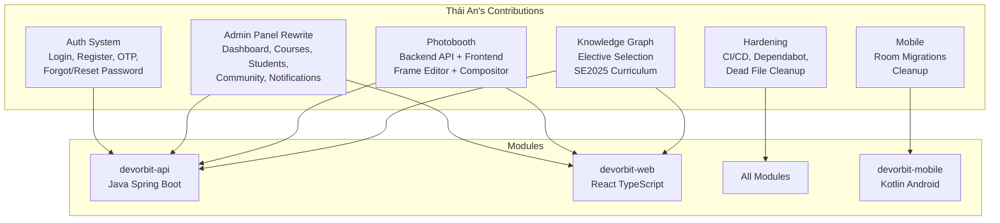
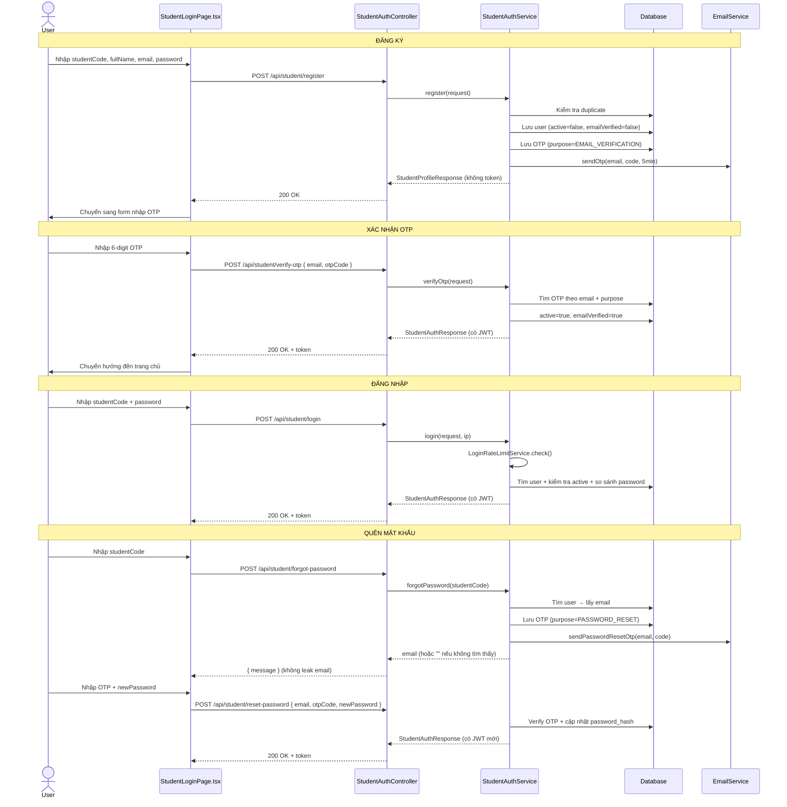
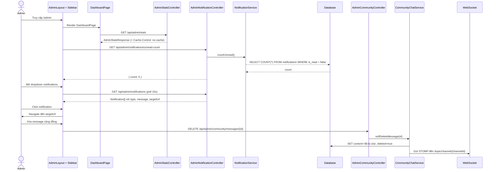
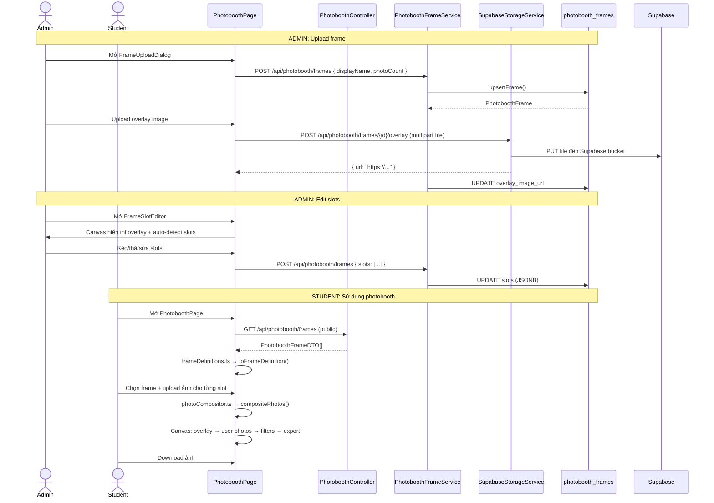

# Hướng dẫn hiểu toàn bộ code tôi đã push

## 1. Bức tranh tổng thể

### DevOrbit là gì?

DevOrbit là một nền tảng giáo dục dành cho sinh viên Khoa học Máy tính, cho phép:

- **Tra cứu môn học** theo chương trình đào tạo SE2025
- **Xây dựng lộ trình học tập** bằng knowledge graph trực quan
- **Kết nối cộng đồng** qua chat channels theo môn học, tech stack
- **Tra cứu GitHub repositories** mẫu cho đồ án
- **Chụp ảnh photobooth** với khung hình tùy chỉnh
- **Theo dõi GPA**, đánh giá môn học, AI tutor

Hệ thống gồm 3 module chính:

```
┌─────────────────────────────────────────────────────────┐
│                    DevOrbit System                       │
├───────────────────┬───────────────────┬─────────────────┤
│  devorbit-api      │  devorbit-web     │ devorbit-mobile │
│  (Spring Boot 21)  │  (React 19+Vite)  │ (Kotlin/Gradle) │
│                    │                    │                 │
│  REST API          │  Admin panel      │  Android app    │
│  JWT auth          │  Student pages    │  Offline sync   │
│  PostgreSQL/Supabase│  Photobooth      │  Room database  │
│  WebSocket         │  Knowledge Graph  │                 │
└───────────────────┴───────────────────┴─────────────────┘
```

### Phần việc của Thái An (HufaCung) trải rộng trên cả 3 module



---

## 2. Bản đồ commit của tôi

**Tổng số commit trên master**: ~108 unique commits (352 commits tổng thể bao gồm duplicated trên các branch).

**Author identities**:
- `HufaCung <24520071@gm.uit.edu.vn>` — đa số commit
- `Thái An <24520071@gm.uit.edu.vn>` — các merge pull request

### Timeline theo giai đoạn

| Giai đoạn | Thời gian | Số commit | Tính năng chính |
|-----------|-----------|-----------|-----------------|
| 1. Auth cơ bản | 09/05/2026 | 7 | Email verification, OTP, login, register |
| 2. Photobooth + Knowledge Graph | 11-15/05/2026 | ~40 | Frame management, compositor, elective selection, SE2025 |
| 3. Mobile init | 12/05/2026 | 6 | Room database, migrations |
| 4. API restructuring | 22/05/2026 | 6 | Major API refactor |
| 5. Merge & cleanup | 29/05-01/06/2026 | ~30 | Dead file removal, CI/CD, Dependabot, hardening |
| 6. OTP + Forgot Password hoàn chỉnh | 06-09/06/2026 | ~10 | Purpose-based OTP, forgot/reset password, tests |
| 7. Admin Panel Rewrite | 12-17/06/2026 | ~20 | Full admin rewrite, notifications, community chat, polish |

### Commit dependency

- Các commit trong cùng giai đoạn thường là sửa lỗi của nhau (vd: `a72dcdaf` fix lỗi từ `a06828c2`)
- Admin rewrite (`8e9d943e`) → Notification system (`aa3f8d32`) → Final polish (`245acbe0`)
- Photobooth backend (`36a9159e`) → Serialization fix (`0a6f5dfe`) → UI hoàn thiện (`9291144b`)

**Trạng thái hiện tại**: Tất cả commit đều đang ở trên `origin/master` (commit cuối `753e2703` là merge từ Bắc). Branch `TA/current-changes` chứa WIP chưa merge.

---

## 3. Các tính năng tôi đã xây dựng

### 3.1 Hệ thống xác thực người dùng (Auth System)

#### Vấn đề cần giải quyết

Hệ thống cần cho phép sinh viên đăng ký tài khoản, đăng nhập, xác thực email qua OTP, và khôi phục mật khẩu. Nếu không có OTP, tài khoản giả mạo có thể được tạo hàng loạt. Nếu không có forgot password, sinh viên quên mật khẩu sẽ không thể truy cập.

#### Giải pháp

Luồng xác thực hai bước: Đăng ký → Gửi OTP → Xác nhận OTP → Kích hoạt tài khoản. JWT token được cấp sau khi OTP được xác nhận. Forgot password dùng OTP riêng (PASSWORD_RESET) thay vì link reset.

#### Luồng chạy thực tế



#### Code quan trọng

**Backend**:

| File | Vai trò |
|------|---------|
| `devorbit-api/.../controller/StudentAuthController.java` | 11 endpoints xác thực |
| `devorbit-api/.../service/StudentAuthService.java` | Logic đăng ký, login, OTP, quên mật khẩu (~314 dòng) |
| `devorbit-api/.../service/EmailService.java` | Gửi email OTP qua SMTP Gmail |
| `devorbit-api/.../service/JwtService.java` | Tạo và validate JWT token |
| `devorbit-api/.../service/OtpRateLimitService.java` | Giới hạn 3 OTP/10 phút |
| `devorbit-api/.../service/LoginRateLimitService.java` | Giới hạn 5 lần đăng nhập sai/15 phút |
| `devorbit-api/.../service/RevokedTokenStore.java` | Blacklist JWT đã logout |
| `devorbit-api/.../config/JwtAuthenticationFilter.java` | Filter kiểm tra JWT mỗi request |
| `devorbit-api/.../config/SecurityConfig.java` | Cấu hình Spring Security, CORS, permitAll |
| `devorbit-api/.../entity/StudentUser.java` | Entity `student_users` |
| `devorbit-api/.../entity/Otp.java` | Entity `otps` với `purpose` enum |
| `devorbit-api/.../repository/StudentUserRepository.java` | JPA repository |
| `devorbit-api/.../repository/OtpRepository.java` | JPA repository |

**Frontend**:

| File | Vai trò |
|------|---------|
| `devorbit-web/src/pages/student/StudentLoginPage.tsx` | 4 mode: login, register, otp, forgot (498 dòng) |
| `devorbit-web/src/pages/student/StudentProfilePage.tsx` | Trang hồ sơ cá nhân |
| `devorbit-web/src/components/student/ProfileDropdown.tsx` | Dropdown avatar |
| `devorbit-web/src/lib/auth.ts` | Quản lý token trong localStorage |
| `devorbit-web/src/lib/api.ts` | API client với auto-attach Bearer token |

**Database tables**:

| Table | Cột quan trọng |
|-------|---------------|
| `student_users` | id, student_code (unique), full_name, email (unique), password_hash, active, email_verified, avatar |
| `otps` | id, email, purpose (EMAIL_VERIFICATION/PASSWORD_RESET), otp_code, expires_at |
| `student_bookmarks` | student_id (FK), target_type, target_id |

**API endpoints** (11 endpoints, tất cả dưới `/api/student/`):

| Method | Path | Auth | Mục đích |
|--------|------|------|----------|
| POST | `/login` | Public | Đăng nhập |
| POST | `/register` | Public | Đăng ký (gửi OTP) |
| POST | `/verify-otp` | Public | Xác nhận OTP → active tài khoản |
| POST | `/resend-otp` | Public | Gửi lại OTP |
| POST | `/forgot-password` | Public | Gửi OTP reset mật khẩu |
| POST | `/reset-password` | Public | Xác nhận OTP + đặt mật khẩu mới |
| POST | `/logout` | STUDENT | Thu hồi JWT |
| GET | `/me` | STUDENT | Lấy thông tin cá nhân |
| PATCH | `/me/avatar` | STUDENT | Cập nhật avatar URL |
| POST | `/me/avatar/upload` | STUDENT | Upload avatar lên Supabase |
| POST | `/me/name` | STUDENT | Cập nhật fullName |
| POST | `/me/password` | STUDENT | Đổi mật khẩu (khi đã login) |

#### Ví dụ đơn giản

Giống như bạn vào một club: bạn đăng ký (ghi danh sách chờ), bạn nhận mã QR qua email, bạn đưa mã QR cho bảo vệ để vào cửa (OTP verification). Khi bạn quên thẻ thành viên, bạn xin cấp lại bằng mã OTP khác (forgot password).

#### Tại sao không làm theo cách đơn giản hơn?

- **Tại sao không dùng OAuth2 (Google Login)?** — Hệ thống yêu cầu student code của trường, không phải tài khoản Google. OAuth2 sẽ không xác thực được mã số sinh viên.
- **Tại sao dùng OTP thay vì link magic?** — OTP đơn giản hơn cho UX trên mobile, không phụ thuộc vào email client render HTML.
- **Tại sao rate limiting?** — Ngăn brute-force OTP (6 số = 1 triệu tổ hợp) và brute-force mật khẩu.

#### Điều gì có thể bị lỗi?

- **OTP hết hạn mà người dùng không nhận được email** → resend-otp có rate limit, không thể spam
- **Email service không config** → `EmailService` graceful fallback: log thay vì throw exception
- **JWT secret default trong production** → `JwtService` block với `IllegalStateException` nếu profile là prod
- **RevokedTokenStore dùng memory** → Mất khi restart server, token cũ vẫn dùng được đến khi hết hạn
- **In-memory rate limit** → Mất khi restart, attacker có thể spam lại từ đầu
- **OTP 6 số chỉ có 1M tổ hợp** → attacker có 3 lần/10ph, cần 3.3 triệu phút (~6 năm) để brute-force

---

### 3.2 Admin Panel Rewrite

#### Vấn đề cần giải quyết

Admin panel cũ là tập hợp các page rời rạc, không có layout chung, không có sidebar, không có hệ thống thông báo. Khó quản lý khi số lượng chức năng tăng lên.

#### Giải pháp

Xây dựng lại toàn bộ với:
- Layout chung: `AdminLayout` (sidebar + topbar + `<Outlet/>`)
- Component dùng chung: `AdminTable`, `AdminSpinner`, `AdminErrorBanner`, `AdminConfirmDialog`, `AdminPageLayout`
- Hook dùng chung: `useAdminFetch` (5-phút cache), `useNotifications`
- Notification system realtime

#### Luồng chạy thực tế



#### Code quan trọng

| File | Vai trò |
|------|---------|
| `devorbit-web/src/components/admin/layout/AdminLayout.tsx` | Layout với sidebar + topbar |
| `devorbit-web/src/components/admin/layout/AdminSidebar.tsx` | Menu điều hướng (collapsible groups) |
| `devorbit-web/src/components/admin/layout/AdminTopbar.tsx` | Thanh trên với NotificationDropdown |
| `devorbit-web/src/components/admin/shared/` | `AdminTable`, `AdminSpinner`, `AdminErrorBanner`, v.v. |
| `devorbit-web/src/hooks/useNotifications.ts` | Polling notification (60s/15s) |
| `devorbit-web/src/pages/admin/DashboardPage.tsx` | Trang dashboard với stats |
| `devorbit-web/src/pages/admin/CoursesPage.tsx` | CRUD môn học |
| `devorbit-web/src/pages/admin/StudentsPage.tsx` | Quản lý sinh viên |
| `devorbit-web/src/pages/admin/CommunityPage.tsx` | Community messages |
| `devorbit-web/src/pages/admin/PhotoboothPage.tsx` | Quản lý frame |
| `devorbit-api/.../controller/AdminNotificationController.java` | Notification CRUD |
| `devorbit-api/.../controller/AdminStatsController.java` | Dashboard stats |
| `devorbit-api/.../controller/AdminCommunityController.java` | Soft-delete message |
| `devorbit-api/.../service/NotificationService.java` | Tạo/mark read notification |
| `devorbit-api/.../service/CommunityChatService.java` | Chat channel + message lifecycle |

#### Các endpoint admin (~50 endpoints)

Xem danh sách đầy đủ ở phần 3.1 của báo cáo phân tích. Nhóm chính:
- `/api/admin/stats` — Dashboard
- `/api/admin/students` — CRUD sinh viên
- `/api/admin/courses` — CRUD môn học
- `/api/admin/repos` — Quản lý repo
- `/api/admin/community/*` — Community messages
- `/api/admin/chat/*` — AI chat sessions
- `/api/admin/techstack` — Tech stack labels
- `/api/admin/notifications` — Notifications
- `/api/admin/reviews/*` — Reviews
- `/api/admin/github/*` — GitHub scan

#### Tại sao không làm theo cách đơn giản hơn?

- Sử dụng nested routing với `<Outlet/>` thay vì flat routing → cho phép layout chung, code gọn hơn
- Notification polling thay vì WebSocket → đơn giản hơn, không cần maintain WebSocket connection cho admin
- 5-phút cache với `useAdminFetch` → giảm số request nhưng có thể stale data

#### Điều gì có thể bị lỗi?

- Notification polling 60s → có thể chậm 60s giữa lúc có notification và lúc hiển thị
- Optimistic update trong notification → nếu API fail, UI sai trạng thái
- Course + TechStack channel lifecycle → khi xóa course, nếu channel đã có message thì deactivate thay vì xóa (ẩn với người dùng)
- Soft-delete community message thay vì hard-delete → storage tăng dần (cần cleanup job sau này)

---

### 3.3 Photobooth Backend API + Frontend

#### Vấn đề cần giải quyết

Tính năng photobooth cho phép sinh viên chụp ảnh với khung hình tùy chỉnh (frame overlay), áp dụng filter, và tải ảnh xuống. Frame có nhiều slot (1-6 ảnh) và có thể tùy chỉnh vị trí.

#### Giải pháp

Backend Spring Boot quản lý frame definitions (JSONB slots), overlay images trên Supabase Storage. Frontend dùng Canvas API để composite ảnh + overlay.

#### Luồng chạy thực tế



#### Code quan trọng

**Backend**:

| File | Vai trò |
|------|---------|
| `devorbit-api/.../entity/PhotoboothFrame.java` | Entity `photobooth_frames` với `JsonNode slots` (JSONB) |
| `devorbit-api/.../dto/PhotoboothFrameDTO.java` | DTO với `@JsonRawValue` slots |
| `devorbit-api/.../repository/PhotoboothFrameRepository.java` | JPA repository |
| `devorbit-api/.../service/PhotoboothFrameService.java` | CRUD frame + xử lý legacy data |
| `devorbit-api/.../service/SupabaseStorageService.java` | Upload file lên Supabase (validate 5MB, MIME types, magic bytes) |

**Frontend**:

| File | Vai trò |
|------|---------|
| `devorbit-web/src/lib/frames/frameDefinitions.ts` | `FrameDefinition` interface, global cache, `reloadFrames()` |
| `devorbit-web/src/lib/frames/frameService.ts` | HTTP client gọi API photobooth |
| `devorbit-web/src/lib/photoCompositor.ts` | Canvas compositing: cover-fit crop, zoom, filters, overlays |
| `devorbit-web/src/lib/photoFilters.ts` | Filter presets (sepia, vintage, cool) |
| `devorbit-web/src/types/frames.ts` | `StoredSlot`, `StoredFrame` types |
| `devorbit-web/src/pages/admin/PhotoboothPage.tsx` | Admin page: quản lý frame |
| `devorbit-web/src/components/admin/photobooth/FrameSlotEditor.tsx` | Canvas editor với auto-detect transparent regions |
| `devorbit-web/src/components/admin/photobooth/FrameUploadDialog.tsx` | Upload dialog |
| `devorbit-web/src/components/admin/photobooth/PhotoboothFrameGrid.tsx` | Grid hiển thị frames |
| `devorbit-web/src/pages/student/PhotoboothPage.tsx` | Student page: chụp + composite |

**API endpoints** (`/api/photobooth/frames`):

| Method | Path | Auth | Purpose |
|--------|------|------|---------|
| GET | `/` | Public | List frames |
| GET | `/{frameId}` | Public | Get frame by ID |
| POST | `/` | ADMIN | Upsert frame |
| DELETE | `/{frameId}` | ADMIN | Delete frame |
| POST | `/{frameId}/overlay` | ADMIN | Upload overlay image (multipart) |

#### Tại sao không làm theo cách đơn giản hơn?

- **JSONB slots thay vì separate table** — slots là dữ liệu phụ thuộc hoàn toàn vào frame, lưu JSONB giảm JOIN, dễ đọc
- **Canvas compositing thay vì server-side rendering** — giảm tải server, tận dụng GPU client, realtime preview
- **Supabase Storage thay vì local filesystem** — có sẵn CDN, dễ scale, không cần quản lý disk
- **`@JsonRawValue` trên DTO slots** — giải quyết vấn đề double-serialization khi Jackson serialize String chứa JSON

#### Vấn đề double-serialization slots

Đây là bug quan trọng đã được fix. Ban đầu `slots` là `String` trong entity với `@JdbcTypeCode(SqlTypes.JSON)`. Hibernate + Jackson serialize `String` thành JSON string literal (`"[{\"id\":\"s1\"}]"`) thay vì JSON array (`[{"id":"s1"}]`).

Fix: đổi `String` → `JsonNode` trong entity, dùng `@JsonRawValue` + `setSlots(Object)` auto-serialize trong DTO.

#### Điều gì có thể bị lỗi?

- **Supabase bucket config** — cần bucket public hoặc signed URL, nếu misconfig thì ảnh không load được
- **Canvas cross-origin** — overlay image từ Supabase có thể gây CORS error khi `canvas.toBlob()`
- **Memory với ảnh lớn** — compositing nhiều ảnh HD trên Canvas có thể crash browser
- **Legacy slots format** — `toDTO()` handle `isTextual()` nhưng không test kỹ
- **Repository generic type sai** — `PhotoboothFrameRepository` extends `JpaRepository<PhotoboothFrame, Long>` nhưng entity PK là `UUID`

---

### 3.4 Knowledge Graph + SE2025 Curriculum

#### Vấn đề cần giải quyết

Sinh viên cần visual hóa chương trình đào tạo SE2025, thấy mối quan hệ giữa các môn học (tiên quyết, song hành), chọn môn tự chọn, và xây dựng lộ trình học tập.

#### Giải pháp

Force-directed graph 2D (`react-force-graph-2d`) hiển thị môn học theo semester columns. Môn bắt buộc (25 môn KTPM) + môn tự chọn được mapping từ `CurriculumConstants.java`.

#### Luồng chạy thực tế

```
Student mở GalaxyPage
→ GET /api/courses/graph
→ KnowledgeGraphService.getGraph()
  → Load tất cả courses từ DB
  → Filter MANDATORY_CODES (25 môn)
  → Map semester từ CURRICULUM_SEMESTERS
  → Build GraphNode + GraphLink từ CourseRelationshipService
  → Topological sort (BFS trên PREREQUISITE edges)
  → Impact scoring (reachable * 0.4 + depth * 0.3 + bottleneck * 0.3)
  → Cache kết quả (@Cacheable)
→ ForceGraph2D render với COLUMN_WIDTH = 240px
→ Student click elective group → floating card hiển thị courses trong group
```

#### Code quan trọng

| File | Vai trò |
|------|---------|
| `devorbit-api/.../service/KnowledgeGraphService.java` | Xây dựng graph data |
| `devorbit-api/.../constant/CurriculumConstants.java` | `MANDATORY_CODES`, `CURRICULUM_SEMESTERS`, `ELECTIVE_CODES` |
| `devorbit-api/.../entity/Course.java` | Entity `courses` với prerequisite, semester, loaiMonHoc |
| `devorbit-api/.../controller/PublicCourseController.java` | `GET /api/courses/graph` |
| `devorbit-web/src/pages/student/knowledge-graph/GalaxyPage.tsx` | ForceGraph2D với semester columns |
| `devorbit-web/src/pages/student/knowledge-graph/ui/GalaxyOverlay.tsx` | Legend + controls |

#### Tính năng elective selection

- Hiển thị group nodes (TC_CSN, TC_CN, TC_CN_PM, TC_CN_GAME, TC_TN) dạng dashed-border
- Click vào group node → floating card popover
- Fetch `GET /api/courses/elective-group/{groupCode}` → `CourseSummary[]`
- Cho phép chọn môn tự chọn để thêm vào lộ trình

#### Fix totalCredits

Trước fix: `totalCredits` tính từ tất cả nodes (gồm cả môn chưa xếp semester). Sau fix: chỉ tính từ visible columns (môn đã được xếp vào semester). Điều này tránh inflate tổng số tín chỉ.

---

### 3.5 Hardening: CI/CD, Dependabot, Dead File Cleanup

#### Vấn đề cần giải quyết

Repository không có CI pipeline, không có dependency scanning, chứa nhiều file chết (AST cache 4,739 files, 22.6MB assets không dùng, 33 file Kotlin dead, 18 file web dead), code style không đồng nhất.

#### Giải pháp

**CI/CD** (`.github/workflows/ci.yml` + `security.yml`):
- `ci.yml`: Chạy trên PR vào master
  - `api-check`: JDK 21 + `mvnw compile -B`
  - `web-check`: Node 20 + `npm ci` → `tsc --noEmit` → `npm test`
- `security.yml`: Weekly schedule
  - npm audit cho web + showcase
  - OWASP dependency-check cho API

**Dependabot** (`.github/dependabot.yml`): 6 ecosystems (npm x2, pip, maven, gradle, github-actions), weekly schedule.

**Dead file cleanup**:

| Đợt | Files | Dòng xóa | Chi tiết |
|-----|-------|----------|----------|
| API | 2 files + nhiều imports | ~50 | `ElectiveGroupConfig.java`, `ElectiveGroupResponse.java`, unused methods |
| Web | 18 files | 1,560 | Scene components, motion hooks, theme, `PhotographPage.tsx` |
| Mobile | 33 files | 3,248 | 5 screens, 8 engines, 8 tests, 8 models, 4 repositories |
| Showcase | 10 assets | 22.6MB | 3D models, fonts, PDF, icons |
| graphify-out | ~4,739 files | — | AST cache (untracked via .gitignore) |
| Docs | 10+ files | — | Stale plans, orphaned .md |

**Repository protection** (`.github/CODEOWNERS`, `SECURITY.md`, `CONTRIBUTING.md`, PR/issue templates).

**Code quality** (`.editorconfig`, `.gitattributes`, ESLint flat config).

---

### 3.6 DevOrbit Mobile - Room Database Migrations

#### Vấn đề cần giải quyết

Mobile app cần local database với Room, nhưng chưa có migration infrastructure. Nếu schema thay đổi, app sẽ crash với `MigrationNotFoundException`.

#### Giải pháp

Room database version 3 với 4 entities, schema export enabled, và migration placeholder.

```kotlin
// DevOrbitDatabase.kt
@Database(
    entities = [CourseEntity::class, RepoEntity::class, 
                CourseRelationshipEntity::class, TaskEntity::class],
    version = 3,
    exportSchema = true
)
abstract class DevOrbitDatabase : RoomDatabase() { ... }

// DevOrbitMigrations.kt
val MIGRATION_3_4 = object : Migration(3, 4) {
    override fun migrate(database: SupportSQLiteDatabase) {
        // Placeholder - no schema changes yet
    }
}
```

**Cảnh báo**: `MIGRATION_3_4` là no-op (empty). Nếu có schema change thật sự mà migration không được cập nhật, app sẽ crash.

---

### 3.7 Các fix quan trọng khác

| Commit | Vấn đề | Giải pháp |
|--------|--------|-----------|
| `89a0ac3a` | Vietnamese text mojibake (UTF-8 double-encoding) | Rewrite 66 strings with correct UTF-8 byte sequences |
| `4ec642d0` | React Strict Mode gọi setCachedMessages trong state updater 2 lần | Move ra ngoài, dùng ref để tránh stale closure |
| `ee49eb08` | GithubScanServiceTest fail vì WebFlux 7.x thiếu Jackson2JsonDecoder | Thêm `ExchangeStrategies` với Jackson2JsonDecoder |
| `1de34dcd` | 2 TypeScript errors (missing module, missing import) | Tạo stub AiTutorPage + thêm import useNavigate |
| `abbf8b89` | Dropdown loaiMonHoc không khớp DB values | Mapping đúng giá trị (`CN` thay vì `CHUYEN_NGANH`) |

---

## 4. Những khái niệm nền tảng xuất hiện trong code

### 4.1 JWT (JSON Web Token)

**Giải thích đơn giản**: Giống như một vé vào cửa có chữ ký. Server ký vào vé, và mỗi lần bạn vào cửa, bảo vệ chỉ cần kiểm tra chữ ký mà không cần gọi điện hỏi lại.

**Cách hoạt động**: Dùng `io.jsonwebtoken` (jjwt) để tạo token HMAC-SHA256 với claims: `id` (jti UUID), `subject` (studentCode), `type` (STUDENT/ADMIN). Token có TTL 120 phút.

**Trong repository này**:
- `devorbit-api/.../service/JwtService.java` — generate/validate
- `devorbit-api/.../config/JwtAuthenticationFilter.java` — extract từ header, check revocation
- `devorbit-api/.../config/JwtProperties.java` — cấu hình secret + expiration

**Tại sao cần**: Stateless authentication, không cần session, dễ scale.

**Điều gì sẽ hỏng**: Không có JWT → mỗi request phải gửi credentials, không scale được.

### 4.2 Dependency Injection (Spring)

**Giải thích đơn giản**: Giống như bạn order đồ ăn, không cần tự nấu. Spring tự động tạo các dependency và "tiêm" vào class.

**Cách hoạt động**: `@Service`, `@Repository`, `@Controller` → Spring tạo bean, inject qua constructor.

**Trong repository**: Mọi service đều dùng constructor injection: `StudentAuthService(StudentUserRepository, OtpRepository, JwtService, EmailService, ...)`.

**Tại sao cần**: Dễ test (mock dependencies), dễ thay đổi implementation.

### 4.3 OTP và Rate Limiting

**Giải thích đơn giản**: OTP là mã dùng một lần (giống mã PIN gửi qua SMS). Rate limiting là giới hạn số lần thử (như ATM khóa thẻ sau 3 lần nhập sai).

**Cách hoạt động**: `OtpRateLimitService` dùng `ConcurrentHashMap<String, List<Instant>>` lưu timestamp, check threshold 3 lần/10 phút. Tự động cleanup expired entries.

**Trong repository**: OTP với `purpose` enum phân biệt EMAIL_VERIFICATION và PASSWORD_RESET. Expires sau 5 phút.

**Điều gì sẽ hỏng**: Không rate limit → attacker brute-force OTP (1M combinations × unlimited tries).

### 4.4 WebSocket (STOMP)

**Giải thích đơn giản**: WebSocket là kết nối hai chiều giữa browser và server. Với HTTP thường, client phải hỏi (`poll`) server liên tục. WebSocket cho phép server tự động gửi dữ liệu khi có sự kiện.

**Cách hoạt động**: Spring WebSocket + STOMP protocol. Client subscribe `/topic/channel/{id}`, server publish message khi có tin nhắn mới hoặc soft-delete.

**Trong repository**:
- `useCommunitySocket` hook ở frontend
- `CommunityChatService.sendMessage()` publish STOMP message sau khi save vào DB
- Soft-delete cũng publish cùng topic, frontend replace nếu `id` đã tồn tại

**Tại sao cần**: Chat realtime không cần polling. Tin nhắn hiển thị ngay lập tức.

### 4.5 JSONB và Hibernate JSON Mapping

**Giải thích đơn giản**: JSONB là kiểu dữ liệu PostgreSQL cho phép lưu JSON và query bên trong nó. Hibernate mapping cho phép đọc/ghi JSON object trực tiếp từ Java.

**Cách hoạt động**: Entity field `JsonNode slots` + `@JdbcTypeCode(SqlTypes.JSON)` → Hibernate tự serialize/deserialize.

**Trong repository**: `PhotoboothFrame.slots` lưu vị trí các slot trong frame.

**Điều gì hỏng nếu sai**: Double-serialization bug (đã fix): String chứa JSON → Hibernate serialize lại → `"[{...}]"` thay vì `[{...}]`.

### 4.6 Composite Pattern (Canvas)

**Giải thích đơn giản**: Ghép nhiều lớp ảnh chồng lên nhau, giống như Photoshop layers.

**Cách hoạt động**: HTML Canvas API: load ảnh → vẽ background → vẽ user photos với crop/zoom → vẽ vector overlays → vẽ overlay image → apply pixel filters → export.

**Trong repository**: `devorbit-web/src/lib/photoCompositor.ts` — `compositePhotos()` thực hiện toàn bộ quy trình.

### 4.7 Room Database (Android)

**Giải thích đơn giản**: Room là ORM cho SQLite trên Android, giống Hibernate cho Java. Cho phép định nghĩa entity, truy vấn bằng annotation.

**Cách hoạt động**: `@Entity` class → table. `@Dao` interface → queries. `@Database` class → database instance. Migrations xử lý schema change.

**Trong repository**: `devorbit-mobile/app/src/main/java/.../data/local/DevOrbitDatabase.kt` — version 3, 4 entities.

---

## 5. Những quyết định kỹ thuật tôi cần bảo vệ

### 5.1 In-memory rate limiting thay vì database

- **Đã chọn**: `ConcurrentHashMap` trong `OtpRateLimitService` và `LoginRateLimitService`
- **Ưu điểm**: Không cần DB query, không tạo thêm table, performance cao
- **Nhược điểm**: Mất khi restart server, không scale được với multiple instances
- **Có thể thay bằng**: Redis (cho production) hoặc DB table (cho đơn giản)
- `Verified from code/history`

### 5.2 `@JsonRawValue` + POJO thay vì `record` cho PhotoboothFrameDTO

- **Đã chọn**: POJO với `@JsonRawValue` và `setSlots(Object)` auto-serialize
- **Lý do**: Fix double-serialization bug. `record` không cho phép custom getter logic
- `Verified from code/history`

### 5.3 Soft-delete community messages thay vì hard-delete

- **Đã chọn**: Set `deleted=true`, replace content, WebSocket update
- **Lý do**: Không mất dữ liệu chat history, tránh FK constraint issues, có thể undo
- **Nhược điểm**: Storage tăng, cần cleanup job sau này
- `Reasonable inference`

### 5.4 Notification polling thay vì WebSocket

- **Đã chọn**: Polling 60s (badge) / 15s (dropdown open)
- **Lý do**: Đơn giản hơn WebSocket cho admin pages, không cần maintain connection
- `Reasonable inference`

### 5.5 Cache-Control: no-cache cho admin stats

- **Đã chọn**: `CacheControl.noCache().mustRevalidate()`
- **Lý do**: Stats data cần realtime, không muốn browser cache stale data
- `Verified from code/history`

### 5.6 Room MIGRATION_3_4 là no-op

- **Đã chọn**: Empty migration
- **Lý do**: Chưa có schema change thực sự, chỉ tạo infrastructure
- **Cảnh báo**: Nếu ai modify entities mà quên update migration, app sẽ crash
- `Verified from code/history`

### 5.7 Loại bỏ `.gitattributes` 54 dòng thành 1 dòng `* text=auto`

- **Đã chọn**: `* text=auto` — để Git auto-detect text vs binary
- **Trước**: 54 dòng per-extension rules
- **Lý do**: Dễ maintain, Git auto-detect tốt hơn danh sách thủ công
- `Verified from code/history`

---

## 6. Những phần tôi có nguy cơ không hiểu

### 6.1 `@JsonRawValue` + DTO slots logic

Đây là kỹ thuật nâng cao. `PhotoboothFrameDTO.getSlots()` dùng `@JsonRawValue` để trả về raw JSON string thay vì string literal. `setSlots(Object)` dùng `instanceof` để xử lý cả String và Object. Nếu không hiểu cơ chế Jackson serialization, bạn không thể giải thích tại sao bug xảy ra và tại sao fix này đúng.

### 6.2 Canvas pixel-level filter

`photoCompositor.ts` thao tác trực tiếp trên `ImageData.data` (Uint8ClampedArray) để áp dụng sepia/vintage/cool filters. Đây là code dễ bị xem là "AI-slop" vì style khác với phần còn lại. Bạn cần hiểu:
- `ctx.getImageData()` → pixel array RGBA
- Công thức sepia: `r = r*1.07 + g*0.74 + b*0.43 + 20`
- Lý do canvas dirty flag cần set `ctx.filter` trước `drawImage`

### 6.3 OTP purpose-based lookup

OtpRepository tìm OTP mới nhất theo `email + purpose` với `findTopByEmailAndPurposeOrderByCreatedAtDesc()`. Nếu không understand purpose model, bạn sẽ thấy confusion tại sao `verifyOtp` không tìm thấy OTP do dùng sai purpose.

### 6.4 RevokedTokenStore + JWT filter chain

`RevokedTokenStore` dùng `ConcurrentHashMap<String, Instant>` + auto-evict trên lookup. `JwtAuthenticationFilter` kiểm tra revocation trước khi set SecurityContext. Nếu filter sai thứ tự hoặc quên check revocation, token logout vẫn hoạt động.

### 6.5 Spring Security filter chain

SecurityConfig định nghĩa chain: `securityFilterChain(HttpSecurity)`. Thứ tự filter rất quan trọng:
1. CSRF disable
2. STATELESS session
3. `permitAll()` cho auth endpoints
4. `hasAuthority("ROLE_ADMIN")` cho admin endpoints
5. `JwtAuthenticationFilter` chạy trước `UsernamePasswordAuthenticationFilter`

### 6.6 Các merge conflict đã giải quyết

Nhiều commit merge (Merge origin/feature/bac, Merge PRs) yêu cầu resolve conflicts trong `schema.sql`, `Layout.tsx`, `TEST_MATRIX.md`. Nếu không hiểu conflict resolution, bạn không thể giải thích tại sao file có dòng code hiện tại.

---

## 7. Câu hỏi review hoặc vấn đáp có thể gặp

### Basic Understanding

**Q1**: Tại sao dùng OTP thay vì dùng link xác nhận qua email?
- **Đang test**: Hiểu trade-off giữa UX và security
- **Answer**: OTP không phụ thuộc email client render HTML, hoạt động trên mọi thiết bị (kể cả smartwatch), dễ implement resend, không cần quản lý token expiration riêng.
- **Code evidence**: `EmailService.sendOtp()` gửi plain text, `Otp.expiresAt` 5 phút.

**Q2**: OTP 6 số, có cần lo ngại brute-force không?
- **Đang test**: Hiểu attack surface
- **Answer**: Có, 1M combinations. Nhưng `OtpRateLimitService` giới hạn 3 lần/10 phút/key. Với attacker, cần 333,333 lần reset rate limit (~6 năm) để brute-force trung bình.
- **Code evidence**: `OtpRateLimitService.LIMIT = 3`, `WINDOW_DURATION = 10 * 60 * 1000`

### Runtime Flow

**Q3**: Vẽ luồng request từ lúc user nhấn "Đăng ký" đến lúc nhận JWT.
- **Đang test**: Hiểu toàn bộ flow
- **Answer**: Register → OTP gửi email → User nhập OTP → verify-otp → JWT. Xem sequence diagram ở mục 3.1.

**Q4**: Khi admin xóa course, chuyện gì xảy ra với channel chat liên quan?
- **Đang test**: Hiểu channel lifecycle
- **Answer**: `CommunityChatService.createChannel()` tạo channel khi course được tạo. Khi xóa course, nếu channel có messages → `ChatChannel.active = false`, return `{ channelDeactivated: true }`. Nếu không có messages → hard delete.
- **Code evidence**: `AdminCourseController.delete()`, `CourseDeleteResult.channelDeactivated()`

### Architecture

**Q5**: Tại sao không dùng Redis cho rate limiting?
- **Đang test**: Hiểu architectural decisions
- **Answer**: Dùng in-memory vì tính đơn giản và không cần distributed rate limiting (single instance). Redis sẽ cần thêm dependency, config, operational overhead. Tuy nhiên, nếu scale lên multiple instances, cần migrate sang Redis.
- **Code evidence**: `ConcurrentHashMap` trong `OtpRateLimitService`

**Q6**: Tại sao `useNotifications` polling 60s/15s thay vì WebSocket?
- **Đang test**: Hiểu trade-off realtime vs polling
- **Answer**: Notification không yêu cầu realtime nghiêm ngặt. 60s delay cho badge là chấp nhận được. Polling đơn giản hơn WebSocket (không cần maintain STOMP connection cho admin, không cần handle reconnect). Khi dropdown mở, 15s polling cho cảm giác gần realtime.
- **Code evidence**: `useNotifications.ts` với `pollInterval` tham số

### Database

**Q7**: Tại sao `photobooth_frames.slots` là JSONB thay vì table riêng cho slots?
- **Đang test**: Hiểu JSONB use case
- **Answer**: Slots phụ thuộc hoàn toàn vào frame (composition), không query riêng lẻ, không có quan hệ với entity khác. JSONB giảm JOIN, đọc nhanh hơn, dễ quản lý. Nếu cần query "tìm frame có slot width > 500", JSONB operators có thể handle.
- **Code evidence**: `@JdbcTypeCode(SqlTypes.JSON)` + `JsonNode`

**Q8**: Room MIGRATION_3_4 là empty. Chuyện gì xảy ra nếu thêm column vào entity?
- **Đang test**: Hiểu Room migration mechanism
- **Answer**: Nếu thêm column mà không update migration, Room throw `MigrationNotFoundException`. App crash. Phải viết migration thật: `ALTER TABLE ... ADD COLUMN ...`.
- **Code evidence**: `DevOrbitMigrations.kt` — `MIGRATION_3_4` no-op

### Security

**Q9**: Làm thế nào để prevent OTP reuse attack?
- **Đang test**: Hiểu security design
- **Answer**: OTP bị xóa sau khi verify thành công (`otpRepository.delete(existingOtp)`). OTP có expires_at. Mỗi lần gửi lại, OTP cũ bị xóa. Rate limit 3 lần/10 phút.
- **Code evidence**: `StudentAuthService.verifyOtp()` → `otpRepository.delete(existingOtp)`

### Performance

**Q10**: Admin dashboard load chậm vì query stats. Có thể tối ưu thế nào?
- **Đang test**: Hiểu caching và query optimization
- **Answer**: Hiện tại đã có `Cache-Control: no-cache` (revalidate) + frontend 5-minute cache (`useAdminFetch`). Có thể thêm: DB materialized view cho stats, Redis cache, hoặc async stats computation.
- **Code evidence**: `AdminStatsController` với `@Cacheable` (chưa implement)

---

## 8. Bài kiểm tra Feynman

Tự kiểm tra bằng cách giải thích không nhìn code.

### Task 1: Giải thích auth flow cho người không kỹ thuật

Giải thích: "Làm thế nào để một sinh viên đăng ký và đăng nhập?"

**Rubric**: `0` = không giải thích được / `1` = nói được "gửi mã" / `2` = nói được register→OTP→verify→JWT / `3` = giải thích được rate limit, purpose, no-info-leak

### Task 2: Vẽ lại architecture diagram từ memory

Vẽ sơ đồ: Frontend → API → Service → Repository → Database cho 1 request bất kỳ.

**Rubric**: `0` = không vẽ / `1` = vẽ được Frontend và Backend / `2` = vẽ được đủ 5 layers + data flow / `3` = vẽ được + chỉ ra được exception path

### Task 3: Dự đoán behavior khi EmailService bị lỗi

Câu hỏi: "Nếu SMTP server không khả dụng, chuyện gì xảy ra khi user register?"

**Rubric**: `0` = không biết / `1` = "sẽ crash" / `2` = "EmailService log error, registration vẫn thành công nhưng OTP không gửi được" / `3` = giải thích được try-catch, graceful degradation, cần retry queue

### Task 4: Xác định data validation points

Chỉ ra tất cả nơi dữ liệu được validate trong auth flow.

**Rubric**: `0` = không xác định / `1` = nói được frontend validation / `2` = thêm backend @NotBlank, @Email / `3` = thêm Business validation: duplicate studentCode, duplicate email, inactive account, expired OTP, wrong purpose

### Task 5: Giải thích `@JsonRawValue`

"Tại sao DTO dùng `@JsonRawValue` cho slots field?"

**Rubric**: `0` = không biết / `1` = "để fix bug" / `2` = "tránh double-serialization" / `3` = "vì entity lưu JsonNode, DTO cần serialize slots như raw JSON array, không phải JSON string. Dùng POJO thay record vì cần custom getter."

### Task 6: So sánh polling vs WebSocket cho notifications

"Chọn polling hay WebSocket? Vì sao?"

**Rubric**: `0` = không biết / `1` = "WebSocket tốt hơn" / `2` = "Polling đơn giản, nhưng WebSocket realtime hơn" / `3` = "Polling 60s cho badge là đủ, không cần realtime nghiêm ngặt. WebSocket phức tạp hơn: cần maintain connection, handle reconnect, heartbeat, memory leak. Trade-off là 60s delay khi có notification mới."

### Task 7: Debug scenario

"User report: 'Tôi đăng ký thành công, nhận được OTP, nhập OTP, nhưng server trả về lỗi 400.' Bạn debug thế nào?"

**Rubric**: `0` = không biết / `1` = "kiểm tra log" / `2` = kiểm tra OTP còn hạn không, đúng purpose không, đúng email không / `3` = kiểm tra: expired_at, purpose mismatch, email đã verified, rate limit, có OTP cũ bị xóa chưa, có duplicate submission không

### Task 8: Giải thích totalCredits fix

"Tại sao phải fix totalCredits?"

**Rubric**: `0` = không biết / `1` = "tính sai" / `2` = "tính từ tất cả nodes gồm cả môn chưa xếp" / `3` = "visible columns là semester-assigned courses. Nếu không fix, môn chưa xếp vào semester nào vẫn được tính vào tổng TC, gây confusion cho sinh viên. Color-coded capacity bar cũng dựa trên totalCredits nên cần chính xác."

---

## 9. Kế hoạch học lại theo mức ưu tiên

### P0 — Must understand before presenting

| Chủ đề | Files cần đọc | Tại sao quan trọng | Bài tập thực hành |
|--------|--------------|-------------------|-------------------|
| Auth flow (register → OTP → login → forgot/reset) | `StudentAuthController.java`, `StudentAuthService.java`, `StudentLoginPage.tsx` | Core feature, sẽ bị hỏi nhiều nhất | Trace từng dòng code của login flow |
| JWT + Security config | `JwtService.java`, `JwtAuthenticationFilter.java`, `SecurityConfig.java` | Hiểu authentication mechanism | Vẽ filter chain + explain mỗi filter làm gì |
| OTP purpose-based model | `Otp.java`, `OtpRepository.java`, test cases | Bug hay gặp, purpose wrong gây 400 | Chỉ ra sự khác biệt giữa `EMAIL_VERIFICATION` và `PASSWORD_RESET` flow |
| Photobooth double-serialization fix | `PhotoboothFrameDTO.java`, `PhotoboothFrame.java` | Nếu bị hỏi "tại sao lưu JSON bị lỗi" mà không trả lời được → mất điểm | Giải thích tại sao `String` + `@JdbcTypeCode(SqlTypes.JSON)` fail |

### P1 — Important implementation details

| Chủ đề | Files cần đọc | Tại sao quan trọng |
|--------|--------------|-------------------|
| Admin panel layout + routing | `AdminLayout.tsx`, `router.tsx` (admin routes) | Hiểu cách admin pages được tổ chức |
| Notification system | `useNotifications.ts`, `NotificationDropdown.tsx`, `NotificationService.java` | Implementation pattern (polling + optimistic update) |
| Rate limiting | `OtpRateLimitService.java`, `LoginRateLimitService.java` | Security feature, có thể hỏi trade-off |
| Soft-delete community | `CommunityChatService.java`, `AdminCommunityController.java` | WebSocket + soft-delete pattern |
| Knowledge Graph | `KnowledgeGraphService.java`, `CurriculumConstants.java` | Hiểu elective selection logic |
| CI/CD workflows | `.github/workflows/ci.yml`, `security.yml` | Infrastructure, có thể hỏi "tại sao thiếu mobile job?" |
| Dead file cleanup scope | Các commit `89f66874`, `689471c9`, `83c7b598` | Hiểu phạm vi refactoring |

### P2 — Deeper architecture knowledge

| Chủ đề | Files cần đọc | Tại sao quan trọng |
|--------|--------------|-------------------|
| Canvas compositing | `photoCompositor.ts` | Code phức tạp, dễ bị hỏi |
| FrameSlotEditor auto-detect | `FrameSlotEditor.tsx` | Flood-fill algorithm + coordinate scaling |
| Course + TechStack channel lifecycle | `CommunityChatService.createChannel()`, `AdminCourseController.delete()` | Cross-module interaction |
| RevokedTokenStore + auto-eviction | `RevokedTokenStore.java` | Concurrency pattern |

### P3 — Optional improvements

| Chủ đề | Files cần đọc | Tại sao quan trọng |
|--------|--------------|-------------------|
| Room migrations | `DevOrbitMigrations.kt`, `DevOrbitDatabase.kt` | Chỉ cần nếu hỏi mobile |
| Dependabot config | `.github/dependabot.yml` | Biết là được |
| .editorconfig | `.editorconfig` | Code style convention |
| ESLint config | `devorbit-web/eslint.config.js` | Tooling |

---

## 10. Tóm tắt một trang

### DevOrbit — Môn học tốt nghiệp (UIT)

**Mục đích**: Nền tảng hỗ trợ sinh viên KTPM tra cứu môn học, xây dựng lộ trình, kết nối cộng đồng, chụp ảnh photobooth.

**Major components** (của Thái An):
- **Auth System**: 11 endpoints, OTP 2-purpose, JWT, rate limiting, 16 tests
- **Admin Panel**: 50+ endpoints, notification system, sidebar layout, soft-delete community
- **Photobooth**: 5 endpoints, Canvas compositing, JSONB slots, Supabase Storage
- **Knowledge Graph**: Force-directed graph, elective selection, SE2025 curriculum
- **Hardening**: CI/CD, Dependabot, 5 cleanup batches (~5,000 files removed)
- **Mobile**: Room database v3, migration infrastructure

**Key flows**:
1. Register → OTP verify → JWT → Authenticated requests
2. Admin login → Dashboard stats → CRUD courses/students → Notification
3. Photobooth: Upload frame → Edit slots → User composite → Download

**Important database tables**: `student_users`, `otps`, `courses`, `photobooth_frames`, `chat_channels`, `community_messages`, `notifications`

**Critical endpoints**:
- `POST /api/student/register` + `/verify-otp` + `/login`
- `GET/POST /api/admin/stats` + `/courses` + `/students`
- `GET/POST /api/photobooth/frames` (public GET, ADMIN POST)
- `GET /api/courses/graph`

**Security model**: JWT (HMAC-SHA256), BCrypt passwords, in-memory rate limiting, OTP 5-min TTL, purpose-based validation, no-info-leak forgot-password, token revocation

**External dependencies**: PostgreSQL/Supabase, Gmail SMTP, Supabase Storage, STOMP WebSocket

**Main risks**:
- Rate limiting in-memory → mất khi restart
- OTP purpose wrong → 400 error (đã test kỹ)
- Room MIGRATION_3_4 empty → crash nếu schema thay đổi
- Canvas memory với ảnh lớn
- PhotoboothFrameRepository generic type sai (Long vs UUID)

### 5 điều quan trọng nhất phải giải thích được

1. **Auth flow end-to-end**: Register → OTP → verify → JWT → authenticated request
2. **OTP purpose model**: `EMAIL_VERIFICATION` vs `PASSWORD_RESET`, tại sao cần phân biệt
3. **Photobooth double-serialization bug**: String + JSONB → double-serialization, fix bằng JsonNode + @JsonRawValue
4. **Admin panel architecture**: Layout + Sidebar + Outlet + Notification polling
5. **Dead file cleanup scope**: ~5,000 files removed, 22.6MB freed, CI/CD pipelines added
