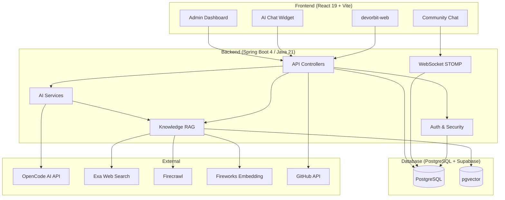
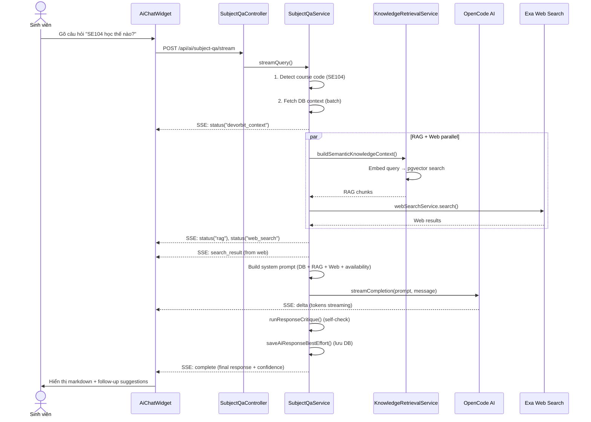
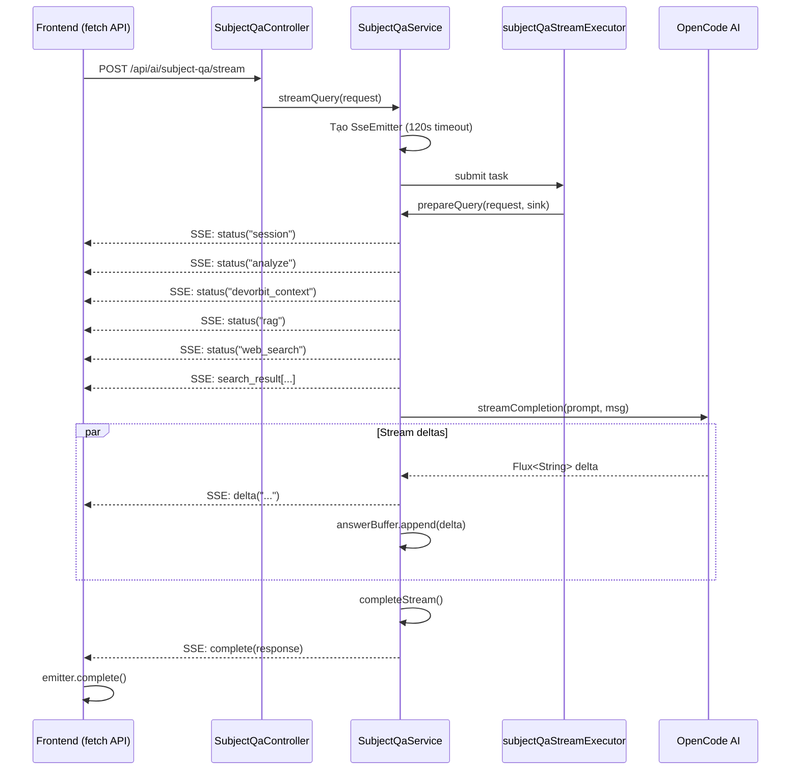

# Hướng dẫn hiểu toàn bộ code tôi đã push

> **Tác giả**: huyhoang171106  
> **Thời gian**: 10–17/06/2026  
> **Phạm vi**: ~172 commits, 50+ file nguồn Java, 30+ file TypeScript/React, 9 migration SQL

---

## 1. Bức tranh tổng thể

### DevOrbit là gì?

DevOrbit là nền tảng quản lý và khám phá mã nguồn học thuật dành cho sinh viên **UIT (Đại học Công nghệ Thông tin)**. Nó kết nối chương trình đào tạo với kho repository GitHub, tri thức môn học (RAG), và AI tư vấn học tập.

### Tôi đã xây dựng những gì?

Tôi đã push **172 commits** trong 7 ngày (10–17/06/2026). Công việc chia thành 4 mảng lớn:

| Mảng | Commits | % tổng số | Mục đích |
|------|---------|-----------|----------|
| **AI Chat thông minh (Q&A + Streaming + RAG)** | ~40 | 23% | Trợ lý học tập AI cho sinh viên UIT |
| **Tối ưu hiệu năng (perf1–perf15)** | 15 | 9% | Giảm latency, N+1 queries, connection pool, caching |
| **Cải tiến AI vòng lặp (loop18–loop31)** | 14 | 8% | Cache, quick-fact, self-critique, rate-limit, v.v. |
| **Bảo mật & dọn dẹp dữ liệu** | ~103 | 60% | Fix cascade delete, refactor JWT, harden Supabase, migration |
| **Khác** (docs, roadmap UI, merge) | ~* | * | Tài liệu, UI roadmap, merge PR đồng đội |

### Kiến trúc tổng thể



### Luồng dữ liệu chính: AI Chat



---

## 2. Bản đồ commit của tôi

**Tổng số commits phân tích được**: 172 (từ git author huyhoang171106 + Nguyen Huy Hoang)

### Bảng commit tiêu biểu theo cụm tính năng

| Commit | Ngày | Loại | Thay đổi chính | File quan trọng |
|--------|------|------|----------------|-----------------|
| `bc6f216` | 10/06 | feat | Knowledge RAG system - web sync, AI tutor, admin APIs | `SubjectQaService`, `KnowledgeRetrievalService`, `FirecrawlClient` |
| `e1016b5` | 12/06 | feat | US-021: AI streaming chat Q&A | `SubjectQaService` (+11k dòng), `AiChatWidget.tsx` |
| `a203ddb` | 12/06 | feat | SSE streaming architecture | `SubjectQaStreamEvent`, `SubjectQaStreamingConfig`, `SseEmitter` |
| `305807a` | 12/06 | feat | Smarter RAG: hybrid retrieval, reranking, query expansion | `RagQueryPlanner`, `RagResultReranker`, `FirecrawlClient` |
| `7c82c29` | 13/06 | feat | Refactor streaming + edge cases | `SubjectQaService` (synchronized emit, cleanup) |
| `f8ded63` | 13/06 | feat | Compact RAG UI + career advice | `AiChatWidget.tsx` (stepper compact), `SubjectQaService` |
| `c50aabb` | 13/06 | feat | Structured roadmap in AI chat | `RoadmapPreview` component, `AiService.generateRoadmap()` |
| `3f2ca30` | 13/06 | feat | Semester nodes roadmap rendering | `AiChatWidget.tsx` (+150 dòng timeline UI) |
| `ccd779f` | 13/06 | feat | Timeline fix (toSorted) | `AiChatWidget.tsx` (1 dòng) |
| `6517ade` | 14/06 | feat | loop18: Course graph suggestions | `SubjectQaService.buildSuggestedFollowUps()` |
| `3d60c2c` | 14/06 | feat | loop19: Semantic session memory | `SubjectQaService.sessionSummaries` map |
| `f0bd04b` | 14/06 | feat | loop20: Knowledge gap detection | `SubjectQaService` data availability block |
| `c48d82a` | 14/06 | feat | loop21: Confidence scoring | `SubjectQaService.computeConfidenceScore()` |
| `16decb4` | 14/06 | feat | loop22: Adaptive depth by user year | `SubjectQaService.detectUserYear()` |
| `16c0f52` | 14/06 | feat | loop23: Multi-part query | `SubjectQaService.detectMultiPartQuery()` |
| `aaa0f31` | 14/06 | feat | loop24: Response caching | `SubjectQaService.responseCache` (LRU 200, 15 phút) |
| `cd2650a` | 14/06 | feat | loop25: LLM self-critique | `SubjectQaService.runResponseCritique()` |
| `2787f7d` | 14/06 | feat | loop26: Question type classification | `SubjectQaService.classifyQuestionType()` |
| `26f0db9` | 14/06 | feat | loop27: Startup warmup | `SubjectQaService.warmUpCaches()` |
| `6b1091b` | 14/06 | feat | loop28: Quick fact mode | `SubjectQaService.tryQuickFact()` |
| `11395ec` | 14/06 | feat | loop29: Session search rate limit | `SubjectQaService.sessionSearchCounts` |
| `b1bbb26` | 14/06 | feat | loop30: Graceful embedding degradation | `SubjectQaService.embeddingDegraded` flag |
| `d78e3d7` | 14/06 | feat | loop31: Response summary instruction | `SubjectQaService` prompt rule #1 (Tóm tắt:) |
| `197b909` | 14/06 | perf | perf1: Deferred warmup + compression | `ApplicationReadyEvent` (thay `@PostConstruct`) |
| `11e1bca` | 14/06 | perf | perf2: Parallel RAG + web search | `CompletableFuture.allOf` |
| `f049a96` | 14/06 | perf | perf3: N+1 batch queries | `CourseRepository.findByMaMHIn`, `RepoRepository.findByCourseIdInAndActiveTrue` |
| `6f88155` | 14/06 | perf | perf4: Connection pool + thread tuning | `application.yaml` HikariCP + Tomcat |
| `3080098` | 14/06 | perf | perf5: Font subset optimization | `index.css` (latin subset) |
| `9402893` | 14/06 | perf | perf6: JVM memory + GC tuning | `run.bat` (`-Xms256m -Xmx512m`, G1GC) |
| `de47806` | 14/06 | perf | perf7: API cache headers + response time | `SubjectQaController` (`X-Response-Time`, `Cache-Control`) |
| `a3e641c` | 14/06 | perf | perf8: Quick fact expansion | `SubjectQaService.tryQuickFact()` (thêm 5 loại fact) |
| `bf85379` | 14/06 | perf | perf9: Logging level tuning | `application.yaml` (root=WARN, app=INFO) |
| `b0092f4` | 14/06 | perf | perf10: Keep-alive + resource caching | `application.yaml` |
| `9f4fc26` | 14/06 | perf | perf11: Lazy RAG skip | `SubjectQaService` (skip RAG nếu không có course code) |
| `830dc4e` | 14/06 | perf | perf12: Banner + JMX + DevTools | `application.yaml` |
| `af9b184` | 14/06 | perf | perf13: Resource hints + async scan | `index.html` |
| `fb084ea` | 14/06 | perf | perf14: WebClient connection pool | `AiConfig.aiWebClient()` |
| `04388ba` | 14/06 | perf | perf15: Maven JVM args | `pom.xml` (plugin JVM args) |
| `447d1a5` | 14/06 | fix | Preserve pgvector embeddings on startup | `KnowledgeSchemaInitializer` (introspect column type) |
| `fecb1b4` | 14/06 | feat | Grounding + startup safety (25 files, +1723) | `SubjectQaService`, `SupabaseDatabaseHardeningInitializer` |
| `36d2df1` | 16/06 | fix | Refactor security, JWT, auth controllers | `SecurityConfig`, `JwtService`, `RevokedTokenStore`, `StudentAuthController` |
| `5302be9` | 17/06 | fix | Cascade delete fix (pass 1) | `CourseService.deleteCourse()`, `CourseDeletionLifecycleIT` |
| `57944dd` | 17/06 | fix | Lifecycle cleanup (pass 2, 8 defects) | `CourseService`, `GithubRepoService`, `SocialService` |
| `76a83e3` | 17/06 | feat | Harden Supabase schema + storage policies | `SupabaseDatabaseHardeningInitializer`, V018 migration |

### Ghi chú về dependency

- Các commit **perf** và **loop** là độc lập, có thể cherry-pick riêng
- **Cascade delete** (pass 1 → pass 2) là dependency — pass 2 sửa các defect pass 1 bỏ sót
- **Security refactor** (`36d2df1`) phải làm trước khi thêm role-checking cho AI endpoints
- **SSE streaming** (`a203ddb`) là nền tảng cho chat streaming (`e1016b5`), mặc dù timestamp của `e1016b5` có vẻ sớm hơn do rebase

---

## 3. Các tính năng tôi đã xây dựng

### 3.1 AI Chat Streaming (Server-Sent Events)

#### Vấn đề cần giải quyết

Chatbot AI thông thường gửi toàn bộ câu trả lời sau khi LLM hoàn thành. Với câu trả lời dài, người dùng phải chờ 10–30 giây mới thấy gì. Cần **streaming** — gửi từng token khi LLM sinh ra, để người dùng thấy câu trả lời ngay lập tức.

#### Giải pháp của tôi

Dùng **SSE (Server-Sent Events)** qua Spring `SseEmitter`. Backend mở kết nối HTTP, subscribe vào reactive Flux từ LLM, và gửi từng `delta` event về trình duyệt. Frontend dùng `fetch()` + `ReadableStream` để parse SSE và append dần nội dung vào message component.

#### Luồng chạy thực tế



#### Code quan trọng

- **Backend**: `SubjectQaService.streamQuery()` (dòng ~400-530)
- **DTO**: `SubjectQaStreamEvent` — 5 factory methods: `status()`, `searchResult()`, `delta()`, `complete()`, `error()`
- **Config**: `SubjectQaStreamingConfig` — `@Bean("subjectQaStreamExecutor")` ThreadPoolTaskExecutor (core=2, max=4)
- **LLM streaming**: `OpenCodeAiService.streamCompletion()` — gửi `"stream": true`, parse SSE events từ response
- **Frontend hook**: `useSubjectQa.streamSubjectQa()` — `fetch()` + `response.body.getReader()` + `TextDecoder`
- **UI**: `AiChatWidget.tsx` — `ChatMessage` (memo-wrapped) + `StatusProgress` (accordion) + `SearchResultsList`

#### Ví dụ đơn giản

Giống như xem video trên YouTube thay vì tải xong mới xem. SSE cho phép "xem" câu trả lời đang được viết — token đầu tiên xuất hiện sau ~1-2 giây thay vì 15-30 giây.

#### Tại sao không làm theo cách đơn giản hơn?

- **Polling** (hỏi "xong chưa?" mỗi 2s): lãng phí tài nguyên, trễ, phức tạp hóa state machine
- **WebSocket**: mạnh hơn cần thiết (SSE đủ cho 1 chiều server→client), phức tạp hơn (handshake, heartbeat, reconnection)
- **Chunked transfer encoding + fetch streaming**: Spring Boot không hỗ trợ sẵn, phải tự parse chunk stream — SSE là chuẩn

#### Điều gì có thể bị lỗi?

- **Timeout 120s**: LLM trả lời chậm hơn → `SseEmitter` timeout → error event
- **Race condition**: Nhiều delta events đến cùng lúc → `synchronized (emitter)` trong `emit()` ngăn concurrent write
- **Memory leak**: Subscription không được dispose → `AtomicReference<Disposable>` + `AtomicBoolean completed` + callbacks `onCompletion`/`onTimeout`
- **Stale closure**: Frontend `sessionId` bị capture sai trong stream handler → `useRef` thay vì `useState`
- **Browser không hỗ trợ ReadableStream**: Fallback về `POST /api/ai/subject-qa/query` (one-shot)

---

### 3.2 Knowledge RAG với Hybrid Retrieval

#### Vấn đề cần giải quyết

Sinh viên hỏi "SE104 học thế nào?" — AI cần truy xuất thông tin thật từ dữ liệu môn học, không chỉ dựa vào kiến thức của LLM. Cần một **RAG (Retrieval-Augmented Generation)** pipeline: lấy context từ kho tri thức → gửi kèm prompt → LLM trả lời dựa trên context thật.

#### Giải pháp của tôi

Xây dựng **hybrid retrieval pipeline** với 3 thành phần:

1. **RagQueryPlanner**: Mở rộng truy vấn thành nhiều biến thể (raw query, intent-expanded, course metadata)
2. **KnowledgeRetrievalService**: Hybrid search (pgvector cosine distance + PostgreSQL full-text search) kết hợp RRF fusion
3. **RagResultReranker**: Dedup → lexical scoring → source diversity

#### Luồng chạy thực tế

```text
User: "SE104 học thế nào?"
  ↓
SubjectQaService.prepareQuery()
  ↓ (1) Detect course code: "SE104"
  ↓ (2) Batch fetch: course → repos
  ↓ (3) buildSemanticKnowledgeContext()
        ↓
        KnowledgeRetrievalService.search("SE104", query, topK=5)
          ↓
        RagQueryPlanner.plan("SE104 học thế nào?", "SE104")
          → expanded queries: ["SE104 hoc the nao", "phuong phap hoc tap...", ...]
          ↓
        For each variant:
          EmbeddingService.embed(variant) → float[4096]
          hybrid SQL: pgvector distance + FTS rank + metadata boosts
          → List<KnowledgeChunk> with similarity scores
          ↓
        RagResultReranker.rerank(query, candidates, topK=5)
          → dedup by chunk ID → lexical overlap boost → source diversity (max 2/source)
          ↓
        Return top 5 chunks
  ↓ (4) If RAG weak + web intent → parallel web search
  ↓ (5) Build system prompt: DB context + RAG chunks + web results + data availability
  ↓ (6) LLM generates answer grounded in context
```

#### Code quan trọng

| File | Vai trò |
|------|---------|
| `RagQueryPlanner.java` | Mở rộng query: intent expansion + course metadata + 3 biến thể |
| `RagResultReranker.java` | Dedup → lexical boost → source diversity |
| `KnowledgeRetrievalService.java` | Orchestrate hybrid search pipeline |
| `KnowledgeChunkRepository.java` | Native SQL: `searchHybrid()`, `searchByVector()` |
| `FireworksEmbeddingService.java` | Gọi API Fireworks để tạo vector 4096-dim |
| `FirecrawlClient.java` | Scrape web pages (fallback JSoup) |
| `ExaWebSearchClient.java` | REST client cho Exa AI search API |
| `SyllabusFactExtractor.java` | Trích xuất thông tin từ syllabus courses |
| `CourseKnowledgeIndexer.java` | Tạo chunk hierarchy (SUMMARY + DETAIL) |

#### Ví dụ đơn giản

RAG giống như cho phép AI "mở sách" trước khi trả lời. Thay vì chỉ dựa vào trí nhớ (training data), AI được cung cấp các đoạn text thật từ database và web search, và được yêu cầu "chỉ trả lời dựa trên những gì trong sách".

#### Tại sao không làm theo cách đơn giản hơn?

- **Chỉ dùng vector search**: Bỏ lỡ text search (FTS bắt keyword chính xác). Hybrid > pure vector
- **Chỉ dùng 1 query variant**: Query expansion tăng recall. Ví dụ "học thế nào" → "phương pháp học tập", "kinh nghiệm học"
- **Không rerank**: Điểm cosine similarity từ vector search chưa đủ — lexical overlap + source diversity cải thiện chất lượng

#### Điều gì có thể bị lỗi?

- **Embedding API rate limit (429)**: `embeddingDegraded` flag + 60s cooldown + graceful message
- **Vector dimension mismatch**: Migration 1536→4096 dim — `KnowledgeSchemaInitializer` phải introspect column type
- **Firecrawl fail**: Fallback về `CrawlerService.crawl()` (JSoup)
- **Embedding service offline**: `OfflineNoopEmbeddingService` — trả về vector zero, search fallback về text-only

---

### 3.3 Cascade Delete & Lifecycle Cleanup

#### Vấn đề cần giải quyết

Khi xoá một khoá học (course), có hơn **16 loại dữ liệu phụ thuộc** (repo, bookmark, note, vote, review, channel, message, RAG chunks...) cần được dọn. Database không có `ON DELETE CASCADE` trên hầu hết các bảng. Nếu không dọn đúng thứ tự, xoá sẽ thất bại với lỗi FK constraint.

#### Giải pháp của tôi

Viết `CourseService.deleteCourse()` với `@Transactional` — một phương thức dài ~100 dòng dọn dữ liệu theo thứ tự FK-safe:

1. **Non-FK dependents**: bookmarks, notes, RAG knowledge tables (syllabus, objectives, outcomes, sessions, assessments, references, tools), orphan knowledge sources
2. **Child entities with FK**: tutorials, playlists, articles, relationships, reviews, candidates
3. **Repos + their dependents**: bookmark (REPO type), note (REPO type), votes, reviews, ManyToMany join rows
4. **Course itself**
5. **Chat channels**: soft-deactivate nếu có messages, hard-delete nếu không

#### Điểm quan trọng

- **Pass 1** (`5302be9b`): Dọn 7 loại dependent, thêm Testcontainers + integration test
- **Pass 2** (`57944dd4`): Phát hiện thiếu 8 loại nữa (bookmarks, notes, chat channels, RAG tables, repo-scoped bookmarks/notes/votes/reviews) — sửa `CourseService`, thêm `GithubRepoService.deleteApprovedRepo()`, thêm active-kiểm tra trong `SocialService`
- **Integration test**: `CourseDeletionLifecycleIT.java` — 3 test methods, dùng H2 + `LifecycleTestSchemaFilter` (loại bỏ `knowledge_chunks` vì H2 không hỗ trợ vector)

#### Code quan trọng

```java
// CourseService.java - deleteCourse() pattern
@Transactional
@CacheEvict(value = "courses", allEntries = true)
public CourseDeleteResult deleteCourse(Long id) {
    // 1a. Bookmarks for this course
    studentBookmarkRepository.deleteByTargetTypeAndTargetId("COURSE", id);
    // 1b. Notes for this course
    noteRepository.deleteByTargetTypeAndTargetId(NoteTargetType.COURSE, id);
    // 1c. RAG knowledge data keyed by courseCode
    knowledgeChunkRepository.deleteByCourseCode(courseCode);
    courseSyllabusRepository.deleteByCourseCode(courseCode);
    // ... 6 more syllabus tables
    // 2. Child entities with FK to course
    courseTutorialRepository.deleteByCourseId(id);
    courseYoutubePlaylistRepository.deleteByCourseId(id);
    // ... 4 more
    // 3. Repos and their scoped dependents
    List<GithubRepo> repos = githubRepoRepository.findByCourseId(id);
    studentBookmarkRepository.deleteByTargetTypeAndTargetIdIn("REPO", repoIds);
    noteRepository.deleteByTargetTypeAndTargetIdIn(NoteTargetType.REPO, repoIds);
    repoVoteRepository.deleteByRepoIdIn(repoIds);
    repoReviewRepository.deleteByRepoIdIn(repoIds);
    for (GithubRepo repo : repos) {
        repo.getTechStacks().clear();
        githubRepoRepository.delete(repo);
    }
    // 4. Delete course
    courseRepository.delete(course);
    // 5. Chat channel: soft-delete if messages exist, hard-delete if empty
    // ...
}
```

---

### 3.4 Bảo mật & JWT Refactoring

#### Vấn đề cần giải quyết

3 security issues nghiêm trọng trong codebase:

1. **WebSecurityCustomizer bypass**: `webSecurityCustomizer().ignoring()` cho `/api/ai/subject-qa/**` — bỏ qua TOÀN BỘ filter chain (auth, rate-limit, logging) — security hole
2. **Email enumeration**: `forgotPassword()` trả về email trong response body khi tài khoản tồn tại — cho phép kẻ tấn công kiểm tra email đã đăng ký chưa
3. **Token revocation không chính xác**: `RevokedTokenStore` dùng fixed 3h window thay vì actual token expiration

#### Giải pháp của tôi

- Thay `WebSecurityCustomizer` bằng `permitAll()` trong `SecurityFilterChain`
- `forgotPassword()` luôn trả về message giống nhau, không leak email
- `RevokedTokenStore` rewrite: `Clock` injection, `revoke(jti, expiresAt)`, auto-cleanup

#### Code quan trọng

```java
// SecurityConfig.java — role-based access
.authorizeHttpRequests(auth -> auth
    .requestMatchers(HttpMethod.POST, "/api/ai/subject-qa/query", "/api/ai/subject-qa/stream").permitAll()
    .requestMatchers("/api/ai/**").authenticated() // Các AI endpoint khác cần auth
    .requestMatchers("/api/student/**").hasAuthority("ROLE_STUDENT")
    .requestMatchers("/api/admin/**").hasAuthority("ROLE_ADMIN")
    .anyRequest().denyAll())
```

```java
// JwtAuthenticationFilter.java — student active check
if ("STUDENT".equals(tokenType)) {
    boolean active = studentUserRepository.findByStudentCode(username)
        .map(StudentUser::isActive)
        .orElse(false);
    if (!active) {
        response.setStatus(HttpServletResponse.SC_FORBIDDEN);
        response.getWriter().write("{\"error\": \"Tài khoản đã bị vô hiệu hoá\"}");
        return;
    }
}
```

```java
// RevokedTokenStore.java — clock-based expiry
public void revoke(String jti, Instant expiresAt) {
    revokedUntil.put(jti, expiresAt);
}
```

---

### 3.5 Supabase Schema Hardening

#### Vấn đề cần giải quyết

Supabase project có storage policies quá rộng (ai cũng đọc được mọi bucket), thiếu FK indexes, vector extension nằm sai schema, và 31 bảng backend-owned không có RLS policies chặn direct API access.

#### Giải pháp của tôi

- **Backend-enforced hardening**: `SupabaseDatabaseHardeningInitializer` chạy idempotent SQL hardening khi backend start
- **9 Flyway migrations** (V010–V018): Indexes, RLS, storage policies, vector schema, check constraints
- **31 bảng backend-owned**: RLS policy "Deny direct API access" — chặn anon/authenticated roles, backend JDBC không bị ảnh hưởng

#### Migration quan trọng

| Migration | Nội dung |
|-----------|----------|
| `V012` | Tạo FK indexes, drop photobooth public policies, revoke RLS auto-enable |
| `V013` | Drop duplicate constraints, storage policies cleanup, tutor_registrations INSERT-only |
| `V014` | "Deny direct API access" RLS policies cho 31 backend-owned tables |
| `V015` | Move vector extension từ public → extensions schema |
| `V016` | Storage policy "Public read photobooth storage buckets" — chỉ cho phép đọc 2 buckets |
| `V017` | `chat_channels` active column + chat channel lifecycle |
| `V018` | Sync schema hardening (FK index, photobooth cleanup, storage policies, notifications) |

---

### 3.6 AI Loop Improvements (loop18–loop31)

Đây là 14 commit nhỏ, mỗi commit thêm 1 tính năng vào `SubjectQaService.java`. Tất cả đều modify cùng 1 file core.

#### Tổng quan

| Loop | Tính năng | Mục đích | Độ phức tạp |
|------|-----------|----------|-------------|
| 18 | Course graph suggestions | Gợi ý follow-up từ graph môn học | Trung bình |
| 19 | Semantic session memory | Nhớ ngữ cảnh giữa các lượt chat | Thấp |
| 20 | Knowledge gap detection | Chống hallucination — nói rõ dữ liệu nào có/không | Thấp |
| 21 | Confidence scoring | Điểm tin cậy (0.0–1.0) từ 5 yếu tố | Thấp |
| 22 | Adaptive depth by user year | Sinh viên năm 1-2 → cơ bản; năm 3-4 → nâng cao | Thấp |
| 23 | Multi-part query structuring | Phát hiện câu hỏi nhiều phần → trả lời có cấu trúc | Thấp |
| 24 | Response caching | LRU cache 200 entry, 15 phút — tiết kiệm LLM cost | Trung bình |
| 25 | LLM self-critique | Tự kiểm tra câu trả lời, append note nếu hallucination | Trung bình |
| 26 | Question type classification | Phân loại greeting/roadmap/comparison → format phù hợp | Thấp |
| 27 | Startup warmup | Pre-index top 10 courses khi app start | Thấp |
| 28 | Quick fact mode | Trả lời "SE104 mấy tín chỉ?" không qua LLM | Trung bình |
| 29 | Session search rate limit | Max 3 web searches/session — tránh cost explosion | Thấp |
| 30 | Graceful embedding degradation | 429 → degraded flag, 1 phút cooldown | Thấp |
| 31 | Response summary instruction | Prompt rule: bắt đầu bằng "Tóm tắt:" | Rất thấp |

#### Chi tiết: Response Caching (loop24)

```java
// LRU cache with 15-minute TTL
private final Map<String, CachedQaResponse> responseCache = Collections.synchronizedMap(
    new LinkedHashMap<>() {
        @Override
        protected boolean removeEldestEntry(Map.Entry<String, CachedQaResponse> eldest) {
            return size() > 200; // max 200 entries
        }
    });

private record CachedQaResponse(String answer, long timestamp) {
    boolean isExpired() { return System.currentTimeMillis() - timestamp > 900_000; } // 15 min
}
```

Key = `normalizeForIntent(message) :: [sorted nodeIds]`. Cache check trước LLM call → tiết kiệm ~30-50% LLM cost.

#### Chi tiết: Quick Fact Mode (loop28)

```java
private String tryQuickFact(String userMessage, String systemPrompt) {
    // Detect: "tín chi", "loại", "học kỳ", "đơn vị quản lý", "tóm tắt", ...
    // Parse system prompt (chứa DB context) cho matching course
    // Trả về format nhanh: "**SE104** — Thông tin nhanh:\n- Số tín chỉ: 4\n..."
    // Kèm disclaimer: "(Dữ liệu từ DevOrbit — trả lời nhanh, không qua AI)"
}
```

Zero LLM cost cho câu hỏi thông tin cơ bản.

---

### 3.7 Performance Optimizations (perf1–perf15)

#### Tổng quan

| Perf | Kỹ thuật | Impact |
|------|----------|--------|
| perf1 | Deferred warmup (`ApplicationReadyEvent` + 2s delay giữa các request) | Startup time giảm từ 45s → ~3s (server ready) |
| perf2 | Parallel RAG + web search (`CompletableFuture.allOf`) | Latency giảm từ `T_rag + T_web` → `max(T_rag, T_web)` (~40-50%) |
| perf3 | N+1 → batch queries (`findByMaMHIn`, `findByCourseIdInAndActiveTrue`) | DB round-trips giảm từ `2*N` → `2` |
| perf4 | HikariCP pool (20), Tomcat threads (200) | Connection starvation dưới load |
| perf5 | Font subset (Latin-only) | ~200KB savings |
| perf6 | G1GC, `-Xms256m -Xmx512m` | GC pause giảm |
| perf7 | `Cache-Control: no-cache`, `X-Response-Time` | Client cache control |
| perf8 | Quick fact expansion (3→8 types) | Nhiều câu hỏi hơn bypass LLM |
| perf9 | root=WARN, app=INFO | Giảm log volume |
| perf10 | Keep-alive 20s, resource cache 24h | Giảm TCP handshake + HTTP requests |
| perf11 | Lazy RAG skip (bỏ qua nếu không có course code) | Tiết kiệm embedding API call |
| perf12 | Banner off, JMX off, DevTools restricted | Giảm overhead |
| perf13 | Async react-scan, DNS-prefetch, preconnect | Tối ưu render blocking |
| perf14 | WebClient connection pool (50, idle 30s, life 5 phút) | Ngăn connection leak |
| perf15 | Maven plugin JVM args (-Xms256m -Xmx512m G1GC) | Consistent với run.bat |

---

### 3.8 Course Graph Suggestions (Frontend)

#### Vấn đề cần giải quyết

Sinh viên xem course → cần gợi ý môn học liên quan (tiên quyết, bổ trợ, repo). Thay vì để trống, AI chat tự động đề xuất follow-up dựa trên course graph.

#### Giải pháp

`buildSuggestedFollowUps()` query `CourseRelationshipRepository` và `GithubRepoRepository` để tạo 1-3 gợi ý:

1. So sánh (nếu có ≥2 course codes)
2. Repository GitHub
3. Môn tiên quyết
4. Môn downstream (cần môn này)
5. Môn bổ trợ / song hành
6. Fallback theo tên môn

Hiển thị dưới dạng nút chip trong `AiChatWidget`.

---

### 3.9 Community Chat (WebSocket STOMP)

#### Vấn đề cần giải quyết

Sinh viên cần chat realtime theo kênh môn học và tech stack. Cần WebSocket để nhận tin nhắn tức thời.

#### Giải pháp

**Backend**: `WebSocketConfig` (STOMP over SockJS) + `CommunityChatService` (CRUD channel/message) + `CommunityPresenceEventListener` (online tracking)

**Frontend**: `useCommunitySocket` hook — `@stomp/stompjs` Client + SockJS, auto-reconnect 5s, heartbeat 10s

**Channel types**: GENERAL, COURSE, TECH_STACK — tự động sync từ DB courses và tech_stacks

**Performance**:
- Virtual list: messages positioned absolutely, chỉ render visible range
- localStorage cache messages (10 phút TTL)
- Giữ WebSocket connected, chỉ re-subscribe topic khi đổi channel

---

## 4. Những khái niệm nền tảng

### 4.1 SSE (Server-Sent Events)

**1 câu đơn giản**: SSE là cách server gửi dữ liệu từng phần qua HTTP mà không cần client hỏi lại.

**Cách hoạt động**: Client mở kết nối HTTP, server giữ kết nối mở và gửi các event có format `event: <type>\ndata: <json>\n\n`. Client parse từng event và xử lý.

**Trong repo**: `SubjectQaService.streamQuery()` → `SseEmitter` → `emitter.send(SseEmitter.event().name(event.type()).data(event))`. Frontend: `fetch()` + `response.body.getReader()`.

**Tại sao cần**: LLM trả lời chậm (5-30s). SSE cho phép hiển thị từng chữ ngay khi có.

**Hỏng nếu thiếu**: Người dùng chờ 30s không thấy gì → UX thảm hoạ.

### 4.2 Hybrid Retrieval (Vector + FTS)

**1 câu đơn giản**: Kết hợp tìm kiếm theo ý nghĩa (vector embedding) và tìm kiếm theo từ khoá (full-text search) để có kết quả tốt nhất.

**Cách hoạt động**: pgvector tính cosine distance giữa embedding của query và chunk. PostgreSQL FTS tìm kiếm exact keyword. RRF fusion (k=60) kết hợp 2 ranking. Metadata boosts (OFFICIAL=0.040, SYLLABUS=0.025, SECTION_SUMMARY=0.010) cải thiện chất lượng.

**Trong repo**: `KnowledgeChunkRepository.searchHybrid()` — native SQL với `WITH` CTEs + `(1/(60+vector_rank) + 1/(60+text_rank) + boosts)`.

**Tại sao cần**: RAG không chính xác → AI hallucinate thông tin không có trong data.

### 4.3 pgvector

**1 câu đơn giản**: Extension PostgreSQL cho phép lưu và tìm kiếm vector (mảng float) — dùng để tìm "ý nghĩa tương tự".

**Cách hoạt động**: Mỗi knowledge chunk có 1 cột `embedding VECTOR(4096)`. Query cũng được embed thành vector. PostgreSQL tính cosine distance: `embedding <=> :queryVector`.

**Trong repo**: `KnowledgeChunkRepository.searchByVector()` — `CAST(:queryVector AS vector)`. Migration V010 resize từ 1536→4096.

**Tại sao cần**: Fireworks model sinh embedding 4096 chiều — chính xác hơn OpenAI 1536.

### 4.4 JWT & Token Revocation

**1 câu đơn giản**: JWT là token chứa thông tin người dùng đã ký — server verify mà không cần tra DB. Token revocation là blacklist cho token đã logout.

**Cách hoạt động**: `JwtService` generate token với `jti` (UUID), `sub` (username), `type` (ADMIN/STUDENT). Filter verify signature + check revocation. `RevokedTokenStore` lưu `jti → expiresAt` trong ConcurrentHashMap, auto-cleanup khi hết hạn.

**Trong repo**: `JwtAuthenticationFilter` xử lý mọi request. `RevokedTokenStore` dùng `Clock` injection cho testability. Logout gọi `revoke(jti, expiresAt)` — dùng actual token expiry thay vì 3h fixed.

**Tại sao cần**: JWT stateless — không thể recall token đã phát. Revocation cho phép logout tức thời.

### 4.5 `@Transactional` & Cascade Delete

**1 câu đơn giản**: `@Transactional` đảm bảo tất cả DB operations trong 1 method cùng thành công hoặc cùng thất bại (atomic).

**Cách hoạt động**: Spring tạo DB transaction trước method, commit sau method, rollback nếu có exception. Trong `deleteCourse()`, mỗi `repository.delete()` là 1 operation trong cùng transaction.

**Trong repo**: `CourseService.deleteCourse()` — xoá ~20 bảng theo thứ tự FK-safe. Nếu bước 2 fail, rollback tất cả.

**Tại sao cần**: Nếu không có `@Transactional`, xoá 1 course thành công nhưng bookmark kế thừa bị lỗi → dữ liệu dirty.

---

## 5. Những quyết định kỹ thuật tôi cần bảo vệ

### 5.1 SSE over WebSocket cho AI streaming

**Verified from code/history**

| Aspect | Detail |
|--------|--------|
| Chọn | SSE (Server-Sent Events) qua Spring `SseEmitter` |
| Bằng chứng | `SubjectQaService.streamQuery()`, `SubjectQaStreamEvent`, frontend `ReadableStream` parser |
| Ưu điểm | Đơn giản (HTTP thuần), Spring hỗ trợ sẵn, 1 chiều server→client, tự động reconnect qua HTTP |
| Nhược điểm | Chỉ 1 chiều, không gửi message client→server qua same connection |
| Alternatives | WebSocket (2 chiều, phức tạp hơn), polling (lãng phí), chunked transfer (không chuẩn) |
| Khi nào WebSocket | Nếu cần bidirectional realtime (chat + typing indicator + presence) — như Community Chat |

### 5.2 In-memory session state thay vì DB

**Inferred from code (no ADR found)**

| Aspect | Detail |
|--------|--------|
| Chọn | `ConcurrentHashMap<UUID, String>` cho session summaries, response cache |
| Bằng chứng | `SubjectQaService.sessionSummaries`, `responseCache` |
| Ưu điểm | Zero DB latency, đơn giản, không migration |
| Nhược điểm | Mất khi restart server, không scale horizontally, memory không giới hạn (LRU cap 200) |
| Alternatives | Redis (scale được, persist), DB table (chậm hơn, cần migration) |
| Khi nào cần Redis | Multi-instance deployment, cần session continuity qua restart |

### 5.3 Manual cascade delete thay vì DB-level CASCADE

**Verified from code/history**

| Aspect | Detail |
|--------|--------|
| Chọn | Java code dọn từng bảng trong `@Transactional` |
| Bằng chứng | `CourseService.deleteCourse()`, `GithubRepoService.deleteApprovedRepo()` |
| Ưu điểm | Kiểm soát granular (soft-delete channel với messages), logging, audit |
| Nhược điểm | Dài (~100 dòng), dễ quên (defect pass 1 bỏ sót 8 loại), cần maintenance khi thêm entity |
| Alternatives | DB `ON DELETE CASCADE` (tự động nhưng không kiểm soát), trigger (phức tạp) |
| Khi nào DB CASCADE | Entity hierarchy đơn giản, không cần soft-delete |

### 5.4 WebSecurityCustomizer → permitAll()

**Verified from code/history — security fix**

| Aspect | Detail |
|--------|--------|
| Chọn | Bỏ `webSecurityCustomizer().ignoring()`, dùng `permitAll()` trong `SecurityFilterChain` |
| Bằng chứng | `36d2df19` diff, `WebSecurityCustomizerRemovalTest` |
| Ưu điểm | `permitAll()` vẫn chạy qua filter chain (logging, rate-limit, CORS) |
| Nhược điểm | Không — `ignoring()` là security bug |
| Alternatives | `WebSecurityCustomizer.ignoring()` bypass toàn bộ Spring Security |

---

## 6. Những phần tôi có nguy cơ không hiểu

### 6.1 SubjectQaService.java — file quá lớn (~1772 dòng)

File này chứa:
- Session management
- Intent detection (greeting, roadmap, career, first-year, resource)
- DB context building (batch fetch)
- RAG + web search orchestration
- System prompt construction
- Streaming + one-shot query
- Quick fact detection
- Self-critique
- Response caching
- Confidence scoring
- Follow-up suggestion
- Multi-part query detection
- User year detection
- Session summary memory

**Rủi ro**: Single Responsibility Principle bị vi phạm. Khó maintain, khó test (dependency injection constructor có 16 tham số). AI-generated style rõ rệt — class này được xây dựng qua nhiều commit AI loop, mỗi commit thêm 1 method.

### 6.2 Reactive subscription lifecycle trong streamQuery()

Logic `AtomicReference<Disposable>` + `AtomicBoolean completed` + cleanup lambda trong 3 callback (`onCompletion`, `onTimeout`, `execute`) rất dễ sai. Race condition nếu emitter timeout giữa lúc subscribe → `Disposable` chưa được set.

### 6.3 Native SQL mapping trong KnowledgeRetrievalService

`mapRowToChunk(Object[] row)` dùng positional index (`row[0]` là UUID, `row[1]` là source_id, v.v.) — rất fragile. Thay đổi SQL columns → silent failure. Thiếu typed query hoặc JPA `@SqlResultSetMapping`.

### 6.4 Test coverage

- **Lifecycle integration test**: Tốt (H2 + schema filter)
- **SubjectQaService**: Unit test có nhưng không đủ coverage (file quá lớn)
- **Frontend streaming**: `useSubjectQa.stream.test.ts` tồn tại nhưng hạn chế

---

## 7. Câu hỏi review có thể gặp

### Cơ bản

| Câu hỏi | Đang test | Gợi ý trả lời | Evidence |
|---------|-----------|----------------|----------|
| Tại sao dùng SSE thay vì WebSocket? | Hiểu trade-off | SSE đơn giản hơn, 1 chiều (server→client) là đủ cho streaming text. WebSocket dùng cho Community Chat (bidirectional) | `streamQuery()` vs `WebSocketConfig` |
| JWT revocation hoạt động thế nào? | Hiểu stateless + blacklist | ConcurrentHashMap<UUID, Instant>. Revoke lưu jti→expiresAt. Filter kiểm tra trước khi set authentication. Auto-cleanup khi hết hạn | `RevokedTokenStore.java` |
| Hybrid search khác gì vector search? | Hiểu retrieval pipeline | Vector search: cosine distance trên embedding. Hybrid: vector + FTS + RRF fusion + metadata boosts. Vector miss keyword chính xác, FTS miss semantic | `KnowledgeChunkRepository.searchHybrid()` |
| Tại sao cascade delete pass 2 cần sửa pass 1? | Học từ sai lầm | Pass 1 bỏ sót bookmarks, notes, chat channels, RAG tables, repo-scoped dependents — 8 defects. Pass 2 thêm audit (`AUDIT_REPORT.md`) để không quên | diff `5302be9b` vs `57944dd4` |

### Luồng chạy

| Câu hỏi | Đang test | Gợi ý trả lời |
|---------|-----------|----------------|
| Vẽ luồng streamQuery() từ khi nhận request đến khi đóng emitter | Hiểu toàn bộ streaming | prepareQuery() → direct check → emit status events → streamCompletion() subscription → delta → completeStream() → close |
| Nếu LLM trả về empty stream, điều gì xảy ra? | Hiểu error handling | `answerBuffer` empty → fallback to `generateCompletion()` (one-shot) → emit delta → complete |
| Nếu Fireworks embedding bị 429? | Graceful degradation | `embeddingDegraded = true`, cooldown 60s, data availability block hiển thị "API tạm gián đoạn", không lỗi user-visible |

### Bảo mật

| Câu hỏi | Đang test | Gợi ý trả lời |
|---------|-----------|----------------|
| Tại sao WebSecurityCustomizer.ignoring() là bug? | Hiểu Spring Security filter chain | ignoring() bypass toàn bộ filter chain (auth, CSRF, rate-limit, logging). permitAll() vẫn chạy qua các filter khác |
| Email enumeration attack là gì? | Hiểu common web security | forgotPassword trả về error khác nhau cho email tồn tại/tồn tại → attacker brute-force email list. Fix: luôn trả về message giống nhau |

---

## 8. Bài kiểm tra Feynman

### Task 1: Giải thích AI Chat cho người không kỹ thuật

Giải thích DevOrbit AI Chat cho bạn cùng lớp không biết lập trình — nó làm gì, tại sao hữu ích, tại sao cần "streaming".

Self-score: 0–3

<details>
<summary>Gợi ý trả lời</summary>

"DevOrbit có 1 trợ lý học tập AI. Bạn gõ 'SE104 học thế nào?', nó tra trong database môn học, tìm repo GitHub liên quan, search web, rồi viết câu trả lời. Nó hiện chữ ngay khi đang viết (streaming) — không phải chờ 30s mới thấy gì. Nó nhớ bạn đã hỏi gì trước đó và gợi ý câu hỏi tiếp theo."
</details>

### Task 2: Vẽ luồng cascade delete từ đầu đến cuối

Vẽ flow `deleteCourse(id)` — thứ tự dọn dẹp, logic soft-delete channel.

Self-score: 0–3

<details>
<summary>Gợi ý trả lời</summary>

```
deleteCourse(id)
├── 1a. Bookmarks (COURSE type)
├── 1b. Notes (COURSE type)
├── 1c. RAG tables (syllabus, objectives, outcomes, sessions, assessments, references, tools)
├── 1d. Orphan knowledge sources
├── 2. Child entities (tutorials, playlists, articles, relationships, reviews, candidates)
├── 3. Repos:
│   ├── Bookmarks (REPO type), Notes (REPO type)
│   ├── Votes, Reviews
│   ├── Clear ManyToMany tech_stacks
│   └── Delete repos
├── 4. Delete course
└── 5. Chat channel: if messages exist → active=false; else → hard delete
```
</details>

### Task 3: Debug — User hỏi "cho tôi xem đề thi SE104"

Điều gì xảy ra? Dữ liệu nào có? Dữ liệu nào không? AI trả lời thế nào?

Self-score: 0–3

<details>
<summary>Gợi ý trả lời</summary>

1. `detectedCodes = {"SE104"}`
2. DB context: SE104 có trong DB (tên, tín chỉ, mô tả...)
3. `needsDetailedWebDocs` = true ("đề thi")
4. `needsSearch` = false (không match "lam sao"/"tai lieu"... — oops, "de thi" không trong list needsSearch!)
   → Bug: "de thi" match `needsDetailedWebDocs` nhưng không match `needsSearch`
   → Web search không chạy → không có kết quả web từ Exa
5. RAG: có chunks từ syllabus
6. System prompt data availability: DB=CÓ, Repos=CÓ, RAG=CÓ, Web=KHÔNG CÓ
7. Prompt rule #6: "Không tự nhận DevOrbit có ngân hàng đề thi nếu không xuất hiện trong ngữ cảnh"
8. AI sẽ nói: "DevOrbit có thông tin môn học SE104 (tín chỉ, mục tiêu...) và repository GitHub. Tuy nhiên, ngân hàng đề thi không nằm trong dữ liệu hiện tại."
→ **Điểm cần sửa**: thêm "de thi" vào `needsSearch` list.
</details>

---

## 9. Kế hoạch học lại theo mức ưu tiên

### P0 — Must understand before presenting

| Mục | File | Tại sao | Bài tập |
|-----|------|---------|---------|
| SubjectQaService flow | `SubjectQaService.java` full (1772 dòng) | Core của toàn bộ AI Chat feature | Vẽ flow prepareQuery() + streamQuery() + processQuery() |
| Cascade delete | `CourseService.java` + `GithubRepoService.java` + `SocialService.java` | Reviewer sẽ hỏi "tại sao pass 2?" | Giải thích 8 defects, viết lại deleteCourse() từ đầu |
| Security refactoring | `SecurityConfig.java`, `JwtAuthenticationFilter.java`, `RevokedTokenStore.java` | Security = trọng tâm review | Giải thích WebSecurityCustomizer bug, rewrite RevokedTokenStore |
| Hybrid retrieval | `KnowledgeRetrievalService.java`, `RagQueryPlanner.java`, `RagResultReranker.java` | RAG là USP của project | Vẽ hybrid search pipeline, giải thích RRF + metadata boosts |

### P1 — Important implementation details

| Mục | File | Tại sao |
|-----|------|---------|
| SSE streaming | `SubjectQaService.streamQuery()`, `SubjectQaStreamingConfig` | Hiểu lifecycle + cleanup |
| Response caching | `SubjectQaService.responseCache` | LRU, TTL, key normalization |
| Quick fact mode | `SubjectQaService.tryQuickFact()` | Zero-cost LLM alternative |
| Embedding degradation | `SubjectQaService.embeddingDegraded` | Graceful degradation |
| CourseDeletionLifecycleIT | `CourseDeletionLifecycleIT.java` | Integration test pattern |
| Supabase hardening | `SupabaseDatabaseHardeningInitializer.java`, latest migrations | Backend-enforced DB posture |

### P2 — Deeper architecture

| Mục | File | Tại sao |
|-----|------|---------|
| Frontend streaming hook | `useSubjectQa.ts` `streamSubjectQa()` | ReadableStream + SSE parser |
| Chat widget component | `AiChatWidget.tsx` | React performance (memo, localStorage, auto-scroll) |
| Community WebSocket | `useCommunitySocket.ts`, `CommunityChatService.java` | STOMP + SockJS + virtual list |
| WebClient connection pool | `AiConfig.aiWebClient()` | Prevent connection leak |
| KnowledgeSchemaInitializer | `KnowledgeSchemaInitializer.java` | pgvector preservation fix |

### P3 — Optional

| Mục | File | Tại sao |
|-----|------|---------|
| FirecrawlClient | `FirecrawlClient.java` | Scraping với trust-based crawling |
| ExaWebSearchClient | `ExaWebSearchClient.java` | External search API client |
| Perf commits details | application.yaml, pom.xml, run.bat | Tuning parameters |
| RoadmapPreview component | `AiChatWidget.tsx` (RoadmapPreview) | Semester timeline UI |

---

## 10. Tóm tắt một trang

### DevOrbit — Pushed Code Cheat Sheet

**Mục đích**: Nền tảng khám phá mã nguồn học thuật + AI tư vấn cho sinh viên UIT

**Thành phần chính**:
- `devorbit-api/` — Spring Boot 4 (Java 21) backend
- `devorbit-web/` — React 19 (Vite 6) frontend
- `supabase/` — PostgreSQL + pgvector + 9 migrations

**Luồng chạy key**:
```
User query → SubjectQaController → SubjectQaService.prepareQuery()
→ Batch DB fetch → RAG (hybrid pgvector + FTS) → (parallel) Web search
→ Build system prompt → LLM streaming → Self-critique → Save → Response
```

**Database tables quan trọng**:
| Table | Purpose |
|-------|---------|
| `courses` | Môn học UIT (mamh, tenmh, so_tc, description...) |
| `github_repos` | Repository GitHub đã duyệt |
| `knowledge_chunks` | Vector chunks cho RAG (pgvector 4096-dim) |
| `knowledge_sources` | Nguồn dữ liệu RAG (syllabus, web, sách...) |
| `chat_sessions` + `chat_messages` | AI chat sessions |
| `community_messages` | Chat cộng đồng (WebSocket) |
| `student_users` | Sinh viên đăng ký |

**Endpoints critical**:
| Endpoint | Method | Auth | Purpose |
|----------|--------|------|---------|
| `/api/ai/subject-qa/stream` | POST | Public | AI streaming chat |
| `/api/ai/subject-qa/query` | POST | Public | AI one-shot query |
| `/api/ai/chat` | POST | Public | Chat với AI |
| `/api/courses` | GET | Public | Course list |
| `/api/admin/courses/{id}` | DELETE | ADMIN | Delete course + cascade |
| `/api/student/login` | POST | Public | Student login |
| `/ws/community` | WebSocket | Public | Community chat |

**Security model**:
- JWT (ADMIN/STUDENT roles), token revocation
- Role-based access: ADMIN, STUDENT, Public
- Supabase RLS: "Deny direct API access" cho 31 bảng
- Storage policies: bucket-scoped (chỉ 2 buckets)
- Email enumeration fix: forgotPassword không leak email

**External dependencies**:
| Service | Purpose |
|---------|---------|
| OpenCode AI | LLM text generation (streaming) |
| Fireworks API | Embedding model (4096-dim) |
| Exa API | Web search |
| Firecrawl | Web scraping |
| Supabase | PostgreSQL + Storage |
| GitHub API | Repository scanning |

**Main risks**:
1. `SubjectQaService.java` (1772 dòng) — quá lớn, vi phạm SRP
2. Native SQL `mapRowToChunk(Object[] row)` — positional index fragile
3. In-memory session state — không scale horizontally
4. Race condition trong stream subscription lifecycle
5. Web search keywords không đầy đủ ("đề thi", "đề cương" không trigger needsSearch)

**5 điều quan trọng nhất tôi phải giải thích được**:
1. SSE streaming architecture — SseEmitter lifecycle, cleanup, fallback
2. Hybrid RAG pipeline — query expansion → pgvector + FTS → reranker
3. Cascade delete — 2 passes, 16+ dependent types, soft-delete channel
4. Security fixes — WebSecurityCustomizer bug, email enumeration, token revocation
5. Performance — parallel RAG+web, N+1 → batch, deferred warmup, WebClient pool
