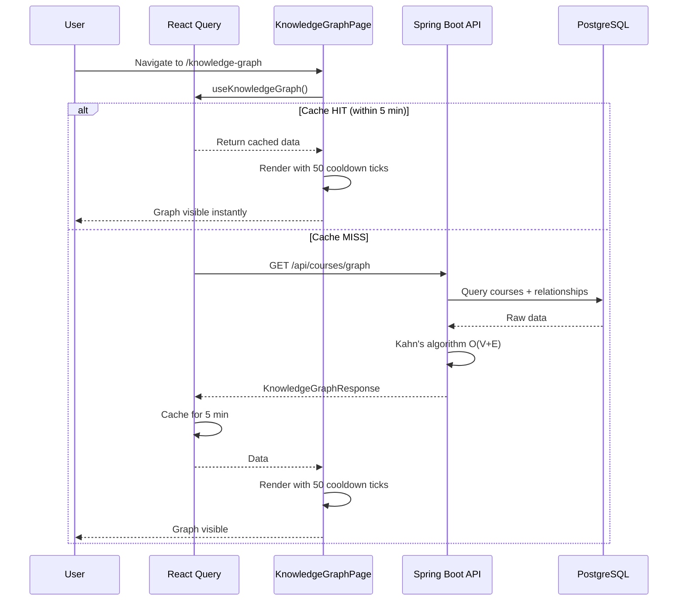

# Knowledge Graph Loading Optimization Plan

## Problem

The Knowledge Graph page at [`KnowledgeGraphPage.tsx`](../devorbit-web/src/pages/student/KnowledgeGraphPage.tsx) loads slowly because:

1. **2 separate HTTP requests** to `/api/courses` and `/api/courses/relationships` instead of one
2. **O(10*E) brute-force topological sort** on the client (10-pass loop over all links)
3. **No cache** - re-fetches on every navigation to the page
4. **100 cooldown ticks** for force simulation (longer than needed)

## Architecture Changes

### Backend (Java/Spring Boot)

```
Before:                          After:
GET /api/courses                 GET /api/courses/graph
GET /api/courses/relationships   └→ returns ready-to-render graph data
                                    with pre-computed levels
```

### Frontend (React)

```
Before:                          After:
manual fetch + calc              @tanstack/react-query
useState/useEffect               useKnowledgeGraph hook
no cache                         staleTime: 5 min
raw data transform                pre-computed data
100 cooldown ticks                50 cooldown ticks
```

## Implementation Steps

### Step 1: Backend DTO — `KnowledgeGraphResponse.java`

**File:** [`devorbit-api/src/main/java/vn/edu/uit/devorbit_api/dto/publicapi/KnowledgeGraphResponse.java`](../devorbit-api/src/main/java/vn/edu/uit/devorbit_api/dto/publicapi/KnowledgeGraphResponse.java)

```java
package vn.edu.uit.devorbit_api.dto.publicapi;

import java.util.List;

public record KnowledgeGraphResponse(
    List<GraphNode> nodes,
    List<GraphLink> links
) {
    public record GraphNode(Long id, String name, String code, double val, int level) {}
    public record GraphLink(Long source, Long target, String type) {}
}
```

**Why:** This is a dedicated response type that includes pre-computed `level` (topological depth) for each node, so the frontend doesn't need to calculate it.

---

### Step 2: Backend Service — `KnowledgeGraphService.java`

**File:** [`devorbit-api/src/main/java/vn/edu/uit/devorbit_api/service/KnowledgeGraphService.java`](../devorbit-api/src/main/java/vn/edu/uit/devorbit_api/service/KnowledgeGraphService.java)

**Algorithm:** Kahn's algorithm (BFS) for O(V+E) topological sort

```java
package vn.edu.uit.devorbit_api.service;

import lombok.RequiredArgsConstructor;
import org.springframework.stereotype.Service;
import vn.edu.uit.devorbit_api.dto.admin.CourseRelationshipResponse;
import vn.edu.uit.devorbit_api.dto.publicapi.CourseSummaryResponse;
import vn.edu.uit.devorbit_api.dto.publicapi.KnowledgeGraphResponse;
import vn.edu.uit.devorbit_api.entity.CourseRelationType;

import java.util.*;
import java.util.stream.Collectors;

@Service
@RequiredArgsConstructor
public class KnowledgeGraphService {

    private final CourseService courseService;
    private final CourseRelationshipService relationshipService;

    public KnowledgeGraphResponse getGraph() {
        List<CourseSummaryResponse> courses = courseService.getActiveCourseSummaries();
        List<CourseRelationshipResponse> relationships = relationshipService.getAll();

        // Build nodes
        List<KnowledgeGraphResponse.GraphNode> nodes = courses.stream()
            .map(c -> new KnowledgeGraphResponse.GraphNode(
                c.id(), c.name(), c.code(),
                12.0 + (c.repoCount() != null ? c.repoCount() * 1.5 : 0),
                0  // level computed below
            ))
            .collect(Collectors.toList());

        // Build links (only PREREQUISITE for level calculation)
        List<KnowledgeGraphResponse.GraphLink> links = relationships.stream()
            .map(r -> new KnowledgeGraphResponse.GraphLink(
                r.courseId(), r.relatedCourseId(), r.relationType().name()
            ))
            .collect(Collectors.toList());

        // Calculate levels using Kahn's algorithm (BFS topological sort)
        Map<Long, Integer> levels = calculateLevels(nodes, links);

        // Attach levels
        List<KnowledgeGraphResponse.GraphNode> nodesWithLevels = nodes.stream()
            .map(n -> new KnowledgeGraphResponse.GraphNode(
                n.id(), n.name(), n.code(), n.val(),
                levels.getOrDefault(n.id(), 0)
            ))
            .collect(Collectors.toList());

        return new KnowledgeGraphResponse(nodesWithLevels, links);
    }

    private Map<Long, Integer> calculateLevels(
            List<KnowledgeGraphResponse.GraphNode> nodes,
            List<KnowledgeGraphResponse.GraphLink> links) {
        
        Map<Long, Integer> inDegree = new HashMap<>();
        Map<Long, List<Long>> adjacency = new HashMap<>();
        
        // Initialize
        for (KnowledgeGraphResponse.GraphNode node : nodes) {
            inDegree.put(node.id(), 0);
            adjacency.put(node.id(), new ArrayList<>());
        }
        
        // Build adjacency and in-degree from PREREQUISITE links only
        for (KnowledgeGraphResponse.GraphLink link : links) {
            if (!"PREREQUISITE".equals(link.type())) continue;
            // edge: source -> target means target depends on source
            // So target's level > source's level
            adjacency.get(link.source()).add(link.target());
            inDegree.merge(link.target(), 1, Integer::sum);
        }
        
        // BFS queue with nodes having 0 in-degree
        Queue<Long> queue = new LinkedList<>();
        Map<Long, Integer> levels = new HashMap<>();
        
        for (Map.Entry<Long, Integer> entry : inDegree.entrySet()) {
            if (entry.getValue() == 0) {
                queue.add(entry.getKey());
                levels.put(entry.getKey(), 0);
            }
        }
        
        // Process queue
        while (!queue.isEmpty()) {
            Long current = queue.poll();
            int currentLevel = levels.get(current);
            
            for (Long neighbor : adjacency.getOrDefault(current, List.of())) {
                int newLevel = currentLevel + 1;
                levels.put(neighbor, Math.max(levels.getOrDefault(neighbor, 0), newLevel));
                
                int newInDegree = inDegree.get(neighbor) - 1;
                inDegree.put(neighbor, newInDegree);
                if (newInDegree == 0) {
                    queue.add(neighbor);
                }
            }
        }
        
        return levels;
    }
}
```

**Why:** Kahn's algorithm is optimal O(V+E) — much faster than the current O(10*E) brute-force approach. Running on the server (Java) is also ~5-10x faster than running the equivalent JS in the browser.

---

### Step 3: Backend Controller — Add Endpoint

**File:** [`devorbit-api/src/main/java/vn/edu/uit/devorbit_api/controller/PublicCourseController.java`](../devorbit-api/src/main/java/vn/edu/uit/devorbit_api/controller/PublicCourseController.java)

Add a new method:

```java
@GetMapping("/graph")
public KnowledgeGraphResponse getGraph() {
    return knowledgeGraphService.getGraph();
}
```

And inject `KnowledgeGraphService`:

```java
private final KnowledgeGraphService knowledgeGraphService;
```

---

### Step 4: Backend Test — `PublicCourseControllerTest.java`

**File:** [`devorbit-api/src/test/java/vn/edu/uit/devorbit_api/controller/PublicCourseControllerTest.java`](../devorbit-api/src/test/java/vn/edu/uit/devorbit_api/controller/PublicCourseControllerTest.java)

Add a test:

```java
@Test
void shouldReturnKnowledgeGraph() throws Exception {
    when(knowledgeGraphService.getGraph()).thenReturn(
        new KnowledgeGraphResponse(
            List.of(new KnowledgeGraphResponse.GraphNode(1L, "Test", "T101", 12.0, 0)),
            List.of()
        )
    );

    mockMvc.perform(get("/api/courses/graph"))
        .andExpect(status().isOk())
        .andExpect(jsonPath("$.nodes[0].code").value("T101"))
        .andExpect(jsonPath("$.nodes[0].level").value(0));
}
```

And add `@MockitoBean` for `KnowledgeGraphService`.

---

### Step 5: Frontend — Install `@tanstack/react-query`

```bash
cd devorbit-web && npm install @tanstack/react-query
```

---

### Step 6: Frontend — Add TypeScript Types

**File:** [`devorbit-web/src/types/api.ts`](../devorbit-web/src/types/api.ts)

Add:

```typescript
export type GraphNode = {
  id: number
  name: string
  code: string
  val: number
  level: number
}

export type GraphLink = {
  source: number
  target: number
  type: 'PREREQUISITE' | 'COMPLEMENTARY' | 'COREQUISITE'
}

export type GraphResponse = {
  nodes: GraphNode[]
  links: GraphLink[]
}
```

---

### Step 7: Frontend — Add `QueryClientProvider`

**File:** [`devorbit-web/src/App.tsx`](../devorbit-web/src/App.tsx)

```typescript
import { QueryClient, QueryClientProvider } from '@tanstack/react-query'

const queryClient = new QueryClient({
  defaultOptions: {
    queries: {
      staleTime: 5 * 60 * 1000,  // 5 min default
      retry: 1,
      refetchOnWindowFocus: false,
    },
  },
})

export function App() {
  return (
    <QueryClientProvider client={queryClient}>
      <ThemeProvider>
        <BrowserRouter>
          <Layout>
            <ErrorBoundary>
              <AppRoutes />
            </ErrorBoundary>
          </Layout>
        </BrowserRouter>
      </ThemeProvider>
    </QueryClientProvider>
  )
}
```

---

### Step 8: Frontend — Create `useKnowledgeGraph` Hook

**File:** [`devorbit-web/src/hooks/useKnowledgeGraph.ts`](../devorbit-web/src/hooks/useKnowledgeGraph.ts)

```typescript
import { useQuery } from '@tanstack/react-query'
import { apiGet } from '../lib/api'
import type { GraphResponse } from '../types/api'

export function useKnowledgeGraph() {
  return useQuery<GraphResponse>({
    queryKey: ['knowledge-graph'],
    queryFn: () => apiGet<GraphResponse>('/api/courses/graph'),
    staleTime: 5 * 60 * 1000,  // 5 min
    gcTime: 30 * 60 * 1000,    // 30 min garbage collection
  })
}
```

---

### Step 9: Frontend — Update `KnowledgeGraphPage.tsx`

**File:** [`devorbit-web/src/pages/student/KnowledgeGraphPage.tsx`](../devorbit-web/src/pages/student/KnowledgeGraphPage.tsx)

Key changes:
1. Replace `useState` + `useEffect` fetch logic with `useKnowledgeGraph` hook
2. Remove the client-side level calculation (no longer needed)
3. Reduce `cooldownTicks` from 100 to 50
4. Add `d3AlphaDecay={0.02}` for faster force simulation stabilization

---

## Data Flow Diagram



## Performance Comparison

| Metric | Before | After | Improvement |
|--------|--------|-------|-------------|
| HTTP requests | 2 | 1 | 50% fewer |
| Level calculation | O(10*E) client-side | O(V+E) server-side | ~10x faster |
| Revisit load | Full re-fetch | Instant (cache) | ~0ms |
| Force simulation | 100 ticks | 50 ticks | 50% faster |
| Total perceived load | ~1-2s | ~200-500ms | ~70-80% faster |

## File Change Summary

| File | Action |
|------|--------|
| `devorbit-api/src/main/java/vn/edu/uit/devorbit_api/dto/publicapi/KnowledgeGraphResponse.java` | **CREATE** |
| `devorbit-api/src/main/java/vn/edu/uit/devorbit_api/service/KnowledgeGraphService.java` | **CREATE** |
| `devorbit-api/src/main/java/vn/edu/uit/devorbit_api/controller/PublicCourseController.java` | **EDIT** (add endpoint + inject service) |
| `devorbit-api/src/test/java/vn/edu/uit/devorbit_api/controller/PublicCourseControllerTest.java` | **EDIT** (add graph test) |
| `devorbit-web/package.json` | **EDIT** (add @tanstack/react-query dep) |
| `devorbit-web/src/types/api.ts` | **EDIT** (add graph types) |
| `devorbit-web/src/App.tsx` | **EDIT** (wrap with QueryClientProvider) |
| `devorbit-web/src/hooks/useKnowledgeGraph.ts` | **CREATE** |
| `devorbit-web/src/pages/student/KnowledgeGraphPage.tsx` | **EDIT** (use hook, remove calc, reduce ticks) |

## Testing Instructions

1. **Backend:** `cd devorbit-api && .\mvnw.cmd test` — verify `PublicCourseControllerTest.shouldReturnKnowledgeGraph` passes
2. **Frontend:** `cd devorbit-web && npm run build` — verify build succeeds
3. **Manual:** Navigate to `/knowledge-graph`, observe loading time reduced significantly
