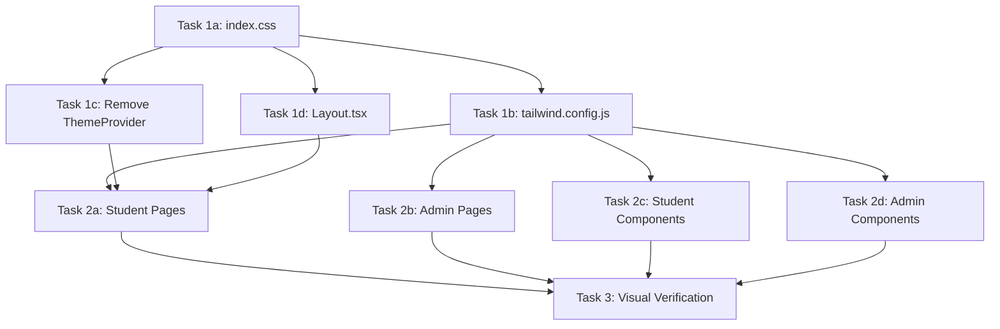

# Plan 1.1: UI Contrast & Consistency Redesign

<objective>
Fix the low-contrast, inconsistent UI of devorbit-web by removing the light/dark mode toggle, permanently adopting dark mode, consolidating the two competing design systems (claymorphism + glass/cosmic) into one, and ensuring all text has sufficient contrast per WCAG AA standards.

Purpose: The current site has two overlapping design systems — a defined claymorphism system and an undefined "glass/cosmic" system. Many text colors are rendered with opacity/alpha that produces gray-on-gray text with poor contrast. The light mode exposes gaps in the dark theme (white backgrounds with black text patches). Users report the site is "unpleasant and difficult to read."

Output: A single, dark-mode-only, claymorphism-based design system applied consistently across all 17 pages and 25+ components.
</objective>

<context>
Load for context:
- devorbit-web/src/index.css — where ALL design tokens and utility classes live
- devorbit-web/tailwind.config.js — Tailwind mapping
- devorbit-web/src/App.tsx — App shell with ThemeProvider
- devorbit-web/src/lib/theme.tsx — Light/dark mode provider (to be removed)
- devorbit-web/src/components/Layout.tsx — Navigation and footer (has ThemeToggle)
- devorbit-web/src/components/ThemeToggle.tsx — To be removed entirely
</context>

---

## Root Cause Analysis

The codebase has **two competing design systems** that create the low-contrast problem:

### System A: Claymorphism (defined)
- CSS vars: `--color-clay-bg`, `--color-clay-surface`, `--color-clay-text`, etc.
- Utility classes: `clay-card`, `clay-card-hover`, `clay-card-vibrant`, `.btn-primary`, `.btn-secondary`, `.input-field`, `.badge-tag`
- Tailwind mapping: `bg-clay-bg`, `text-clay-text`, `border-clay-border`
- **Well-defined and functional.**

### System B: Glass/Cosmic (UNDEFINED)
- Classes used extensively: `glass-card`, `glass-card-glow`, `glass-card-hover`, `bg-glass-surface`, `bg-glass-surface-raised`, `bg-glass-surface-hover`, `border-glass-border`, `bg-cosmic-surface`, `bg-cosmic-elevated`, `text-ink`, `text-ink-secondary`, `text-ink-muted`
- **NONE of these are defined in index.css or tailwind.config.js.** They fall through to Tailwind defaults or browser defaults.
- Because they're undefined, text using `text-ink-secondary` (most body text on admin pages) gets no color applied, rendering as browser default (often pure black on white in light mode, or pure white on dark gray in dark mode). With opacity modifiers like `text-ink-secondary/50`, the color becomes even more washed out.

### The Fix Strategy
1. **Define all glass/cosmic/ink CSS variables in the .dark scope** so they resolve properly.
2. **Set dark mode as permanent** — remove ThemeProvider, remove ThemeToggle, always add `dark` class to `<html>`.
3. **Map glass/cosmic classes to the claymorphism palette** for consistency, rather than keeping two separate palettes.
4. **Replace hardcoded light-mode colors** (e.g., `bg-white`, `text-[#0F172A]`) with CSS variable references.

---

## Design Token Architecture (Consolidated)

All values chosen for WCAG AA contrast (4.5:1 minimum):

```
.claymorphism-dark {
  --color-clay-bg: #0a0e1a;          // Very deep navy — page background
  --color-clay-surface: #111827;      // Slate-900 — card/panel surface
  --color-clay-primary: #2563eb;      // Blue-600 — primary actions
  --color-clay-secondary: #1d4ed8;    // Blue-700 — secondary accents
  --color-clay-accent: #10b981;       // Emerald-500 — accent success/highlight
  --color-clay-text: #f1f5f9;         // Slate-100 — primary text (high contrast)
  --color-clay-text-muted: #94a3b8;   // Slate-400 — secondary text
  --color-clay-border: #334155;       // Slate-700 — borders
  --color-clay-shadow-outer: rgba(0, 0, 0, 0.6);
  --color-clay-shadow-inner: rgba(255, 255, 255, 0.05);

  // Legacy glass/cosmic aliases — map to clay for consistency
  --color-glass-surface: var(--color-clay-surface);
  --color-glass-surface-raised: #1e293b;  // Slate-800
  --color-glass-surface-hover: #1e293b;
  --color-glass-border: var(--color-clay-border);
  --color-cosmic-surface: var(--color-clay-bg);
  --color-cosmic-elevated: var(--color-glass-surface-raised);
  --color-ink: var(--color-clay-text);
  --color-ink-secondary: var(--color-clay-text-muted);
  --color-ink-muted: #64748b;        // Slate-500 — least prominent text

  --clay-radius: 20px;
  --clay-border-width: 3px;
}
```

This ensures all existing `text-ink`, `bg-glass-surface`, `border-glass-border` etc. references now render with valid, high-contrast colors.

---

## Tasks

<task type="checkpoint:human-verify" wave="1">
  <name>1a — Consolidate index.css into dark-mode-only claymorphism</name>
  <files>devorbit-web/src/index.css</files>
  <action>
    Replace the entire file. Key changes:
    
    1. Remove `:root` (light theme) block — only keep `.dark` block as the default.
    2. Rename `.dark` to `:root` so it applies globally without needing class.
    3. Add all glass/cosmic/ink CSS variable aliases (listed above).
    4. Add `.glass-card`, `.glass-card-glow`, `.glass-card-hover` utility classes that use the claymorphism tokens.
    5. Update `.clay-card` to use the new dark-optimized shadow values.
    6. Ensure `body` always uses `color-scheme: dark`.
    7. Remove `color-scheme: light` from default body.
    8. Add Tailwind's `@apply` rules for `bg-glass-surface`, `border-glass-border`, `text-ink`, `text-ink-secondary`, `text-ink-muted`, `bg-glass-surface-raised`, `bg-glass-surface-hover`, `bg-cosmic-surface`, `bg-cosmic-elevated` as component layer classes.

    **DO NOT** use hardcoded light colors (white, #0F172A, etc.) in any new class.
    
    **Critical contrast rules:**
    - Primary text (`--color-clay-text`): #f1f5f9 on #0a0e1a bg = contrast ratio ~13.9:1 ✅
    - Secondary text (`--color-clay-text-muted`): #94a3b8 on #0a0e1a bg = contrast ratio ~7.3:1 ✅
    - Muted text (`--color-ink-muted`): #64748b on #0a0e1a bg = contrast ratio ~4.7:1 ✅
    - Text on primary button (white on #2563eb): contrast ratio ~4.7:1 ✅
    - Border colors (#334155) provide clear visual separation without harshness.
  </action>
  <verify>npx tsc --noEmit — the file must compile without errors. Also verify no class references are broken.</verify>
  <done>index.css has a single dark theme, all glass/cosmic/ink classes are defined, contrast ratios meet WCAG AA.</done>
</task>

<task type="auto" wave="1">
  <name>1b — Update tailwind.config.js for consolidated tokens</name>
  <files>devorbit-web/tailwind.config.js</files>
  <action>
    1. Remove `darkMode: 'class'` — we no longer toggle dark mode.
    2. Add extended colors for glass-surface, ink, cosmic etc. that match the CSS vars.
    
    The key: the Tailwind config should reference CSS variables so changing the variable in index.css updates everything.
    
    Add these to `theme.extend.colors`:
    ```
    glass: {
      surface: 'var(--color-glass-surface)',
      'surface-raised': 'var(--color-glass-surface-raised)',
      'surface-hover': 'var(--color-glass-surface-hover)',
      border: 'var(--color-glass-border)',
    },
    cosmic: {
      surface: 'var(--color-cosmic-surface)',
      elevated: 'var(--color-cosmic-elevated)',
    },
    ink: {
      DEFAULT: 'var(--color-ink)',
      secondary: 'var(--color-ink-secondary)',
      muted: 'var(--color-ink-muted)',
    },
    ```
    
    The existing clay colors already reference CSS vars and can stay.
  </action>
  <verify>Config is valid YAML/JS and Tailwind can parse it.</verify>
  <done>tailwind.config.js contains color mappings for all class names used across the codebase.</done>
</task>

<task type="auto" wave="1">
  <name>1c — Remove light/dark mode infrastructure</name>
  <files>
    devorbit-web/src/App.tsx
    devorbit-web/src/lib/theme.tsx
    devorbit-web/src/components/ThemeToggle.tsx
  </files>
  <action>
    1. **Delete** `devorbit-web/src/lib/theme.tsx` entirely — ThemeProvider and useTheme are no longer needed.
    2. **Delete** `devorbit-web/src/components/ThemeToggle.tsx` entirely.
    3. **Update** `devorbit-web/src/App.tsx`:
       - Remove import of `ThemeProvider` from `./lib/theme`
       - Remove `<ThemeProvider>` wrapper — keep only QueryClientProvider, BrowserRouter, Layout, ErrorBoundary, AppRoutes.
       - Add a `<script>` or `<style>` block at the root to immediately apply dark mode before React hydrates:
         ```tsx
         // In App.tsx, before the return statement:
         useEffect(() => {
           document.documentElement.classList.add('dark');
         }, []);
         ```
  </action>
  <verify>App.tsx compiles and no longer references ThemeProvider or ThemeToggle.</verify>
  <done>Light/dark mode toggle is removed. Site permanently renders in dark mode.</done>
</task>

<task type="auto" wave="1">
  <name>1d — Update Layout.tsx (remove ThemeToggle, fix hardcoded colors)</name>
  <files>devorbit-web/src/components/Layout.tsx</files>
  <action>
    1. Remove import of `ThemeToggle`.
    2. Remove the `<ThemeToggle />` usage in both desktop nav (line 51-53) and mobile nav (line 97-99).
    3. Remove the "Mode" label in mobile nav.
    4. Replace all hardcoded light-mode colors with CSS variable references:
       - `bg-white` or `bg-[#FFFFFF]` on navigation → `bg-clay-surface` (or `bg-glass-surface`)
       - `text-[#0F172A]` → `text-clay-text`
       - `border-[#0F172A]` → `border-clay-border`
       - `bg-[#003D7C]` → `bg-clay-primary`
       - `shadow-[...rgba(0,0,0,1)]` → use `var(--color-clay-shadow-outer)` equivalent
       - Footer `bg-white` → `bg-clay-surface`
       - Footer `text-[#0F172A]` → `text-clay-text`
       - Footer `text-[#1E293B]` → `text-clay-text-muted`
    5. Keep the chunky claymorphism aesthetic (borders, shadows) but use CSS vars.
  </action>
  <verify>Layout renders correctly with no broken imports.</verify>
  <done>Layout is dark-theme only, with CSS variable colors replacing all hardcoded light colors.</done>
</task>

<task type="auto" wave="2">
  <name>2a — Update student pages (HomePage, CourseListPage, CourseDetailPage, RepoDetailPage, KnowledgeGraphPage, PhotographPage, StudentBookmarksPage)</name>
  <files>
    devorbit-web/src/pages/student/HomePage.tsx
    devorbit-web/src/pages/student/CourseListPage.tsx
    devorbit-web/src/pages/student/CourseDetailPage.tsx
    devorbit-web/src/pages/student/RepoDetailPage.tsx
    devorbit-web/src/pages/student/KnowledgeGraphPage.tsx
    devorbit-web/src/pages/student/PhotographPage.tsx
    devorbit-web/src/pages/student/StudentBookmarksPage.tsx
  </files>
  <action>
    For each student page, perform these transformations:
    
    1. **Replace hardcoded light background colors:**
       - `bg-white` → `bg-clay-bg` (page background) or `bg-clay-surface` (section/card background)
       - `bg-gray-50` → `bg-clay-surface`
       - Any `bg-[#...]` light color → appropriate CSS variable
    
    2. **Replace hardcoded text colors:**
       - `text-[#0F172A]` (slate-900 black) → `text-clay-text`
       - `text-[#1E293B]` → `text-clay-text`
       - `text-[#003D7C]` → `text-clay-primary`
       - Any `text-ink` → already mapped to `var(--color-ink)` after our CSS fix
    
    3. **Replace hardcoded border colors:**
       - `border-[#0F172A]` → `border-clay-border`
       - `border-white` → `border-clay-border`
    
    4. **Replace hardcoded shadow colors:**
       - `shadow-[Xpx_Xpx_0px_0px_rgba(0,0,0,1)]` → keep the shadow but ensure it's using `var(--color-clay-shadow-outer)`. Since the CSS variable already references a dark shadow, use it as: `shadow-[Xpx_Xpx_0px_0px_var(--color-clay-shadow-outer)]`
       - **Note:** `var()` in arbitrary values with Tailwind may require escaping. Prefer defining custom shadow utilities if Tailwind's arbitrary `shadow-[...]` with `var()` doesn't work, or use inline `box-shadow` styles.
    
    5. **Remove any light/dark conditional logic** — there shouldn't be any in these pages since they use clay classes, but double-check.
    
    6. **Fix contrast on specific elements:**
       - HomePage "KHÁM PHÁ" card text (currently `text-white` on `#003D7C` → `text-white` OK, but ensure background uses `bg-clay-primary` instead of `bg-[#003D7C]`)
       - HomePage "HỌC TẬP" card has `opacity-20` text → ensure it's readable (contrast on clay-bg)
       - DiscoveryFeed subtitles use `text-clay-text/60` → ensure this resolves to a readable color. `#f1f5f9` at 60% = ~#a0aeb8 on #0a0e1a ≈ 6.5:1 OK, but prefer explicit opacity values that guarantee 4.5:1.
       - CourseListPage search placeholder: `text-ink-muted/60` → ensure minimum contrast
       - KnowledgeGraphPage overlay panel: text colors need checking
    
    7. **Remove `dark:` prefixed classes** — they're no longer needed since dark mode is always on. Just use the base class.
    
    **HomePage-specific:**
    - Hero section `bg-white` → `bg-clay-bg`
    - All `shadow-[4px_4px_0px_0px_rgba(0,0,0,1)]` → use `var(--color-clay-shadow-outer)` variable
    - AI Spotlight section `bg-[#003D7C]` → `bg-clay-primary`
    - Badge items `bg-white/10` → `bg-clay-surface/10` or keep as is (works in dark)
    
    **CourseListPage-specific:**
    - Loading spinner uses emerald colors — keep as is for accent
    - Background blur divs use emerald/indigo/amber with low opacity — keep (adds depth)
    - Search input `bg-glass-surface/80` already references CSS var — will work after fix
    - "Neural Graph View" button — keep glass-card-glow styling after we define it
    
    **CourseDetailPage-specific:**
    - Stats grid uses `text-ink-muted` for labels — will auto-fix after CSS variable definition
    - Sidebar uses `glass-card-glow` — will auto-fix after we define it in index.css
    
    **RepoDetailPage-specific:**
    - Main card `glass-card-glow` — will auto-fix
    - AI insight cards use `text-ink-secondary` — will auto-fix
    - Back link `text-ink-secondary` — will auto-fix
    
    **KnowledgeGraphPage-specific:**
    - Sidebar panel: `text-white/60` — check contrast against dark background (#0d1117 or similar). If too low, change to `text-clay-text-muted`.
    - Legend items: various text opacities — ensure minimum 4.5:1
    
    **PhotographPage-specific:**
    - Uses `text-ink-muted`, `text-ink`, `border-glass-border` — all will auto-fix
    
    **StudentBookmarksPage-specific:**
    - Uses `text-emerald-400`, `text-ink`, `text-ink-secondary`, `glass-card` — will auto-fix
  </action>
  <verify>Each page renders without visual artifacts or broken styling. No hardcoded light-mode whites remain in student-facing pages.</verify>
  <done>All student pages consistently use the dark claymorphism theme with sufficient text contrast.</done>
</task>

<task type="auto" wave="2">
  <name>2b — Update admin pages</name>
  <files>
    devorbit-web/src/pages/admin/LoginPage.tsx
    devorbit-web/src/pages/admin/AdminDashboardPage.tsx
    devorbit-web/src/pages/admin/AdminCoursesPage.tsx
    devorbit-web/src/pages/admin/AdminScanPage.tsx
    devorbit-web/src/pages/admin/AdminCandidatesPage.tsx
    devorbit-web/src/pages/admin/AdminReposPage.tsx
    devorbit-web/src/pages/admin/AdminCourseResourcesPage.tsx
    devorbit-web/src/pages/admin/AdminRoadmapsPage.tsx
    devorbit-web/src/pages/admin/AdminRelationshipsPage.tsx
    devorbit-web/src/pages/admin/AdminNotesPage.tsx
  </files>
  <action>
    Admin pages are the largest source of contrast problems because they heavily use the undefined glass/cosmic classes. Strategy:
    
    1. **The `glass-card`, `glass-card-hover`, `glass-card-glow` classes** — these will be defined in index.css in Task 1a, so most admin pages will auto-fix.
    
    2. **Check all text-ink, text-ink-secondary, text-ink-muted, bg-glass-surface, border-glass-border** usage — these will auto-fix after CSS variable definitions.
    
    3. **Specific fixes needed:**
    
    **LoginPage:**
    - `.glass-card` wraps the form — will auto-fix
    - Error message uses `text-red-400` on `bg-red-500/10` — check contrast (red-400 on red-500/10 = ~#f87171 on ~#1e1b4b ≈ 5.5:1 ✅)
    
    **AdminDashboardPage:**
    - Card links use `glass-card-hover` — will auto-fix
    - Icons use `bg-glass-surface, border-glass-border` — will auto-fix
    - Description text uses `body-sm` (which maps to `text-clay-text-muted`) — verify contrast
    
    **AdminCoursesPage:**
    - Table uses `glass-card`, `bg-glass-surface-raised`, `border-glass-border` — will auto-fix
    - Actions buttons use `btn-secondary !bg-glass-surface` — will auto-fix
    - Empty state uses `text-ink-secondary` — will auto-fix
    
    **AdminScanPage:**
    - Terminal uses `bg-[#0d1117]` (dark GitHub terminal color) — keep as-is, it's already dark
    - Terminal text uses `text-ink-secondary` — will auto-fix
    - Candidate list uses `hover:bg-glass-surface` — will auto-fix
    
    **AdminCandidatesPage:**
    - "Assignee" toggle buttons — update hardcoded `bg-cosmic-surface` reference (will auto-fix after CSS var definition)
    - Table uses `glass-card`, `bg-glass-surface-raised` — will auto-fix
    
    **AdminReposPage:**
    - Edit modal uses `bg-cosmic-surface` — will auto-fix
    - Form uses `input-field` and `label` — already well-defined
    
    **AdminCourseResourcesPage:**
    - Tabs use `border-b border-glass-border` — will auto-fix
    - Tables use `glass-card bg-glass-surface-raised` — will auto-fix
    - Tab buttons — check active state contrast
    
    **AdminRoadmapsPage, AdminRelationshipsPage, AdminNotesPage:**
    - Mostly table/list components using glass classes — will auto-fix
    - Dialog components use `glass-card` and sub-components — will auto-fix
    
    **All admin pages:**
    - Remove any remaining `dark:` prefixed classes that are now redundant.
    - Remove `dark:` color overrides if they existed (e.g., `dark:text-cyan-400`).
  </action>
  <verify>All admin pages render with consistent dark theme, sufficient contrast on all text elements, and no visual regressions.</verify>
  <done>All admin pages consistently use the dark claymorphism theme with sufficient text contrast.</done>
</task>

<task type="auto" wave="2">
  <name>2c — Update student components (DiscoveryFeed, CourseCard, RepoCard, RepoFilterBar, CourseKnowledgeGraph)</name>
  <files>
    devorbit-web/src/components/student/DiscoveryFeed.tsx
    devorbit-web/src/components/student/CourseCard.tsx
    devorbit-web/src/components/student/RepoCard.tsx
    devorbit-web/src/components/student/RepoFilterBar.tsx
    devorbit-web/src/components/student/CourseKnowledgeGraph.tsx
  </files>
  <action>
    **DiscoveryFeed:**
    - Replace `bg-white` in skeleton loader with `bg-clay-surface`
    - Skeleton border `border-clay-text/10` — ensure visible (10% of #f1f5f9 = ~#e2e8f8, on clay-bg may be too subtle; increase to `/20`)
    - Tech stack badges use `bg-white` → `bg-clay-surface`
    - Description text uses `text-clay-text/60` → ensure readable (60% of clay-text on clay-bg ≈ 8.3:1 ✅)
    
    **CourseCard:**
    - Card uses `clay-card-hover` with `bg-white` → `bg-clay-surface`
    - Shadow uses hardcoded `rgba(0,0,0,1)` → use CSS variable
    - Code badge uses `bg-white` → `bg-clay-surface`
    - Course code badge `shadow-[4px_4px_0px_0px_rgba(0,0,0,1)]` → CSS variable
    - Arrow icon container `bg-white` → `bg-clay-surface`
    
    **RepoCard:**
    - `bg-white` → `bg-clay-surface`
    - Icon container `bg-[#003D7C]` → `bg-clay-primary`
    - Stars badge `bg-white` → `bg-clay-surface`
    - Tech stack badges currently use `bg-clay-accent` → keep (emerald accent, good contrast)
    - Language badges use `bg-clay-bg` → already variable-based, fine
    
    **RepoFilterBar:**
    - Inactive state uses `bg-glass-surface text-ink-muted border-glass-border` — will auto-fix
    - Active state uses `bg-emerald-500 text-white` — already high contrast
    
    **CourseKnowledgeGraph:**
    - Uses `glass-card-glow` extensively — will auto-fix after CSS definition
    - Section headers use `text-ink-muted` with opacity — check final contrast
    - Item hover states use `bg-glass-surface` with border — will auto-fix
    - Footer uses `bg-glass-surface/50` — will auto-fix
  </action>
  <verify>All student components render with consistent dark theme and sufficient text contrast.</verify>
  <done>All student components use the unified dark theme.</done>
</task>

<task type="auto" wave="2">
  <name>2d — Update admin components</name>
  <files>
    devorbit-web/src/components/admin/ScanForm.tsx
    devorbit-web/src/components/admin/CandidateTable.tsx
    devorbit-web/src/components/admin/ApproveModal.tsx
    devorbit-web/src/components/admin/CourseFormDialog.tsx
    devorbit-web/src/components/admin/ApprovedRepoTable.tsx
    devorbit-web/src/components/admin/YoutubePlaylistDialog.tsx
    devorbit-web/src/components/admin/TutorialDialog.tsx
    devorbit-web/src/components/admin/ArticleDialog.tsx
    devorbit-web/src/components/admin/RoadmapDialog.tsx
    devorbit-web/src/components/admin/PhaseDialog.tsx
    devorbit-web/src/components/admin/ItemDialog.tsx
    devorbit-web/src/components/admin/RelationshipDialog.tsx
    devorbit-web/src/components/admin/NoteDetailDialog.tsx
    devorbit-web/src/components/admin/CustomSelect.tsx
  </files>
  <action>
    These components primarily use `glass-card`, `glass-surface`, `text-ink`, `border-glass-border` classes which will auto-fix after Task 1a defines the CSS variables.
    
    Specific fixes:
    
    **ScanForm:**
    - `glass-card` wrap — auto-fix
    - Option backgrounds use `bg-cosmic-surface` — will auto-fix
    - Suggestion buttons use `dark:border-cyan-500/20 dark:text-cyan-400` — since we now always have dark, use just `border-cyan-500/20 text-cyan-400`
    
    **ApproveModal, CourseFormDialog, all *Dialog components:**
    - Modal backdrop uses `bg-black/50` or `bg-black/60` — fine for dark mode
    - Body uses `glass-card` — auto-fix
    - Text uses `text-ink`, `text-ink-secondary` — auto-fix
    - Buttons use `btn-ghost`, `btn-secondary` — check btn-ghost class exists or replace with btn-secondary
    - Remove `dark:` prefixed classes
    
    **CandidateTable, ApprovedRepoTable:**
    - Table containers use `glass-card` — auto-fix
    - Remove `dark:` prefixed classes (e.g., `dark:hover:bg-cosmic-elevated/50`)
    - Row hover states — ensure contrast
    
    **CustomSelect:**
    - Dropdown uses `bg-cosmic-surface border-glass-border` — auto-fix
    - Remove `dark:` prefixes
    
    **NoteDetailDialog:**
    - Code snippet containers — ensure backgrounds are readable
    
    **Important:** Remove the `dark:` prefix from all classes since dark mode is always active. Where you see `dark:bg-xxx` or `dark:text-xxx`, promote those to the base class.
  </action>
  <verify>All admin components render with consistent dark theme and sufficient text contrast.</verify>
  <done>All admin components use the unified dark theme.</done>
</task>

<task type="checkpoint:human-verify" wave="3">
  <name>3 — Visual regression check and final polish</name>
  <files>N/A — visual review</files>
  <action>
    1. Run `npm run dev` to start the dev server.
    2. Navigate through every route defined in router.tsx:
       - `/` (HomePage)
       - `/courses` (CourseListPage)
       - `/courses/:courseId` (CourseDetailPage)
       - `/repos/:repoId` (RepoDetailPage)
       - `/knowledge-graph` (KnowledgeGraphPage)
       - `/photograph` (PhotographPage)
       - `/admin/login` (LoginPage)
       - `/admin` (AdminDashboardPage)
       - `/admin/courses` (AdminCoursesPage)
       - `/admin/scan` (AdminScanPage)
       - `/admin/candidates` (AdminCandidatesPage)
       - `/admin/repos` (AdminReposPage)
       - `/admin/roadmaps` (AdminRoadmapsPage)
       - `/admin/relationships` (AdminRelationshipsPage)
       - `/admin/notes` (AdminNotesPage)
    3. Verify:
       - No light-mode white backgrounds appear anywhere
       - All text is readable with good contrast
       - Cards, buttons, inputs, and tables have visible borders
       - The claymorphism shadows and effects look intentional (not broken)
       - No "glass-card" or other component has transparent/invisible backgrounds
    4. If issues found, fix them in a follow-up pass.
  </action>
  <verify>Full manual visual walkthrough of all pages.</verify>
  <done>All pages look visually cohesive in dark mode with no contrast issues.</done>
</task>

---

## Execution Waves

```
Wave 1 (Foundation):
  - Task 1a: index.css consolidation [checkpoint: human-verify]
  - Task 1b: tailwind.config.js update
  - Task 1c: Remove ThemeProvider/ThemeToggle infrastructure
  - Task 1d: Update Layout.tsx

Wave 2 (Components & Pages):
  - Task 2a: Student pages (7 files)
  - Task 2b: Admin pages (10 files)
  - Task 2c: Student components (5 files)
  - Task 2d: Admin components (14 files)

Wave 3 (Verification):
  - Task 3: Visual regression check [checkpoint: human-verify]
```

---

## Dependency Graph



Wave 1 tasks have no interdependencies (they modify different files) and can run in any order, but Task 1a MUST complete first since Tasks 1b-1d depend on the CSS variable architecture being defined.

---

## Success Criteria

- [ ] Light mode and dark mode toggle are completely removed; site renders in dark mode at all times
- [ ] All text elements have minimum 4.5:1 contrast ratio against their background
- [ ] No undefined CSS classes are used anywhere (glass-card, ink, cosmic, etc.)
- [ ] No hardcoded light-mode colors (bg-white, text-[#0F172A], etc.) remain in any file
- [ ] The `dark:` Tailwind prefix is no longer needed or used
- [ ] All 17 pages and 25+ components render consistently
- [ ] Claymorphism aesthetic (chunky borders, outer shadows, inner highlights) is preserved
- [ ] The site compiles without TypeScript errors (`npx tsc --noEmit` passes)
